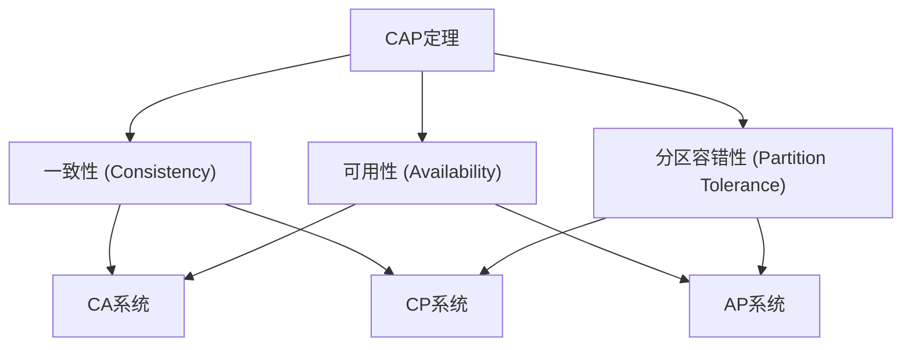

# CAP定理

CAP定理是分布式系统设计中的一个重要理论，由计算机科学家Eric Brewer在2000年提出。它指出，在分布式系统中，**一致性（Consistency）**、**可用性（Availability）**和**分区容错性（Partition Tolerance）**这三个特性无法同时满足，最多只能同时满足其中的两个。

## 什么是CAP定理？

CAP定理的核心思想是：在分布式系统中，当网络分区（Partition）发生时，系统必须在**一致性**和**可用性**之间做出选择。具体来说：

- **一致性（Consistency）**：所有节点在同一时间看到的数据是一致的。
- **可用性（Availability）**：每个请求都能得到响应，即使某些节点出现故障。
- **分区容错性（Partition Tolerance）**：系统能够在网络分区的情况下继续运行。

:::note
**网络分区**指的是由于网络故障，导致系统中的部分节点无法与其他节点通信。
:::

## CAP定理的权衡

根据CAP定理，分布式系统只能满足以下三种组合中的两种：

1. **CA（一致性和可用性）**：系统保证一致性和可用性，但无法容忍网络分区。这类系统通常用于单机或局域网环境。
2. **CP（一致性和分区容错性）**：系统保证一致性和分区容错性，但在网络分区时可能无法提供服务。例如，ZooKeeper就是一个典型的CP系统。
3. **AP（可用性和分区容错性）**：系统保证可用性和分区容错性，但在网络分区时可能会返回不一致的数据。例如，Cassandra是一个典型的AP系统。



## 实际应用场景

### 1. CP系统：ZooKeeper

ZooKeeper是一个分布式协调服务，它优先保证一致性和分区容错性。在网络分区发生时，ZooKeeper可能会拒绝部分请求，以确保数据的一致性。

```bash
# 示例：ZooKeeper的CP特性
# 当网络分区发生时，ZooKeeper可能会返回错误
zkCli.sh -server localhost:2181
# 输出：Connection refused (网络分区时)
```

### 2. AP系统：Cassandra

Cassandra是一个分布式NoSQL数据库，它优先保证可用性和分区容错性。在网络分区发生时，Cassandra仍然可以处理读写请求，但可能会返回不一致的数据。

```bash
# 示例：Cassandra的AP特性
# 即使网络分区发生，Cassandra仍然可以处理请求
cqlsh> SELECT * FROM users;
# 输出：可能返回不一致的数据
```

## 总结

CAP定理是分布式系统设计中的一个基础理论，它帮助开发者理解在分布式环境中如何权衡一致性、可用性和分区容错性。根据具体的应用场景，开发者可以选择适合的CAP组合来设计系统。

:::tip
**练习**：尝试设计一个简单的分布式系统，并思考在不同的网络分区情况下，如何选择CAP组合以满足系统需求。
:::

## 附加资源

- [CAP Theorem - Wikipedia](https://en.wikipedia.org/wiki/CAP_theorem)
- [Distributed Systems: Principles and Paradigms](https://www.distributed-systems.net/index.php/books/ds3/) by Andrew S. Tanenbaum and Maarten Van Steen

通过理解CAP定理，你将能够更好地设计和优化分布式系统，尤其是在非关系型数据库的应用中。