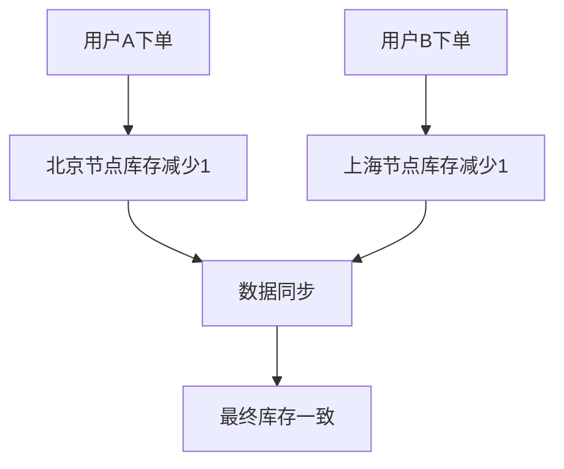

# BASE理论

在非关系型数据库（NoSQL）的世界中，**BASE理论**是一个重要的设计理念。它与传统关系型数据库的**ACID**特性形成鲜明对比，强调高可用性和最终一致性。本文将详细介绍BASE理论的核心概念，并通过实际案例帮助你理解其应用场景。

## 什么是BASE理论？

**BASE**是以下四个单词的首字母缩写：

- **B**asically **A**vailable（基本可用）
- **S**oft state（软状态）
- **E**ventual consistency（最终一致性）

BASE理论的核心思想是，系统在大多数时间内是**基本可用**的，即使在某些节点出现故障时也能继续运行。同时，系统允许数据在一段时间内处于**软状态**，即数据可能不一致，但最终会达到一致状态。

### 与ACID的对比

在传统的关系型数据库中，**ACID**（原子性、一致性、隔离性、持久性）是保证数据完整性的关键特性。然而，ACID特性在高并发、分布式系统中可能会导致性能瓶颈。相比之下，BASE理论通过放宽一致性要求，换取更高的可用性和性能。

## BASE理论的三个核心概念

### 1. 基本可用（Basically Available）

**基本可用**意味着系统在大多数时间内是可用的，即使在部分节点出现故障时也能继续提供服务。例如，一个分布式数据库可能会在某个节点宕机时，将请求重定向到其他可用节点，从而保证系统的整体可用性。

:::tip
**提示**：基本可用并不意味着系统在所有情况下都可用，而是指在大多数情况下系统能够正常运行。
:::

### 2. 软状态（Soft State）

**软状态**指的是系统中的数据在一段时间内可能处于不一致的状态。这种不一致性是由于分布式系统中的节点之间可能存在延迟或通信问题。然而，系统会通过某种机制（如数据复制或同步）最终使数据达到一致状态。

### 3. 最终一致性（Eventual Consistency）

**最终一致性**是BASE理论的核心。它表示系统在一段时间内可能不一致，但最终会达到一致状态。例如，在一个分布式数据库中，数据可能会在不同节点之间存在短暂的差异，但最终所有节点的数据会保持一致。

:::note
**注意**：最终一致性并不意味着数据永远不一致，而是指在一段时间内允许不一致，但最终会达到一致。
:::

## 实际案例：电商网站的库存管理

假设你正在开发一个电商网站，用户可以在多个地区同时下单购买商品。为了确保系统的高可用性，你决定使用一个分布式数据库来存储库存信息。

### 场景描述

- 用户A在北京下单购买某商品，库存减少1。
- 同时，用户B在上海下单购买同一商品，库存减少1。
- 由于网络延迟，北京和上海的数据库节点之间可能存在短暂的不一致。

### 最终一致性的体现

尽管北京和上海的数据库节点在短时间内可能显示不同的库存数量，但系统会通过数据同步机制，最终使所有节点的库存数量保持一致。这就是**最终一致性**的体现。

## 总结

BASE理论是非关系型数据库设计中的一个重要理念，它通过放宽一致性要求，换取更高的可用性和性能。理解BASE理论的核心概念（基本可用、软状态、最终一致性）对于设计和优化分布式系统至关重要。

## 附加资源与练习

- **练习**：尝试设计一个简单的分布式系统，模拟BASE理论的应用场景。例如，模拟一个多节点的库存管理系统，观察最终一致性是如何实现的。
- **资源**：阅读更多关于分布式系统和NoSQL数据库的书籍，如《Designing Data-Intensive Applications》。

通过本文的学习，你应该对BASE理论有了初步的了解。希望你能在实际项目中应用这些知识，设计出高可用、高性能的分布式系统！