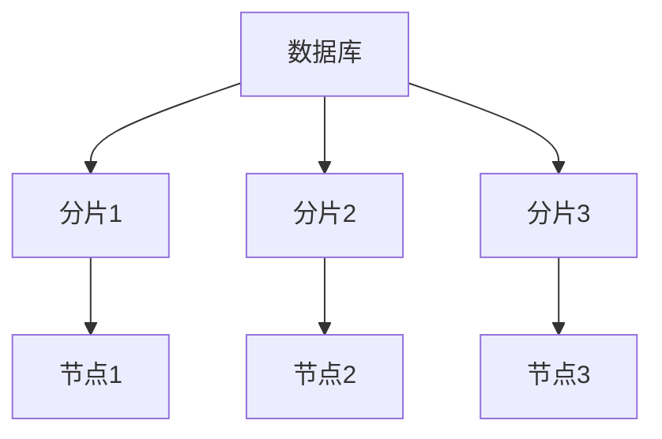
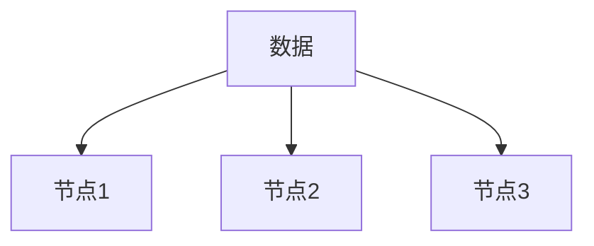

# 分布式数据库原理

## 介绍

在现代计算环境中，数据量呈指数级增长，传统的单机数据库已经无法满足大规模数据存储和处理的需求。分布式数据库应运而生，它通过将数据分散存储在多个节点上，实现了高可用性、可扩展性和容错性。本文将带你了解分布式数据库的基本原理、核心概念以及实际应用场景。

## 什么是分布式数据库？

分布式数据库是一种将数据存储在多个物理位置的数据库系统。这些位置可以是同一数据中心的不同服务器，也可以是分布在全球各地的数据中心。分布式数据库通过将数据分片（Sharding）和复制（Replication）来实现高可用性和负载均衡。

### 分布式数据库的核心概念

1. **数据分片（Sharding）**：将数据分割成多个部分，每个部分存储在不同的节点上。分片可以基于范围、哈希或列表等方式进行。
2. **数据复制（Replication）**：将同一份数据复制到多个节点上，以提高数据的可用性和容错性。
3. **一致性（Consistency）**：在分布式系统中，一致性指的是所有节点在同一时间看到的数据是一致的。
4. **分区容错性（Partition Tolerance）**：系统在网络分区的情况下仍能继续运行。
5. **可用性（Availability）**：系统在任何时候都能响应客户端的请求。

## 分布式数据库的工作原理

### 数据分片

数据分片是分布式数据库的核心技术之一。通过将数据分片，可以将负载分散到多个节点上，从而提高系统的性能和可扩展性。

在上图中，数据库被分成了三个分片，每个分片存储在不同的节点上。这样，当查询数据时，系统可以并行地从多个节点上获取数据，从而提高查询速度。

### 数据复制

数据复制是分布式数据库实现高可用性的关键技术。通过将数据复制到多个节点上，即使某个节点发生故障，系统仍然可以从其他节点获取数据。

在上图中，同一份数据被复制到了三个节点上。这样，即使节点1发生故障，系统仍然可以从节点2和节点3获取数据。

### 一致性模型

在分布式数据库中，一致性模型决定了数据在多个节点之间如何同步。常见的一致性模型包括：

- **强一致性（Strong Consistency）**：所有节点在同一时间看到的数据是一致的。
- **最终一致性（Eventual Consistency）**：在一段时间后，所有节点看到的数据会趋于一致。

:::note
强一致性通常会影响系统的性能，因为需要等待所有节点同步数据。而最终一致性则允许系统在一段时间内存在数据不一致的情况，但最终会达到一致状态。
:::

## 实际应用场景

### 电商平台

在电商平台中，分布式数据库可以用于存储用户订单、商品信息和库存数据。通过数据分片和复制，系统可以处理大量的并发请求，并在某个节点发生故障时仍然保持高可用性。

### 社交媒体

社交媒体平台需要处理大量的用户数据和实时消息。分布式数据库可以用于存储用户信息、好友关系和消息记录。通过数据分片，系统可以快速检索用户数据；通过数据复制，系统可以确保消息的可靠传递。

## 总结

分布式数据库通过数据分片和复制实现了高可用性、可扩展性和容错性。它是现代大规模数据处理的核心技术之一。通过本文的学习，你应该对分布式数据库的基本原理有了初步的了解。

## 附加资源

- [CAP 定理](https://en.wikipedia.org/wiki/CAP_theorem)：了解分布式系统中的一致性、可用性和分区容错性之间的权衡。
- [分布式数据库系统](https://en.wikipedia.org/wiki/Distributed_database)：深入了解分布式数据库系统的设计和实现。

## 练习

1. 尝试设计一个简单的分布式数据库系统，描述其数据分片和复制的策略。
2. 研究一个实际的分布式数据库系统（如 Cassandra 或 MongoDB），了解其一致性模型和容错机制。
