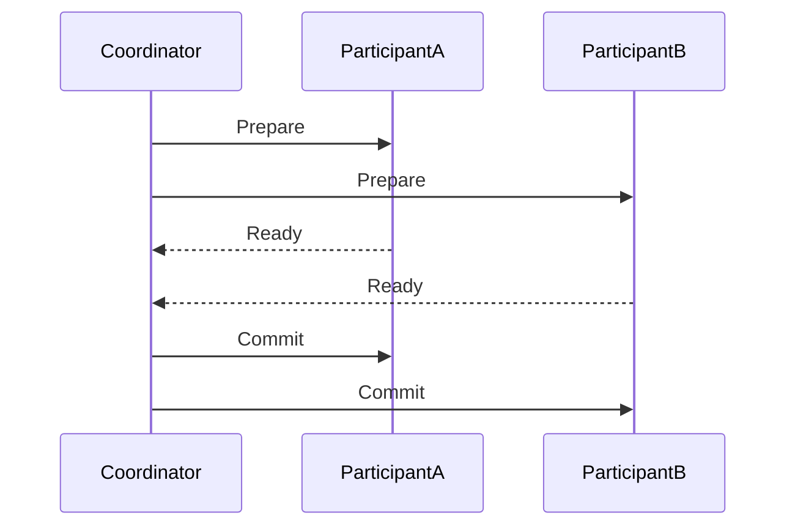
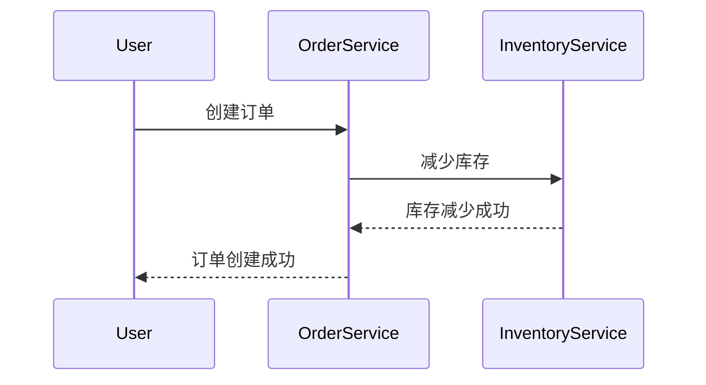

# 分布式事务

在现代分布式系统中，数据通常存储在不同的服务器或数据库中。为了确保数据的一致性和完整性，我们需要一种机制来管理跨多个节点的操作。这就是**分布式事务**的用武之地。

## 什么是分布式事务？

分布式事务是指跨越多个数据库或服务的事务操作。与单机事务不同，分布式事务需要协调多个独立的资源管理器（如数据库、消息队列等），以确保所有操作要么全部成功，要么全部失败。

:::note
**事务的 ACID 属性**：  
- **原子性（Atomicity）**：事务中的所有操作要么全部成功，要么全部失败。  
- **一致性（Consistency）**：事务执行前后，系统状态保持一致。  
- **隔离性（Isolation）**：事务的执行不受其他事务干扰。  
- **持久性（Durability）**：事务一旦提交，其结果永久保存。
:::

在分布式环境中，实现 ACID 属性更具挑战性，因为数据分布在不同的节点上，网络延迟和故障可能导致事务失败。

## 分布式事务的实现方式

### 两阶段提交（2PC）

两阶段提交（2PC）是一种经典的分布式事务协议，分为两个阶段：

1. **准备阶段**：协调者向所有参与者发送准备请求，参与者执行事务但不提交，并返回是否准备好。
2. **提交阶段**：如果所有参与者都准备好，协调者发送提交请求；否则，发送回滚请求。



:::caution
**2PC 的缺点**：  
- **性能问题**：需要多次网络通信，延迟较高。  
- **单点故障**：协调者故障可能导致整个系统阻塞。  
- **数据不一致**：在提交阶段，如果部分参与者失败，可能导致数据不一致。
:::

### 三阶段提交（3PC）

三阶段提交（3PC）是对 2PC 的改进，增加了**预提交阶段**，以减少阻塞时间。然而，3PC 仍然无法完全解决单点故障问题。

### 分布式事务的替代方案

由于 2PC 和 3PC 的局限性，许多分布式系统采用了**最终一致性**模型，通过补偿事务（如 Saga 模式）来实现分布式事务。

## 实际案例：电商系统中的分布式事务

假设我们有一个电商系统，用户下单时需要同时更新库存和创建订单。这两个操作可能分布在不同的服务中：

1. **库存服务**：减少商品库存。
2. **订单服务**：创建订单记录。

如果库存减少成功但订单创建失败，系统需要回滚库存操作。这时可以使用 Saga 模式：



如果订单创建失败，OrderService 会向 InventoryService 发送补偿请求，恢复库存。

## 代码示例：使用 Spring Cloud 实现分布式事务

以下是一个简单的 Spring Cloud 示例，展示如何使用 Saga 模式实现分布式事务。

```java
// OrderService.java
@Service
public class OrderService {
    @Autowired
    private InventoryServiceClient inventoryServiceClient;

    @Transactional
    public void createOrder(Order order) {
        // 创建订单
        saveOrder(order);
        // 调用库存服务减少库存
        inventoryServiceClient.reduceInventory(order.getProductId(), order.getQuantity());
    }

    @Transactional
    public void cancelOrder(Order order) {
        // 取消订单
        deleteOrder(order);
        // 调用库存服务恢复库存
        inventoryServiceClient.restoreInventory(order.getProductId(), order.getQuantity());
    }
}
```

```java
// InventoryServiceClient.java
@FeignClient(name = "inventory-service")
public interface InventoryServiceClient {
    @PostMapping("/inventory/reduce")
    void reduceInventory(@RequestParam String productId, @RequestParam int quantity);

    @PostMapping("/inventory/restore")
    void restoreInventory(@RequestParam String productId, @RequestParam int quantity);
}
```

:::tip
**提示**：在实际应用中，可以使用消息队列（如 Kafka 或 RabbitMQ）来实现异步补偿，提高系统的可靠性。
:::

## 总结

分布式事务是分布式系统中的关键概念，用于确保跨多个节点的操作一致性。尽管两阶段提交和三阶段提交是经典的解决方案，但它们存在性能问题和单点故障风险。现代分布式系统更倾向于使用最终一致性和补偿事务（如 Saga 模式）来实现分布式事务。

## 附加资源与练习

- **资源**：  
  - [分布式系统：概念与设计](https://example.com)  
  - [Spring Cloud 官方文档](https://spring.io/projects/spring-cloud)  

- **练习**：  
  1. 实现一个简单的 Saga 模式，模拟电商系统中的订单创建和库存更新。  
  2. 使用消息队列（如 Kafka）实现异步补偿机制。