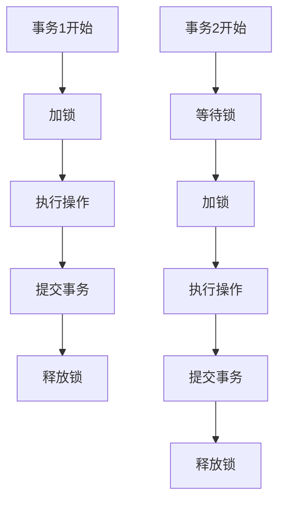

# 并发控制概述

在现代数据库系统中，多个用户或应用程序可能同时访问和修改数据。为了确保数据的一致性和完整性，数据库管理系统（DBMS）需要一种机制来管理这些并发操作。这种机制被称为**并发控制**。

## 什么是并发控制？

并发控制是数据库管理系统中的一种技术，用于确保多个事务同时执行时，数据库的一致性得以保持。如果没有并发控制，可能会出现以下问题：

1. **脏读（Dirty Read）**：一个事务读取了另一个未提交事务的数据。
2. **不可重复读（Non-repeatable Read）**：一个事务两次读取同一数据，但结果不同。
3. **幻读（Phantom Read）**：一个事务两次执行相同的查询，但返回的结果集不同。

## 并发控制的基本概念

### 1. 事务（Transaction）
事务是数据库操作的基本单位，它包含一系列操作，这些操作要么全部成功，要么全部失败。事务具有以下四个特性（ACID）：

- **原子性（Atomicity）**：事务中的所有操作要么全部完成，要么全部不完成。
- **一致性（Consistency）**：事务执行前后，数据库的状态必须保持一致。
- **隔离性（Isolation）**：多个事务并发执行时，一个事务的执行不应影响其他事务。
- **持久性（Durability）**：一旦事务提交，其结果将永久保存在数据库中。

### 2. 锁（Locking）
锁是并发控制中最常用的机制之一。通过锁，数据库可以控制对数据的访问权限。常见的锁类型包括：

- **共享锁（Shared Lock）**：允许多个事务同时读取同一数据，但不允许写入。
- **排他锁（Exclusive Lock）**：只允许一个事务读取或写入数据，其他事务无法访问。

### 3. 时间戳（Timestamp）
时间戳是另一种并发控制机制，它为每个事务分配一个唯一的时间戳，并根据时间戳来决定事务的执行顺序。时间戳机制可以避免死锁，但可能会导致事务回滚。

### 4. 多版本并发控制（MVCC）
多版本并发控制是一种高级并发控制机制，它允许多个事务同时读取同一数据的不同版本。MVCC通过维护数据的多个版本来实现高并发性和一致性。

## 并发控制的实际应用

### 案例：银行转账
假设有两个用户A和B，他们同时从同一个账户中取款。如果没有并发控制，可能会导致账户余额不正确。

```sql
-- 事务1：用户A取款100元
BEGIN TRANSACTION;
UPDATE accounts SET balance = balance - 100 WHERE account_id = 1;
COMMIT;

-- 事务2：用户B取款100元
BEGIN TRANSACTION;
UPDATE accounts SET balance = balance - 100 WHERE account_id = 1;
COMMIT;
```

如果事务1和事务2同时执行，可能会导致账户余额减少200元，而不是预期的100元。通过使用锁机制，可以确保事务1和事务2依次执行，从而避免数据不一致。

## 并发控制的实现

### 1. 悲观并发控制
悲观并发控制假设事务之间会发生冲突，因此在事务开始时就会加锁，直到事务结束才释放锁。这种方法适用于冲突频繁的场景。

### 2. 乐观并发控制
乐观并发控制假设事务之间很少发生冲突，因此在事务提交时才会检查冲突。如果发现冲突，事务会回滚并重试。这种方法适用于冲突较少的场景。

## 总结

并发控制是数据库管理系统中至关重要的技术，它确保了多个事务同时执行时数据的一致性和完整性。通过锁、时间戳、多版本并发控制等机制，数据库可以有效管理并发操作，避免数据不一致的问题。

:::tip
在实际应用中，选择合适的并发控制机制非常重要。悲观并发控制适用于冲突频繁的场景，而乐观并发控制则适用于冲突较少的场景。
:::

## 附加资源与练习

1. **练习**：尝试在一个简单的数据库系统中实现悲观并发控制和乐观并发控制，并比较它们的性能。
2. **资源**：阅读更多关于数据库事务和并发控制的书籍或在线教程，深入理解其原理和应用。



通过以上内容，你应该对并发控制有了初步的了解。继续深入学习并发控制的高级主题，如死锁检测与预防、隔离级别等，将有助于你更好地管理数据库中的并发操作。