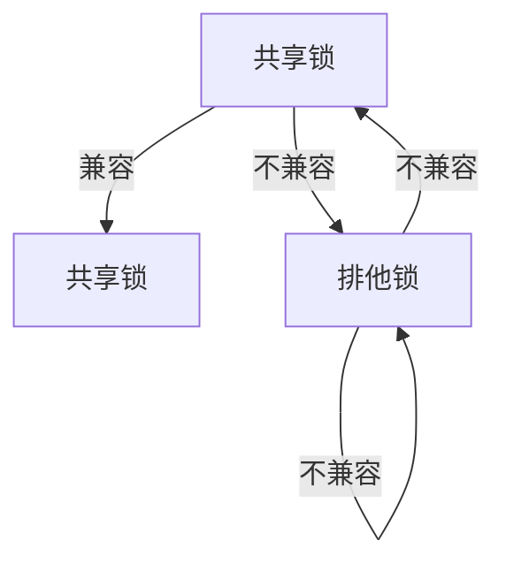

# 锁机制详解

在数据库系统中，**锁机制**是实现并发控制的核心技术之一。它用于管理多个事务对共享资源的访问，确保数据的一致性和事务的隔离性。本文将详细介绍锁机制的工作原理、类型及其在实际中的应用。

## 什么是锁机制？

锁机制是一种用于控制多个事务对同一资源进行访问的技术。当一个事务需要访问某个资源（如表、行或列）时，它可以请求对该资源加锁。如果锁被授予，其他事务必须等待，直到锁被释放。通过这种方式，锁机制可以防止多个事务同时修改同一数据，从而避免数据不一致的问题。

## 锁的类型

锁机制主要分为两种类型：**共享锁（Shared Lock）** 和 **排他锁（Exclusive Lock）**。

### 共享锁（S Lock）

共享锁允许多个事务同时读取同一资源，但不允许任何事务修改该资源。共享锁通常用于读取操作。

```sql
-- 示例：获取共享锁
SELECT * FROM employees WHERE id = 1 LOCK IN SHARE MODE;
```

### 排他锁（X Lock）

排他锁只允许一个事务独占访问资源，其他事务既不能读取也不能修改该资源。排他锁通常用于写入操作。

```sql
-- 示例：获取排他锁
SELECT * FROM employees WHERE id = 1 FOR UPDATE;
```

## 锁的粒度

锁的粒度指的是锁定的资源范围。常见的锁粒度包括：

- **表级锁**：锁定整个表。
- **页级锁**：锁定表中的一页（通常是多个行）。
- **行级锁**：锁定表中的单行。

:::tip
行级锁提供了更高的并发性，但也会增加锁管理的开销。表级锁虽然管理简单，但会降低并发性。
:::

## 锁的兼容性

锁的兼容性指的是不同锁类型之间是否可以共存。以下是共享锁和排他锁的兼容性矩阵：



## 实际案例

假设我们有一个银行系统，两个事务同时尝试从同一个账户中取款。如果没有锁机制，可能会导致账户余额不一致的问题。

### 场景描述

- **事务A**：从账户中取款100元。
- **事务B**：从账户中取款50元。

### 使用锁机制

```sql
-- 事务A
BEGIN;
SELECT balance FROM accounts WHERE id = 1 FOR UPDATE;
UPDATE accounts SET balance = balance - 100 WHERE id = 1;
COMMIT;

-- 事务B
BEGIN;
SELECT balance FROM accounts WHERE id = 1 FOR UPDATE;
UPDATE accounts SET balance = balance - 50 WHERE id = 1;
COMMIT;
```

通过使用排他锁，事务A和事务B将依次执行，确保账户余额的正确性。

## 总结

锁机制是数据库并发控制的核心技术，通过合理使用共享锁和排他锁，可以确保数据的一致性和事务的隔离性。理解锁的类型、粒度及其兼容性，对于设计高效、可靠的数据库系统至关重要。

## 附加资源

- [数据库并发控制](https://en.wikipedia.org/wiki/Concurrency_control)
- [锁机制深入解析](https://www.geeksforgeeks.org/locking-in-dbms/)

## 练习

1. 解释共享锁和排他锁的区别。
2. 设计一个场景，展示如何使用锁机制避免数据不一致。
3. 讨论锁粒度对数据库性能的影响。

通过本文的学习，你应该对锁机制有了更深入的理解。继续探索和实践，你将能够更好地应用锁机制解决实际问题。