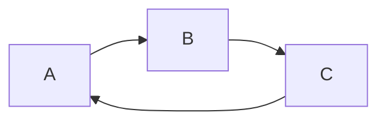

# 死锁检测与预防

在数据库系统中，**死锁**是一个常见的问题，特别是在多个事务并发执行时。死锁会导致事务无法继续执行，从而影响系统的性能和可靠性。本文将详细介绍死锁的概念、检测方法以及预防策略，帮助你更好地理解并解决这一问题。

## 什么是死锁？

死锁是指两个或多个事务在执行过程中，因争夺资源而造成的一种互相等待的现象，导致这些事务都无法继续执行。简单来说，就是事务A持有资源X并等待资源Y，而事务B持有资源Y并等待资源X，两者都无法继续执行。

### 死锁的四个必要条件

1. **互斥条件**：资源一次只能被一个事务占用。
2. **占有并等待**：事务持有至少一个资源，并等待获取其他被占用的资源。
3. **非抢占条件**：已分配给事务的资源不能被其他事务强行抢占，必须由事务自行释放。
4. **循环等待条件**：存在一个事务等待的循环链，每个事务都在等待下一个事务所占用的资源。

## 死锁检测

### 等待图（Wait-for Graph）

数据库系统通常使用**等待图**来检测死锁。等待图是一个有向图，其中节点表示事务，边表示事务之间的等待关系。如果等待图中存在环，则说明系统中存在死锁。



在上图中，事务A等待事务B，事务B等待事务C，事务C又等待事务A，形成了一个循环等待链，因此存在死锁。

### 死锁检测算法

数据库系统会定期运行死锁检测算法，检查等待图中是否存在环。如果检测到死锁，系统会选择其中一个事务作为“牺牲者”，将其回滚以打破死锁。

## 死锁预防

为了避免死锁的发生，可以采取以下预防策略：

### 1. 资源排序法

为所有资源定义一个全局的顺序，要求事务按照这个顺序请求资源。这样可以避免循环等待条件的发生。

**示例：**

假设有两个资源X和Y，规定所有事务必须先请求X，再请求Y。

```sql
-- 事务A
BEGIN;
LOCK X;
LOCK Y;
-- 执行操作
COMMIT;

-- 事务B
BEGIN;
LOCK X;
LOCK Y;
-- 执行操作
COMMIT;
```

### 2. 超时机制

为每个事务设置一个超时时间，如果事务在超时时间内未能获取所需的资源，则自动回滚并释放已占用的资源。

**示例：**

```sql
SET LOCK_TIMEOUT 5000; -- 设置锁超时时间为5秒
BEGIN;
LOCK X;
-- 如果5秒内无法获取Y，事务将回滚
LOCK Y;
-- 执行操作
COMMIT;
```

### 3. 死锁检测与恢复

允许死锁发生，但通过定期检测并回滚其中一个事务来恢复系统。

**示例：**

```sql
-- 假设系统检测到死锁并选择回滚事务A
ROLLBACK TRANSACTION A;
```

## 实际案例

假设有一个银行系统，两个用户A和B同时进行转账操作：

1. 用户A从账户1向账户2转账。
2. 用户B从账户2向账户1转账。

如果两个事务同时执行，可能会发生以下情况：

- 事务A锁定了账户1，并等待锁定账户2。
- 事务B锁定了账户2，并等待锁定账户1。

这样就形成了一个死锁。

**解决方案：**

使用资源排序法，规定所有事务必须先锁定账户1，再锁定账户2。

```sql
-- 事务A
BEGIN;
LOCK ACCOUNT 1;
LOCK ACCOUNT 2;
-- 执行转账操作
COMMIT;

-- 事务B
BEGIN;
LOCK ACCOUNT 1;
LOCK ACCOUNT 2;
-- 执行转账操作
COMMIT;
```

## 总结

死锁是数据库系统中一个常见的问题，但通过合理的检测和预防策略，可以有效地避免或解决死锁问题。理解死锁的四个必要条件以及掌握死锁检测和预防的方法，对于设计和维护高效的数据库系统至关重要。

## 附加资源与练习

- **练习1**：尝试在一个简单的数据库中模拟死锁，并使用等待图检测死锁。
- **练习2**：设计一个资源排序策略，确保事务按照固定的顺序请求资源，避免死锁。
- **附加资源**：阅读更多关于数据库并发控制的书籍或文章，深入了解死锁的其他预防和恢复策略。

通过不断实践和学习，你将能够更好地应对数据库中的并发问题，确保系统的高效运行。