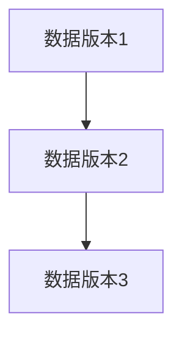

# 多版本并发控制 (MVCC)

## 介绍

多版本并发控制（Multi-Version Concurrency Control，简称 MVCC）是一种用于管理数据库并发操作的机制。它允许多个事务同时读取和写入数据库，而不会相互阻塞。MVCC 通过为每个事务提供数据的“快照”来实现这一点，从而避免了传统锁机制中的许多问题，如死锁和读写冲突。

MVCC 的核心思想是为每个事务提供一个独立的数据视图，使得事务在读取数据时不会受到其他事务写入操作的影响。这种机制在现代数据库系统中得到了广泛应用，如 PostgreSQL、MySQL（InnoDB 引擎）和 Oracle。

## MVCC 的工作原理

### 数据版本化

在 MVCC 中，每次对数据进行修改时，数据库不会直接覆盖旧数据，而是创建一个新的版本。每个版本都会有一个时间戳或事务 ID，用于标识该版本的创建时间。



### 事务快照

当一个事务开始时，数据库会为该事务创建一个“快照”，即该事务可以看到的所有数据版本。这个快照是基于事务开始时的数据库状态生成的。事务在读取数据时，只能看到在其开始之前已经提交的数据版本。

### 并发控制

MVCC 通过以下方式实现并发控制：

1. **读操作**：事务在读取数据时，只能看到在其开始之前已经提交的数据版本。这样可以避免读取到未提交的或已被其他事务修改的数据。
2. **写操作**：事务在写入数据时，会创建一个新的数据版本，而不是直接覆盖旧数据。这样可以避免写操作阻塞读操作。

## 实际案例

假设我们有一个简单的银行账户表 `accounts`，其中包含以下数据：

| id | name  | balance |
|----|-------|---------|
| 1  | Alice | 1000    |
| 2  | Bob   | 500     |

### 场景 1：并发读取

事务 A 和事务 B 同时开始，事务 A 读取 `Alice` 的余额，事务 B 也读取 `Alice` 的余额。由于 MVCC 的存在，事务 A 和事务 B 都会看到 `Alice` 的余额为 1000，即使事务 B 在事务 A 之后开始。

### 场景 2：并发写入

事务 A 开始并读取 `Alice` 的余额为 1000，然后事务 B 开始并更新 `Alice` 的余额为 1500。事务 A 再次读取 `Alice` 的余额时，仍然会看到 1000，因为事务 A 只能看到在其开始之前已经提交的数据版本。

## 代码示例

以下是一个简单的 SQL 示例，展示了 MVCC 的行为：

```sql
-- 事务 A
BEGIN;
SELECT balance FROM accounts WHERE name = 'Alice'; -- 返回 1000

-- 事务 B
BEGIN;
UPDATE accounts SET balance = 1500 WHERE name = 'Alice';
COMMIT;

-- 事务 A
SELECT balance FROM accounts WHERE name = 'Alice'; -- 仍然返回 1000
COMMIT;
```

:::note
注意：在事务 A 提交之前，它看到的 `Alice` 的余额始终是 1000，即使事务 B 已经更新了余额。
:::

## 总结

多版本并发控制 (MVCC) 是一种高效的并发控制机制，它通过为每个事务提供独立的数据视图来避免读写冲突和死锁。MVCC 在现代数据库系统中得到了广泛应用，能够显著提高数据库的并发性能。

## 附加资源

- [PostgreSQL MVCC 文档](https://www.postgresql.org/docs/current/mvcc.html)
- [MySQL InnoDB MVCC 文档](https://dev.mysql.com/doc/refman/8.0/en/innodb-multi-versioning.html)

## 练习

1. 在一个支持 MVCC 的数据库中，创建两个并发事务，分别进行读取和写入操作，观察 MVCC 的行为。
2. 研究你使用的数据库系统（如 PostgreSQL 或 MySQL）的 MVCC 实现细节，并尝试解释其工作原理。
