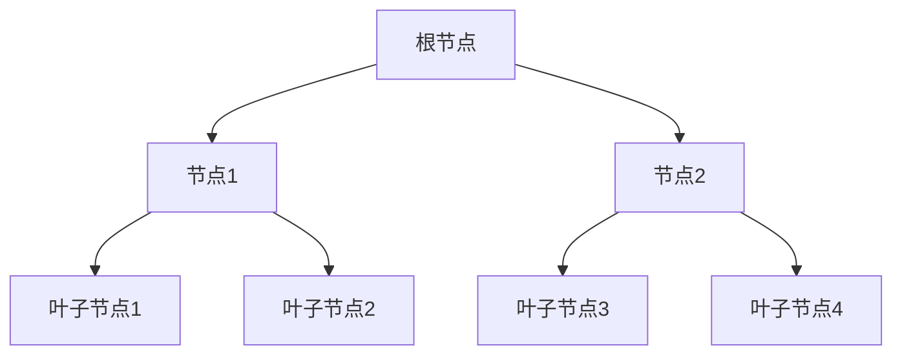

## 介绍

在数据库中，索引是一种用于加速数据检索的数据结构。想象一下，如果你需要在一本没有目录的书中查找某个特定的章节，你可能需要逐页翻阅。而有了目录（即索引），你可以快速定位到目标章节。数据库索引的作用与此类似，它通过创建额外的数据结构，帮助数据库系统更快地找到所需的数据。

索引通常基于表中的某一列或多列创建，这些列被称为“索引键”。通过索引，数据库可以避免全表扫描，从而显著提高查询性能。

## 索引的工作原理

索引的核心思想是通过某种数据结构（如B树、哈希表等）来存储索引键的值及其对应的数据位置。当执行查询时，数据库会首先在索引中查找目标值，然后根据索引中的位置信息快速定位到实际数据。

### 示例：B树索引

B树（Balanced Tree）是一种常见的索引数据结构。它的特点是每个节点可以有多个子节点，且所有叶子节点都在同一层。这种结构使得B树在查找、插入和删除操作中都能保持较高的效率。



在上图中，根节点包含两个子节点（节点1和节点2），每个子节点又包含两个叶子节点。通过这种层次结构，B树可以在对数时间内完成查找操作。

## 索引的类型

数据库中有多种类型的索引，每种索引适用于不同的场景。以下是一些常见的索引类型：

1. **单列索引**：基于表中的单个列创建的索引。
2. **复合索引**：基于表中的多个列创建的索引。
3. **唯一索引**：确保索引键的值在表中是唯一的。
4. **全文索引**：用于加速文本数据的搜索。
5. **哈希索引**：基于哈希表实现的索引，适用于等值查询。

### 示例：创建单列索引

假设我们有一个名为 `users` 的表，其中包含 `id`、`name` 和 `email` 列。我们可以为 `email` 列创建一个单列索引：

```sql
CREATE INDEX idx_email ON users(email);
```

创建索引后，查询 `email` 列的速度将显著提高。

## 索引的实际应用场景

### 场景1：加速查询

假设我们需要从 `users` 表中查找 `email` 为 `user@example.com` 的用户。如果没有索引，数据库需要扫描整个表来找到匹配的记录。而有了索引，数据库可以直接定位到目标记录。

```sql
SELECT * FROM users WHERE email = 'user@example.com';
```

### 场景2：排序和分组

索引还可以加速排序和分组操作。例如，如果我们想按 `name` 列对 `users` 表进行排序，可以为 `name` 列创建索引：

```sql
CREATE INDEX idx_name ON users(name);
```

然后执行排序查询：

```sql
SELECT * FROM users ORDER BY name;
```

## 索引的优缺点

### 优点

- **加速查询**：索引可以显著提高查询速度，尤其是在大数据量的情况下。
- **优化排序和分组**：索引可以加速排序和分组操作。
- **唯一性约束**：唯一索引可以确保数据的唯一性。

### 缺点

- **占用存储空间**：索引需要额外的存储空间。
- **影响写操作性能**：每次插入、更新或删除数据时，索引也需要更新，这可能会影响写操作的性能。

:::caution
过度使用索引可能会导致性能问题。因此，在创建索引时，需要权衡查询性能和写操作性能。
:::

## 总结

索引是数据库优化的重要工具，它通过创建额外的数据结构来加速数据检索。了解索引的基本概念、工作原理以及实际应用场景，对于优化数据库性能至关重要。在实际使用中，应根据具体需求选择合适的索引类型，并注意索引的优缺点。

## 附加资源

- [数据库索引深入理解](https://example.com/database-indexes)
- [SQL索引优化指南](https://example.com/sql-index-optimization)

## 练习

1. 为 `users` 表的 `id` 列创建一个唯一索引。
2. 编写一个查询，使用索引加速查找 `name` 为 `John` 的用户。
3. 讨论在什么情况下应该避免使用索引。