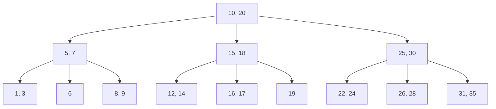
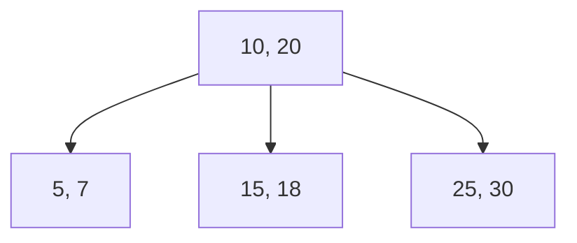
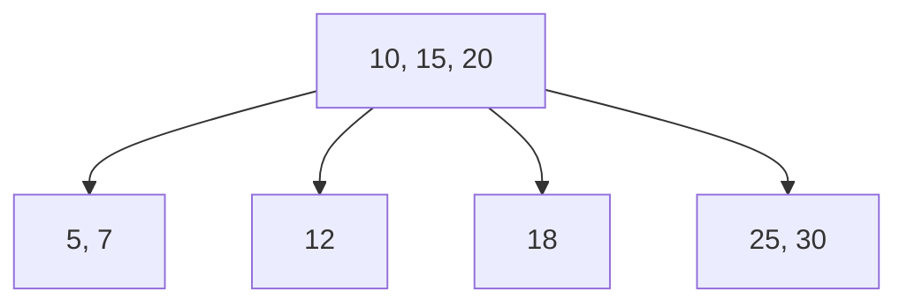

# B树索引结构

在数据库中，索引是一种用于加速数据检索的数据结构。B树（B-Tree）是一种常见的索引结构，广泛应用于数据库管理系统（DBMS）中。它能够高效地支持数据的插入、删除和查找操作，特别适合处理大量数据的场景。

## 什么是B树？

B树是一种自平衡的树形数据结构，它保持数据有序，并且允许在对数时间内进行搜索、插入和删除操作。B树的每个节点可以包含多个键和子节点，这使得它能够有效地减少树的深度，从而提高查询效率。

### B树的基本特性

- **平衡性**：B树的所有叶子节点都位于同一层，确保树的高度平衡。
- **多路分支**：每个节点可以有多个子节点，通常称为“阶数”（order）。
- **有序性**：节点中的键按升序排列，便于快速查找。

## B树的结构

B树的每个节点包含以下内容：

- 一组键（keys）：用于存储数据的关键字。
- 一组子节点（children）：指向子节点的指针。

B树的阶数（m）决定了每个节点最多可以包含的键的数量。一个m阶的B树满足以下条件：

1. 每个节点最多有m个子节点。
2. 每个非叶子节点（除根节点外）至少有⌈m/2⌉个子节点。
3. 根节点至少有2个子节点（除非它是叶子节点）。
4. 所有叶子节点位于同一层。

### B树的示例

以下是一个3阶B树的示例：



在这个示例中，根节点包含两个键（10和20），并且有三个子节点。每个子节点也包含多个键和子节点，最终所有叶子节点位于同一层。

## B树的插入操作

B树的插入操作需要保持树的平衡性。插入新键时，可能会发生节点的分裂。以下是插入操作的步骤：

1. **查找插入位置**：从根节点开始，递归地查找合适的叶子节点。
2. **插入键**：将新键插入到叶子节点中。
3. **检查节点是否溢出**：如果节点中的键数量超过了最大限制（m-1），则需要进行分裂。
4. **分裂节点**：将节点分成两个部分，并将中间的键提升到父节点。
5. **递归处理**：如果父节点也溢出，则继续分裂，直到根节点。

### 插入操作示例

假设我们有一个3阶B树，初始状态如下：



现在，我们插入键`12`：

1. 查找插入位置，发现`12`应该插入到`C`节点。
2. 插入`12`后，`C`节点变为`[12, 15, 18]`。
3. 由于`C`节点的键数量超过了最大限制（2），需要进行分裂。
4. 将`C`节点分裂为`[12]`和`[18]`，并将`15`提升到父节点`A`。
5. 最终，B树的结构如下：



## B树的查询操作

B树的查询操作非常高效，时间复杂度为O(log n)。查询过程如下：

1. **从根节点开始**：比较查询键与节点中的键。
2. **递归查找**：根据比较结果，选择适当的子节点继续查找，直到找到目标键或到达叶子节点。

### 查询操作示例

假设我们要在以下B树中查找键`18`：


1. 从根节点`A`开始，比较`18`与`10`、`15`、`20`。
2. 发现`15 < 18 < 20`，选择子节点`D`。
3. 在`D`节点中找到`18`，查询成功。

## B树在数据库中的应用

B树广泛应用于数据库索引中，特别是在关系型数据库（如MySQL、PostgreSQL）中。B树索引能够高效地支持范围查询、等值查询和排序操作。

### 实际案例：数据库索引

假设我们有一个包含百万条记录的用户表，其中`user_id`是主键。为了加速基于`user_id`的查询，数据库会在`user_id`列上创建B树索引。当执行以下查询时：

```sql
SELECT * FROM users WHERE user_id = 12345;
```

数据库会使用B树索引快速定位到`user_id = 12345`的记录，而不需要扫描整个表。

## 总结

B树是一种高效的自平衡树形数据结构，广泛应用于数据库索引中。它能够在对数时间内完成数据的插入、删除和查找操作，特别适合处理大量数据的场景。通过理解B树的结构和操作，你可以更好地掌握数据库索引的工作原理，并优化数据库查询性能。

## 附加资源与练习

- **练习**：尝试手动构建一个3阶B树，并插入一系列键（如`5, 10, 15, 20, 25, 30`），观察树的结构变化。
- **资源**：
  - [B树与B+树的区别](https://en.wikipedia.org/wiki/B%2B_tree)
  - [数据库索引优化指南](https://use-the-index-luke.com/)

通过实践和深入学习，你将能够更好地理解和应用B树索引结构。