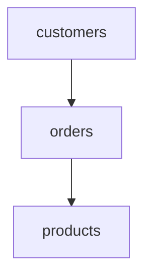

# 连接顺序优化

在数据库查询优化中，**连接顺序优化**是一个关键概念。它指的是在多个表进行连接时，通过调整表的连接顺序来减少查询的执行时间和资源消耗。对于初学者来说，理解这一概念可以帮助你编写更高效的 SQL 查询。

## 什么是连接顺序优化？

在 SQL 查询中，当我们需要从多个表中获取数据时，通常会使用 `JOIN` 操作。数据库管理系统（DBMS）在执行这些连接操作时，会按照一定的顺序依次连接表。连接顺序的选择会直接影响查询的性能。

例如，假设我们有三个表：`A`、`B` 和 `C`。我们可以选择先连接 `A` 和 `B`，然后再连接 `C`，或者先连接 `B` 和 `C`，然后再连接 `A`。不同的连接顺序可能会导致不同的执行计划，进而影响查询的性能。

## 为什么连接顺序重要？

连接顺序的重要性主要体现在以下几个方面：

1. **减少中间结果集的大小**：通过合理的连接顺序，可以尽量减少中间结果集的大小，从而减少后续连接操作的计算量。
2. **利用索引**：某些连接顺序可能更有利于利用索引，从而加快查询速度。
3. **减少磁盘 I/O**：通过优化连接顺序，可以减少磁盘 I/O 操作，提升查询效率。

## 连接顺序优化的基本原则

在进行连接顺序优化时，通常遵循以下原则：

1. **小表优先**：尽量先连接较小的表，因为较小的表生成的中间结果集也较小，可以减少后续连接的计算量。
2. **高选择性优先**：优先连接具有高选择性的表（即过滤条件能够显著减少结果集的表），这样可以快速减少中间结果集的大小。
3. **利用索引**：优先连接那些能够利用索引的表，以加快连接速度。

## 实际案例

假设我们有以下三个表：

- `orders`：存储订单信息，包含 `order_id`、`customer_id` 和 `order_date` 等字段。
- `customers`：存储客户信息，包含 `customer_id`、`name` 和 `email` 等字段。
- `products`：存储产品信息，包含 `product_id`、`name` 和 `price` 等字段。

我们需要查询某个客户的所有订单及其对应的产品信息。假设 `customers` 表中有 1000 条记录，`orders` 表中有 10000 条记录，`products` 表中有 500 条记录。

### 查询示例

```sql
SELECT c.name, o.order_id, p.name AS product_name
FROM customers c
JOIN orders o ON c.customer_id = o.customer_id
JOIN products p ON o.product_id = p.product_id
WHERE c.customer_id = 123;
```

在这个查询中，我们首先连接 `customers` 和 `orders`，然后再连接 `products`。由于 `customers` 表较小且具有高选择性（通过 `customer_id` 过滤），这种连接顺序是合理的。

### 连接顺序优化

如果我们改变连接顺序，先连接 `orders` 和 `products`，然后再连接 `customers`，可能会导致中间结果集过大，从而影响查询性能。

```sql
SELECT c.name, o.order_id, p.name AS product_name
FROM orders o
JOIN products p ON o.product_id = p.product_id
JOIN customers c ON o.customer_id = c.customer_id
WHERE c.customer_id = 123;
```

在这种情况下，`orders` 和 `products` 的连接会生成一个较大的中间结果集，然后再与 `customers` 表连接，这可能会导致性能下降。

## 使用 Mermaid 图表展示连接顺序



在上面的图表中，我们首先连接 `customers` 和 `orders`，然后再连接 `products`。这种连接顺序是合理的，因为它遵循了小表优先和高选择性优先的原则。

## 总结

连接顺序优化是数据库查询优化中的一个重要环节。通过合理的连接顺序，我们可以显著提升查询性能，减少资源消耗。在实际应用中，我们应该根据表的大小、选择性以及索引情况来选择合适的连接顺序。

:::tip
在实际开发中，可以使用数据库的 `EXPLAIN` 命令来分析查询的执行计划，从而判断是否需要调整连接顺序。
:::

## 附加资源与练习

1. **练习**：尝试在你的数据库中编写一个多表连接查询，并使用 `EXPLAIN` 命令分析其执行计划。尝试调整连接顺序，观察执行计划的变化。
2. **进一步阅读**：
   - [SQL 查询优化指南](https://example.com/sql-optimization-guide)
   - [数据库索引与查询优化](https://example.com/database-indexing)

通过不断实践和学习，你将能够更好地掌握连接顺序优化的技巧，从而编写出更高效的 SQL 查询。