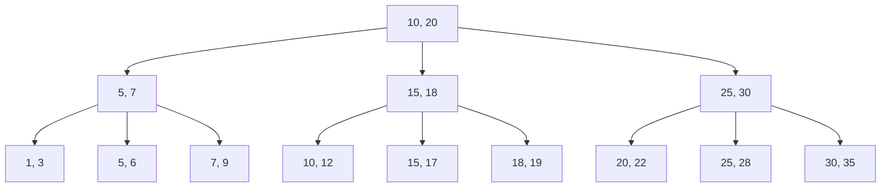

# B+树索引结构

## 介绍

B+树是一种自平衡的树数据结构，广泛用于数据库和文件系统中，作为索引结构来加速数据的查找、插入和删除操作。与普通的二叉树不同，B+树具有多个子节点，这使得它能够有效地处理大量数据，并且在磁盘存储中表现尤为出色。

B+树的主要特点包括：
- 所有数据都存储在叶子节点中，内部节点仅用于索引。
- 叶子节点通过指针连接，形成一个有序链表，便于范围查询。
- 树的高度较低，减少了磁盘 I/O 操作。

## B+树的结构

B+树由多个节点组成，每个节点包含多个键和指针。内部节点的键用于指引搜索路径，而叶子节点则存储实际的数据或指向数据的指针。

以下是一个简单的 B+树结构示意图：



在这个例子中，根节点 `A` 包含两个键 `10` 和 `20`，它将数据分为三个区间：小于 `10`、介于 `10` 和 `20` 之间、以及大于 `20`。每个区间对应一个子节点，子节点进一步细分数据。

## B+树的插入与删除

### 插入操作

当向 B+树中插入一个新键时，首先需要找到合适的叶子节点。如果叶子节点未满，则直接插入；如果叶子节点已满，则需要进行分裂操作。

例如，假设我们有一个 B+树，其叶子节点最多可容纳 3 个键。插入键 `8` 时，如果叶子节点 `[5, 7, 9]` 已满，则需要将其分裂为 `[5, 7]` 和 `[8, 9]`，并将中间键 `7` 提升到父节点。

### 删除操作

删除操作与插入操作类似。如果删除一个键后，叶子节点的键数量低于最小要求，则需要进行合并或重新分配操作。

例如，删除键 `7` 后，如果叶子节点 `[5, 8]` 的键数量低于最小值，则可能需要与相邻节点 `[9, 10]` 合并，形成 `[5, 8, 9, 10]`。

## B+树在数据库中的应用

B+树在数据库中主要用于索引结构。例如，MySQL 的 InnoDB 存储引擎使用 B+树作为其主键索引。通过 B+树索引，数据库可以快速定位到所需的数据，而不需要扫描整个表。

### 实际案例

假设我们有一个包含数百万条记录的用户表，其中 `user_id` 是主键。如果我们想要查找 `user_id = 12345` 的用户信息，数据库会使用 B+树索引快速定位到该记录，而不需要扫描整个表。

```sql
SELECT * FROM users WHERE user_id = 12345;
```

在这个查询中，B+树索引会从根节点开始，逐步向下查找，直到找到包含 `user_id = 12345` 的叶子节点，然后返回对应的用户信息。

## 总结

B+树是一种高效的索引结构，特别适用于需要频繁查找、插入和删除操作的场景。它的平衡性和多子节点特性使得它在处理大量数据时表现出色，尤其是在磁盘存储中。

通过理解 B+树的结构和操作，你可以更好地理解数据库索引的工作原理，并能够优化数据库查询性能。

## 附加资源与练习

- **练习 1**：尝试手动构建一个 B+树，并模拟插入和删除操作。
- **练习 2**：在 MySQL 中创建一个包含 B+树索引的表，并观察查询性能。
- **资源**：阅读《数据库系统概念》一书，深入了解 B+树及其在数据库中的应用。

:::tip
在实际应用中，B+树的节点大小通常与磁盘块大小相匹配，以减少磁盘 I/O 操作。这也是 B+树在数据库索引中表现优异的重要原因之一。
:::