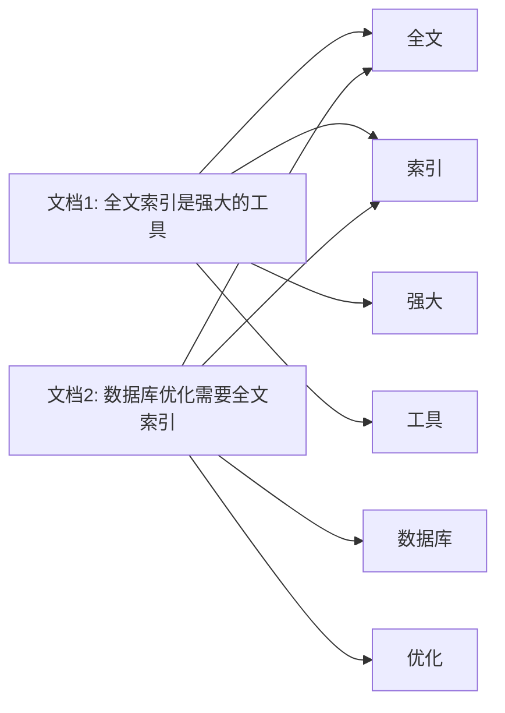

# 全文索引方法

## 介绍

全文索引（Full-Text Index）是一种用于加速文本数据搜索的数据库索引技术。与传统的索引方法不同，全文索引不仅支持精确匹配，还支持模糊搜索、关键词搜索和自然语言查询。它广泛应用于搜索引擎、内容管理系统和数据分析等领域。

在数据库中，全文索引通过对文本内容进行分词、建立倒排索引等方式，快速定位包含特定关键词的文档或记录。这使得全文索引在处理大量文本数据时，能够显著提高查询效率。

## 全文索引的工作原理

全文索引的核心是**倒排索引**（Inverted Index）。倒排索引是一种将文档中的每个单词映射到包含该单词的文档列表的数据结构。以下是倒排索引的简单示例：



在这个例子中，单词“全文”映射到文档1和文档2，而单词“工具”只映射到文档1。通过这种方式，全文索引可以快速找到包含特定关键词的文档。

## 全文索引的创建与使用

### 创建全文索引

在大多数关系型数据库中，全文索引的创建非常简单。以下是一个在 MySQL 中创建全文索引的示例：

```sql
CREATE TABLE articles (
    id INT AUTO_INCREMENT PRIMARY KEY,
    title VARCHAR(255),
    content TEXT,
    FULLTEXT(title, content)
);
```

在这个示例中，我们为 `articles` 表的 `title` 和 `content` 列创建了一个全文索引。

### 使用全文索引进行查询

创建全文索引后，可以使用 `MATCH` 和 `AGAINST` 关键字进行全文搜索。以下是一个查询示例：

```sql
SELECT * FROM articles
WHERE MATCH(title, content) AGAINST('数据库优化');
```

这个查询将返回所有在 `title` 或 `content` 列中包含“数据库优化”关键词的记录。

:::note
全文索引的查询语法可能因数据库系统而异。请参考具体数据库的文档以了解更多细节。
:::

## 全文索引的实际应用

### 案例1：搜索引擎

全文索引最常见的应用场景是搜索引擎。例如，当你在 Google 上搜索“全文索引方法”时，搜索引擎会使用全文索引技术快速找到相关的网页。

### 案例2：内容管理系统

在内容管理系统（CMS）中，全文索引可以帮助用户快速找到包含特定关键词的文章或页面。例如，WordPress 使用全文索引来加速博客文章的搜索。

## 全文索引的优缺点

### 优点

1. **高效搜索**：全文索引可以快速定位包含特定关键词的文档。
2. **支持模糊搜索**：全文索引支持模糊匹配和自然语言查询。
3. **适用于大规模文本数据**：全文索引在处理大量文本数据时表现优异。

### 缺点

1. **存储开销**：全文索引需要额外的存储空间来存储倒排索引。
2. **更新开销**：当文本数据发生变化时，全文索引需要重新构建或更新，这可能会影响性能。
3. **复杂性**：全文索引的实现和维护相对复杂，尤其是在分布式系统中。

## 总结

全文索引是一种强大的工具，能够显著提高文本数据的搜索效率。通过倒排索引等技术，全文索引支持模糊搜索、关键词搜索和自然语言查询，广泛应用于搜索引擎、内容管理系统等领域。

尽管全文索引存在存储和更新开销，但其在提高查询性能方面的优势使其成为处理大规模文本数据的理想选择。

## 附加资源与练习

### 资源

- [MySQL 全文索引文档](https://dev.mysql.com/doc/refman/8.0/en/fulltext-search.html)
- [PostgreSQL 全文搜索文档](https://www.postgresql.org/docs/current/textsearch.html)

### 练习

1. 在你的数据库中创建一个包含全文索引的表，并插入一些文本数据。
2. 使用全文索引进行查询，尝试不同的关键词和搜索模式。
3. 比较使用全文索引和不使用全文索引的查询性能差异。

通过实践，你将更好地理解全文索引的工作原理及其在实际应用中的价值。