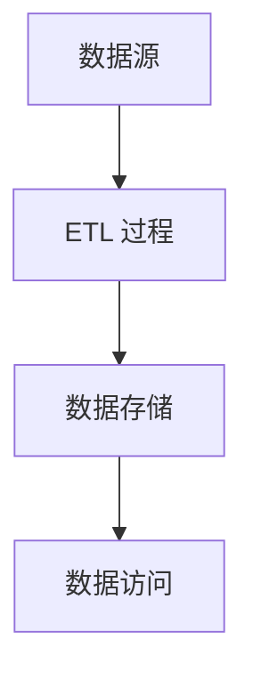

# 数据仓库概念

## 引言

数据仓库（Data Warehouse）是一个用于存储、管理和分析大量历史数据的系统。它通过集成来自不同数据源的数据，为企业提供统一的视图，支持决策制定和商业智能（Business Intelligence, BI）应用。数据仓库的核心目标是提供高效、一致且易于访问的数据，以便用户能够快速获取洞察并做出数据驱动的决策。

本文将逐步介绍数据仓库的基本概念、核心特点、架构设计以及实际应用场景，帮助初学者全面理解数据仓库的重要性。

---

## 什么是数据仓库？

数据仓库是一个面向主题的、集成的、非易失的、随时间变化的数据集合，用于支持管理决策。它通常用于存储历史数据，并通过复杂的查询和分析工具提供数据支持。

### 核心特点

1. **面向主题（Subject-Oriented）**  
   数据仓库围绕特定的业务主题（如销售、库存、客户等）组织数据，而不是围绕应用程序或功能。

2. **集成性（Integrated）**  
   数据仓库将来自不同数据源的数据进行整合，确保数据的一致性和标准化。

3. **非易失性（Non-Volatile）**  
   数据仓库中的数据一旦写入，通常不会被修改或删除，而是以只读方式存储，确保历史数据的完整性。

4. **随时间变化（Time-Variant）**  
   数据仓库中的数据通常包含时间维度，支持对历史数据的分析和趋势预测。

---

## 数据仓库的架构

数据仓库的典型架构包括以下几个主要组件：

1. **数据源（Data Sources）**  
   数据仓库的数据来自多个异构数据源，如关系数据库、文件、API 等。

2. **ETL 过程（Extract, Transform, Load）**  
   ETL 是数据仓库的核心过程，负责从数据源提取数据、进行转换（如清洗、标准化）并加载到数据仓库中。

3. **数据存储（Data Storage）**  
   数据仓库通常采用星型模式（Star Schema）或雪花模式（Snowflake Schema）来组织数据。

4. **数据访问（Data Access）**  
   用户通过查询工具、报表工具或商业智能工具访问数据仓库中的数据。

以下是一个简单的数据仓库架构图：

---

## 数据仓库的实际应用场景

### 案例：零售行业的数据仓库

假设一家零售公司希望分析其销售数据以优化库存管理。以下是数据仓库在该场景中的应用：

1. **数据源**  
   销售数据来自 POS 系统、在线商店和供应链管理系统。

2. **ETL 过程**  
   数据被提取、清洗并转换为统一的格式，例如将不同货币转换为标准货币。

3. **数据存储**  
   数据按照星型模式存储，中心表为销售事实表，周围是维度表（如时间、产品、客户等）。

4. **数据访问**  
   分析师使用商业智能工具生成销售趋势报告，帮助管理层做出库存优化决策。

---

## 总结

数据仓库是现代企业数据管理和分析的核心工具。它通过集成、存储和分析历史数据，为企业提供了强大的决策支持能力。通过本文的介绍，您应该对数据仓库的基本概念、架构和实际应用有了初步的了解。

---

## 附加资源与练习

### 资源
- [《数据仓库工具箱》](https://www.amazon.com/Data-Warehouse-Toolkit-Definitive-Dimensional/dp/1118530802) - 一本经典的数据仓库书籍。
- [Snowflake 数据仓库教程](https://docs.snowflake.com/en/user-guide.html) - 学习如何使用 Snowflake 构建数据仓库。

### 练习
1. 尝试设计一个简单的星型模式，包含一个事实表和三个维度表。
2. 使用 SQL 查询一个模拟的数据仓库，生成销售趋势报告。

:::tip
如果您对数据仓库的概念有任何疑问，欢迎在评论区留言，我们会尽快为您解答！
:::