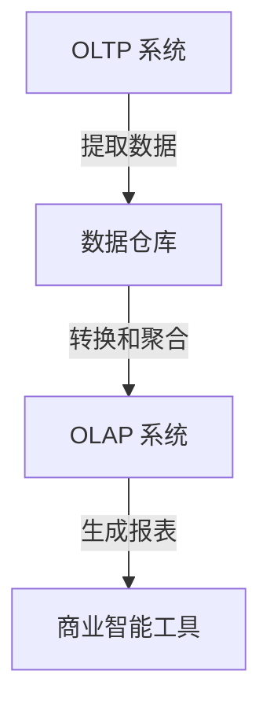

# OLTP vs OLAP

在数据仓库与商业智能领域，**OLTP**（在线事务处理）和**OLAP**（在线分析处理）是两种常见的数据处理系统。它们各自服务于不同的目的，理解它们的区别对于设计高效的数据系统至关重要。

## 什么是 OLTP？

**OLTP**（Online Transaction Processing）系统主要用于处理日常事务操作，例如银行交易、订单处理、库存管理等。这些系统通常需要快速响应，并且需要保证数据的一致性和完整性。

### OLTP 的特点
- **高并发**：支持大量用户同时操作。
- **快速响应**：事务处理通常在毫秒级别完成。
- **数据一致性**：通过 ACID（原子性、一致性、隔离性、持久性）事务保证数据完整性。
- **面向操作**：主要用于插入、更新和删除操作。

### OLTP 的实际应用
例如，一个电商网站的订单系统就是一个典型的 OLTP 系统。当用户下单时，系统需要快速处理订单信息，更新库存，并确保数据的一致性。

```sql
-- 示例：插入一条订单记录
INSERT INTO orders (order_id, customer_id, product_id, quantity, order_date)
VALUES (1001, 123, 456, 2, NOW());
```

## 什么是 OLAP？

**OLAP**（Online Analytical Processing）系统则用于复杂的数据分析和查询。OLAP 系统通常从 OLTP 系统中提取数据，经过转换和聚合后，用于生成报表、进行数据挖掘和趋势分析。

### OLAP 的特点
- **复杂查询**：支持多维度的数据分析。
- **批量处理**：通常处理大量历史数据。
- **数据聚合**：数据通常以聚合形式存储，便于快速查询。
- **面向分析**：主要用于查询和分析操作。

### OLAP 的实际应用
例如，一个零售公司可能使用 OLAP 系统来分析销售数据，生成年度销售报告，或者分析不同地区的销售趋势。

```sql
-- 示例：查询某产品的年度销售总额
SELECT product_id, SUM(quantity) AS total_sales
FROM sales
WHERE YEAR(order_date) = 2023
GROUP BY product_id;
```

## OLTP 与 OLAP 的区别

| 特性          | OLTP                          | OLAP                          |
|---------------|-------------------------------|-------------------------------|
| **目的**      | 处理日常事务                  | 支持复杂的数据分析            |
| **数据量**    | 处理少量但频繁的事务数据      | 处理大量历史数据              |
| **响应时间**  | 毫秒级别                      | 秒到分钟级别                  |
| **数据模型**  | 规范化（3NF）                 | 非规范化（星型或雪花模型）    |
| **操作类型**  | 插入、更新、删除              | 查询、聚合                    |



## OLTP 与 OLAP 的协同工作

在实际应用中，OLTP 和 OLAP 系统通常是协同工作的。OLTP 系统负责处理日常事务，而 OLAP 系统则从 OLTP 系统中提取数据，进行转换和聚合，最终用于生成报表和进行数据分析。

:::note
**注意**：OLTP 和 OLAP 系统通常不会直接交互。数据通常通过 ETL（提取、转换、加载）过程从 OLTP 系统导入到 OLAP 系统中。
:::

## 实际案例

### 案例 1：电商平台
- **OLTP**：处理用户订单、支付、库存更新等事务。
- **OLAP**：分析销售趋势、用户行为、库存周转率等。

### 案例 2：银行系统
- **OLTP**：处理存款、取款、转账等事务。
- **OLAP**：分析客户存款趋势、贷款违约率等。

## 总结

OLTP 和 OLAP 是两种不同的数据处理系统，各自服务于不同的目的。OLTP 系统主要用于处理日常事务，而 OLAP 系统则用于复杂的数据分析。理解它们的区别和协同工作方式，对于设计高效的数据系统至关重要。

## 附加资源与练习

- **资源**：
  - [《数据仓库工具箱》](https://www.amazon.com/Data-Warehouse-Toolkit-Definitive-Dimensional/dp/1118530802) - 一本关于数据仓库设计的经典书籍。
  - [SQL 教程](https://www.w3schools.com/sql/) - 学习 SQL 的基础知识。

- **练习**：
  1. 设计一个简单的 OLTP 数据库模型，包含用户、订单和产品表。
  2. 编写 SQL 查询，从 OLAP 系统中分析某产品的年度销售趋势。

通过本文的学习，你应该对 OLTP 和 OLAP 有了初步的了解。接下来，你可以尝试在实际项目中应用这些概念，进一步加深理解。