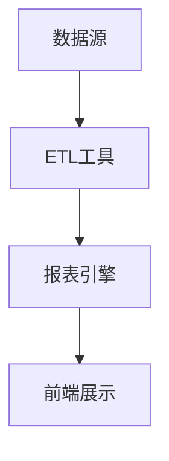

# 报表系统构建

在现代商业环境中，数据驱动的决策变得越来越重要。报表系统是商业智能（BI）的核心组成部分，它能够从数据仓库中提取数据，并将其转化为易于理解的报表和仪表盘。本文将逐步介绍如何构建一个报表系统，适合初学者学习和实践。

## 什么是报表系统？

报表系统是一种软件工具或平台，用于从数据仓库中提取数据，并将其以可视化的形式呈现给用户。这些报表可以是表格、图表、仪表盘等形式，帮助用户快速理解数据并做出决策。

### 报表系统的主要功能

1. **数据提取**：从数据仓库中提取所需的数据。
2. **数据处理**：对数据进行清洗、转换和聚合。
3. **报表生成**：将处理后的数据生成报表。
4. **可视化**：将报表以图表、仪表盘等形式展示。
5. **分发与共享**：将生成的报表分发给相关人员或团队。

## 报表系统的基本架构

一个典型的报表系统通常包括以下几个组件：

1. **数据源**：通常是数据仓库或数据库。
2. **ETL工具**：用于提取、转换和加载数据。
3. **报表引擎**：负责生成报表。
4. **前端展示**：用于展示报表的用户界面。



## 构建报表系统的步骤

### 1. 确定需求

在构建报表系统之前，首先需要明确业务需求。这包括：

- 需要哪些数据？
- 报表的频率是多少？
- 报表的目标用户是谁？
- 需要哪些类型的可视化？

### 2. 数据提取与清洗

从数据仓库中提取数据，并进行必要的清洗和转换。这一步通常使用ETL工具来完成。

```sql
-- 示例：从数据仓库中提取销售数据
SELECT 
    date,
    product_id,
    SUM(sales_amount) AS total_sales
FROM 
    sales_data
GROUP BY 
    date, product_id;
```

### 3. 数据聚合与计算

根据业务需求，对数据进行聚合和计算。例如，计算每个月的总销售额。

```sql
-- 示例：计算每个月的总销售额
SELECT 
    DATE_FORMAT(date, '%Y-%m') AS month,
    SUM(sales_amount) AS monthly_sales
FROM 
    sales_data
GROUP BY 
    DATE_FORMAT(date, '%Y-%m');
```

### 4. 报表生成

使用报表引擎生成报表。常见的报表工具有Tableau、Power BI、Looker等。

```python
# 示例：使用Python生成简单的报表
import pandas as pd
import matplotlib.pyplot as plt

# 假设我们有一个包含销售数据的DataFrame
data = {
    'month': ['2023-01', '2023-02', '2023-03'],
    'sales': [10000, 15000, 20000]
}
df = pd.DataFrame(data)

# 生成柱状图
plt.bar(df['month'], df['sales'])
plt.xlabel('Month')
plt.ylabel('Sales')
plt.title('Monthly Sales Report')
plt.show()
```

### 5. 报表展示与分发

将生成的报表展示在前端界面，并分发给相关人员。可以使用Web应用或邮件等方式进行分发。

```html
<!-- 示例：简单的HTML报表展示 -->
<!DOCTYPE html>
<html>
<head>
    <title>Monthly Sales Report</title>
</head>
<body>
    <h1>Monthly Sales Report</h1>
    <table border="1">
        <tr>
            <th>Month</th>
            <th>Sales</th>
        </tr>
        <tr>
            <td>2023-01</td>
            <td>10000</td>
        </tr>
        <tr>
            <td>2023-02</td>
            <td>15000</td>
        </tr>
        <tr>
            <td>2023-03</td>
            <td>20000</td>
        </tr>
    </table>
</body>
</html>
```

## 实际案例：销售报表系统

假设我们有一个电商公司，需要构建一个销售报表系统来监控每月的销售情况。

### 需求分析

- 需要监控每月的总销售额。
- 需要按产品类别进行销售分析。
- 报表需要每周生成一次，并发送给销售团队。

### 实现步骤

1. **数据提取**：从数据仓库中提取销售数据。
2. **数据清洗**：去除无效数据，处理缺失值。
3. **数据聚合**：按月份和产品类别进行数据聚合。
4. **报表生成**：使用报表工具生成柱状图和饼图。
5. **报表分发**：将报表通过邮件发送给销售团队。

```sql
-- 示例：按月份和产品类别聚合销售数据
SELECT 
    DATE_FORMAT(date, '%Y-%m') AS month,
    product_category,
    SUM(sales_amount) AS total_sales
FROM 
    sales_data
GROUP BY 
    DATE_FORMAT(date, '%Y-%m'), product_category;
```

```python
# 示例：使用Python生成销售报表
import pandas as pd
import matplotlib.pyplot as plt

# 假设我们有一个包含销售数据的DataFrame
data = {
    'month': ['2023-01', '2023-01', '2023-02', '2023-02'],
    'product_category': ['Electronics', 'Clothing', 'Electronics', 'Clothing'],
    'sales': [5000, 5000, 7000, 8000]
}
df = pd.DataFrame(data)

# 生成柱状图
df.groupby(['month', 'product_category']).sum().unstack().plot(kind='bar')
plt.xlabel('Month')
plt.ylabel('Sales')
plt.title('Monthly Sales by Category')
plt.show()
```

## 总结

构建一个高效的报表系统需要明确业务需求、合理设计数据流程，并选择合适的工具和技术。通过本文的学习，你应该能够理解报表系统的基本架构和构建步骤，并能够应用这些知识来构建自己的报表系统。

## 附加资源与练习

- **练习**：尝试使用你熟悉的编程语言和工具，构建一个简单的销售报表系统。
- **资源**：
  - [Tableau 官方文档](https://www.tableau.com/learn)
  - [Power BI 官方文档](https://docs.microsoft.com/en-us/power-bi/)
  - [Looker 官方文档](https://docs.looker.com/)

:::tip
在实际项目中，报表系统的构建往往需要与业务团队紧密合作，确保报表能够满足实际需求。
:::