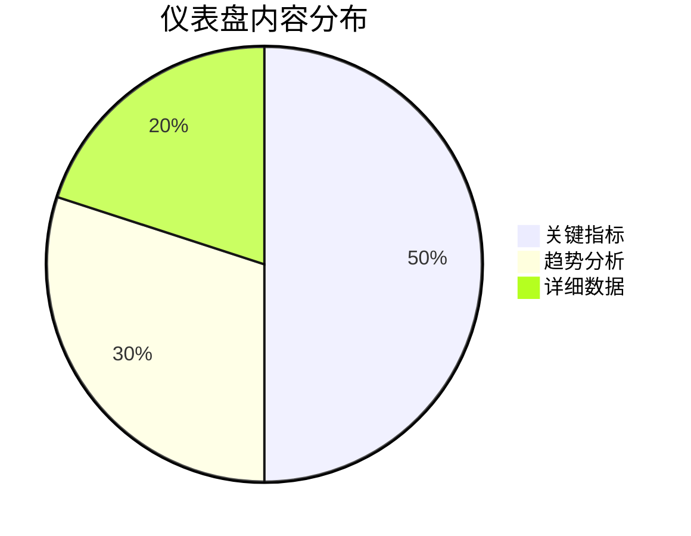
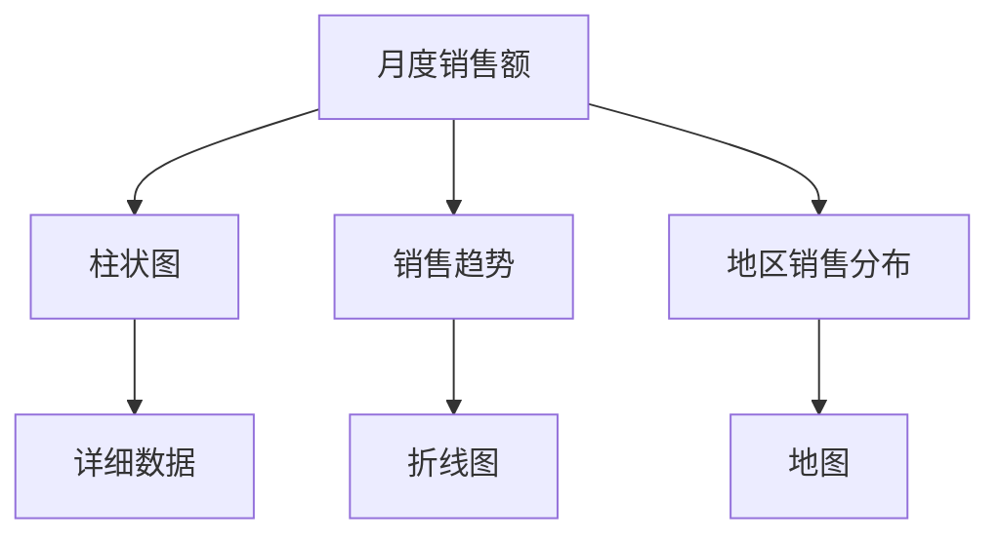

# 仪表盘设计原则

仪表盘（Dashboard）是数据仓库与商业智能（BI）中不可或缺的工具，它通过可视化的方式将复杂的数据转化为易于理解的图表和指标。一个设计良好的仪表盘可以帮助用户快速获取关键信息，做出明智的决策。本文将介绍仪表盘设计的基本原则，并通过实际案例展示如何应用这些原则。

## 什么是仪表盘？

仪表盘是一个集中展示关键指标和数据可视化的界面，通常用于监控业务绩效、分析趋势和发现问题。它可以是静态的，也可以是交互式的，允许用户深入挖掘数据。

## 仪表盘设计的基本原则

### 1. 明确目标
在设计仪表盘之前，首先要明确其目标。仪表盘的目标可能是监控关键绩效指标（KPI）、分析销售趋势或跟踪项目进度。明确目标有助于确定需要展示哪些数据和指标。

:::tip
**提示**：在设计仪表盘时，始终围绕用户的需求和目标进行设计。
:::

### 2. 简洁明了
仪表盘应尽可能简洁，避免信息过载。每个图表和指标都应具有明确的目的，并且不应包含无关的信息。



### 3. 一致性
仪表盘的设计应保持一致，包括颜色、字体、图表类型等。一致性有助于用户快速理解和使用仪表盘。

:::note
**注意**：使用统一的颜色方案来表示相同类型的数据，例如红色表示负面指标，绿色表示正面指标。
:::

### 4. 层次结构
仪表盘应具有清晰的层次结构，重要的信息应放在显眼的位置，次要信息可以放在次要位置或通过交互方式展示。

### 5. 交互性
交互性可以增强仪表盘的功能性。例如，允许用户通过点击图表来查看详细数据，或通过下拉菜单选择不同的时间范围。

```javascript
// 示例：交互式图表
const chart = new Chart(ctx, {
    type: 'line',
    data: data,
    options: {
        onClick: function(event, elements) {
            if (elements.length > 0) {
                const index = elements[0].index;
                alert('点击了数据点: ' + data.labels[index]);
            }
        }
    }
});
```

### 6. 响应式设计
仪表盘应适应不同的设备和屏幕尺寸，确保在桌面、平板和手机上都能良好显示。

## 实际案例

### 案例：销售业绩仪表盘
假设我们需要设计一个销售业绩仪表盘，用于监控月度销售情况。以下是设计步骤：

1. **明确目标**：监控月度销售额、销售趋势和地区销售分布。
2. **简洁明了**：使用柱状图展示月度销售额，折线图展示销售趋势，地图展示地区销售分布。
3. **一致性**：使用统一的颜色方案，蓝色表示销售额，绿色表示增长。
4. **层次结构**：将月度销售额放在仪表盘顶部，销售趋势和地区分布放在下方。
5. **交互性**：允许用户点击柱状图查看某个月的详细销售数据。
6. **响应式设计**：确保仪表盘在移动设备上也能良好显示。



## 总结

设计一个有效的仪表盘需要遵循明确目标、简洁明了、一致性、层次结构、交互性和响应式设计等原则。通过实际案例，我们可以看到这些原则如何应用于真实场景中。

## 附加资源

- [数据可视化最佳实践](https://example.com/data-visualization-best-practices)
- [仪表盘设计工具推荐](https://example.com/dashboard-design-tools)

## 练习

1. 设计一个用于监控网站流量的仪表盘，明确目标并选择适当的图表类型。
2. 尝试使用交互式图表库（如 Chart.js 或 D3.js）创建一个简单的交互式仪表盘。

通过不断实践和学习，你将能够设计出功能强大且易于使用的仪表盘。