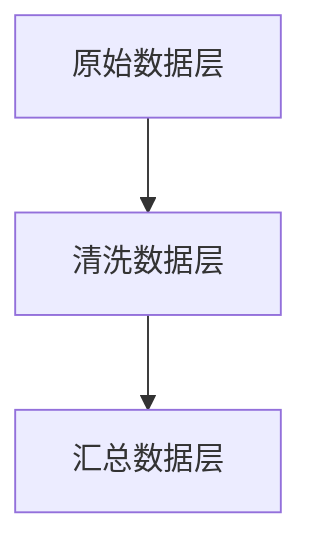

# 数据仓库架构

数据仓库（Data Warehouse）是一个用于存储、管理和分析大量历史数据的系统。它是商业智能（Business Intelligence, BI）的核心组成部分，帮助企业从数据中提取有价值的信息，支持决策制定。数据仓库架构是设计和构建数据仓库的基础框架，决定了数据如何被收集、存储、处理和访问。

本文将介绍数据仓库架构的基本概念、主要组成部分以及实际应用场景，帮助初学者全面理解这一重要主题。

---

## 什么是数据仓库架构？

数据仓库架构是指数据仓库系统的整体设计框架，包括数据的来源、存储方式、处理流程以及访问方法。一个典型的数据仓库架构通常由以下几个主要部分组成：

1. **数据源（Data Sources）**：数据仓库的数据来自多个异构数据源，如关系型数据库、日志文件、API、外部数据等。
2. **ETL（Extract, Transform, Load）**：ETL 是数据仓库的核心流程，负责从数据源提取数据、进行转换（如清洗、聚合、格式化），然后加载到数据仓库中。
3. **数据存储（Data Storage）**：数据仓库通常采用分层存储结构，包括原始数据层、清洗数据层和汇总数据层。
4. **数据访问（Data Access）**：用户通过查询工具、报表工具或 BI 工具访问数据仓库中的数据。
5. **元数据管理（Metadata Management）**：元数据是描述数据的数据，用于管理数据仓库中的数据定义、数据流和数据关系。

---

## 数据仓库架构的主要组成部分

### 1. 数据源层（Data Source Layer）
数据源层是数据仓库的基础，数据从这里被提取。常见的数据源包括：
- 关系型数据库（如 MySQL、PostgreSQL）
- 非关系型数据库（如 MongoDB、Cassandra）
- 日志文件（如服务器日志、应用日志）
- 外部 API（如第三方数据服务）

:::tip
数据源通常是异构的，这意味着它们可能使用不同的数据格式和存储方式。
:::

### 2. ETL 层（Extract, Transform, Load）
ETL 是数据仓库的核心流程，负责将数据从源系统提取出来，进行必要的转换，然后加载到数据仓库中。以下是 ETL 的详细步骤：

- **提取（Extract）**：从数据源中提取数据。
- **转换（Transform）**：对数据进行清洗、格式化、聚合等操作。
- **加载（Load）**：将处理后的数据加载到数据仓库中。

以下是一个简单的 ETL 示例代码（使用 Python 和 Pandas）：

```python
import pandas as pd

# 提取数据
data = pd.read_csv('data_source.csv')

# 转换数据：清洗和格式化
data['date'] = pd.to_datetime(data['date'])
data['sales'] = data['sales'].fillna(0)

# 加载数据到数据仓库
data.to_sql('sales_data', con=database_connection, if_exists='replace', index=False)
```

### 3. 数据存储层（Data Storage Layer）
数据存储层是数据仓库的核心部分，通常采用分层结构：
- **原始数据层（Raw Data Layer）**：存储从数据源提取的原始数据。
- **清洗数据层（Cleaned Data Layer）**：存储经过清洗和转换的数据。
- **汇总数据层（Aggregated Data Layer）**：存储按业务需求聚合的数据。

以下是一个数据存储层的示例结构：



### 4. 数据访问层（Data Access Layer）
数据访问层为用户提供查询和分析数据的接口。常见的工具包括：
- SQL 查询工具（如 MySQL Workbench、pgAdmin）
- 报表工具（如 Tableau、Power BI）
- 自定义 BI 工具

### 5. 元数据管理层（Metadata Management Layer）
元数据管理层用于管理数据仓库中的数据定义、数据流和数据关系。元数据包括：
- 数据表结构
- 数据字段定义
- 数据转换规则
- 数据血缘关系（Data Lineage）

---

## 实际应用场景

### 场景 1：零售行业销售分析
一家零售公司使用数据仓库存储来自多个门店的销售数据。通过 ETL 流程，数据被清洗和汇总，然后加载到数据仓库中。分析师使用 BI 工具生成销售报表，帮助企业优化库存管理和营销策略。

### 场景 2：金融行业风险分析
一家银行使用数据仓库存储客户交易数据。通过数据仓库架构，银行可以实时监控交易风险，识别异常行为，并生成风险报告。

---

## 总结

数据仓库架构是设计和构建数据仓库的基础框架，包括数据源层、ETL 层、数据存储层、数据访问层和元数据管理层。通过合理的数据仓库架构，企业可以高效地存储、管理和分析数据，从而支持商业决策。

---

## 附加资源与练习

### 资源
- [《数据仓库工具箱》](https://www.amazon.com/Data-Warehouse-Toolkit-Definitive-Dimensional/dp/1118530802) - 一本经典的数据仓库书籍。
- [ETL 工具对比](https://www.etltools.org/) - 了解不同 ETL 工具的特点。

### 练习
1. 使用 Python 和 Pandas 实现一个简单的 ETL 流程，将 CSV 文件中的数据加载到 SQLite 数据库中。
2. 设计一个数据仓库架构图，描述数据从源系统到 BI 工具的流动过程。

:::note
如果你有任何问题或需要进一步的帮助，请随时在评论区留言！
:::