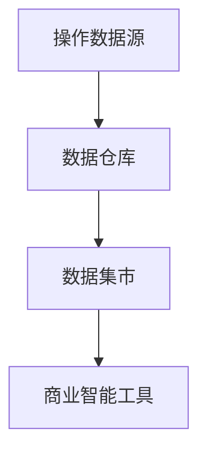

# 数据集市概念

数据集市（Data Mart）是数据仓库（Data Warehouse）的一个子集，专注于为特定业务部门或功能领域提供数据支持。它是商业智能（Business Intelligence, BI）系统中的重要组成部分，旨在帮助用户快速访问和分析与其业务相关的数据。

## 什么是数据集市？

数据集市是一个小型、专门化的数据存储库，通常包含与特定业务领域相关的数据。例如，销售部门可能有一个专门用于分析销售数据的数据集市，而财务部门则可能有一个用于分析财务数据的数据集市。数据集市的设计目标是提供高效、快速的数据访问，以满足特定业务需求。

:::note
数据集市与数据仓库的区别：
- **数据仓库**：存储企业范围内的所有数据，支持跨部门的复杂分析。
- **数据集市**：专注于特定业务领域，数据量较小，查询速度更快。
:::

## 数据集市的架构

数据集市的架构通常分为两种类型：
1. **独立数据集市**：直接从操作系统中提取数据，不依赖于数据仓库。
2. **依赖数据集市**：从数据仓库中提取数据，作为数据仓库的子集。

以下是一个依赖数据集市的架构示例：



## 数据集市的特点

1. **主题导向**：数据集市围绕特定主题（如销售、财务）设计。
2. **数据粒度**：数据通常以汇总形式存储，便于快速分析。
3. **用户友好**：数据集市的设计目标是让非技术人员也能轻松访问数据。
4. **高性能**：由于数据量较小，查询速度通常比数据仓库更快。

## 数据集市的实际应用

### 案例：销售数据集市

假设一家零售公司希望分析其销售数据，以优化库存管理和营销策略。他们可以创建一个销售数据集市，包含以下数据：
- 销售订单
- 客户信息
- 产品信息
- 销售区域

通过数据集市，销售团队可以快速生成以下报告：
- 按产品类别的销售额
- 按地区的销售趋势
- 客户购买行为分析

### 代码示例：创建数据集市

以下是一个简单的 SQL 示例，展示如何从数据仓库中提取数据并创建数据集市：

```sql
-- 从数据仓库中提取销售数据
CREATE TABLE sales_data_mart AS
SELECT 
    order_id,
    product_id,
    customer_id,
    order_date,
    sales_amount
FROM 
    data_warehouse.sales
WHERE 
    order_date >= '2023-01-01';
```

**输入**：数据仓库中的销售数据表 `data_warehouse.sales`。<br />
**输出**：一个新的数据集市表 `sales_data_mart`，包含 2023 年以来的销售数据。

## 数据集市的优势与挑战

### 优势
- **快速部署**：数据集市的规模较小，部署速度比数据仓库更快。
- **成本效益**：由于数据量较小，建设和维护成本较低。
- **灵活性**：可以根据业务需求快速调整数据集市的结构。

### 挑战
- **数据一致性**：多个数据集市可能导致数据不一致问题。
- **数据孤岛**：数据集市可能成为数据孤岛，阻碍跨部门的数据共享。
- **扩展性**：随着业务增长，数据集市可能难以满足复杂分析需求。

## 总结

数据集市是商业智能系统中的重要工具，能够为特定业务部门提供高效的数据支持。通过数据集市，用户可以快速访问和分析与其业务相关的数据，从而做出更明智的决策。然而，数据集市的设计和实施需要谨慎，以避免数据一致性和扩展性问题。

## 附加资源与练习

### 资源
- [数据仓库与数据集市的关系](https://www.example.com/data-warehouse-vs-data-mart)
- [商业智能最佳实践](https://www.example.com/bi-best-practices)

### 练习
1. 尝试从现有的数据仓库中提取数据，创建一个简单的数据集市。
2. 分析数据集市的查询性能，并与数据仓库进行比较。
3. 设计一个数据集市架构，支持多个业务部门的需求。

:::tip
如果你对数据集市的概念还有疑问，可以尝试在实际项目中应用这些知识，或者参考更多关于数据仓库和商业智能的书籍和课程。
:::