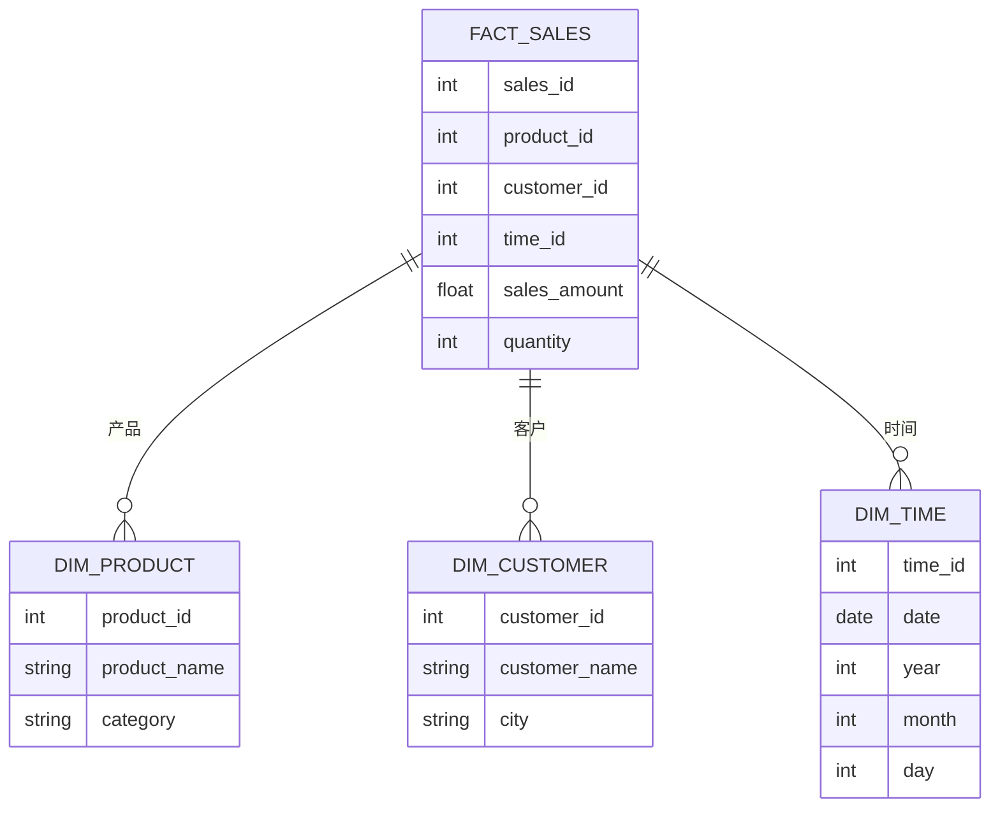

# 星型模式设计

## 介绍

星型模式（Star Schema）是数据仓库设计中最常用的模型之一。它以其简单性和高效性著称，特别适合用于商业智能（BI）和数据分析场景。星型模式的核心思想是将数据组织成一个中心事实表（Fact Table）和多个维度表（Dimension Tables），形成一个类似星形的结构。

### 为什么使用星型模式？

- **简化查询**：星型模式的结构简单，易于理解和查询。
- **性能优化**：通过减少表连接的数量，查询性能得到显著提升。
- **易于维护**：维度表和事实表的分离使得数据维护更加方便。

## 星型模式的基本结构

星型模式由两种主要类型的表组成：

1. **事实表（Fact Table）**：存储业务过程中的度量值（如销售额、订单数量等）。事实表通常包含外键，用于连接维度表。
2. **维度表（Dimension Table）**：存储描述性信息（如产品、客户、时间等）。维度表通过主键与事实表关联。

### 示例结构

以下是一个简单的星型模式示例，展示了一个销售数据仓库的结构：



在这个示例中，`FACT_SALES` 是事实表，存储了销售金额和数量等度量值。`DIM_PRODUCT`、`DIM_CUSTOMER` 和 `DIM_TIME` 是维度表，分别存储了产品、客户和时间的信息。

## 星型模式的设计步骤

### 1. 确定业务过程

首先，明确你要分析的业务过程。例如，销售分析、库存管理等。

### 2. 识别事实表

确定事实表中的度量值。例如，在销售分析中，度量值可以是销售额、订单数量等。

### 3. 识别维度表

确定与事实表相关的维度。例如，在销售分析中，维度可以是产品、客户、时间等。

### 4. 设计表结构

为事实表和每个维度表设计表结构，包括字段和数据类型。

### 5. 建立关系

通过外键将事实表与维度表关联起来。

## 实际案例

假设我们正在为一个在线零售商店设计数据仓库，用于分析销售数据。

### 事实表：`FACT_SALES`

| 字段名         | 数据类型 | 描述           |
| -------------- | -------- | -------------- |
| `sales_id`     | int      | 销售ID         |
| `product_id`   | int      | 产品ID         |
| `customer_id`  | int      | 客户ID         |
| `time_id`      | int      | 时间ID         |
| `sales_amount` | float    | 销售金额       |
| `quantity`     | int      | 销售数量       |

### 维度表：`DIM_PRODUCT`

| 字段名         | 数据类型 | 描述           |
| -------------- | -------- | -------------- |
| `product_id`   | int      | 产品ID         |
| `product_name` | string   | 产品名称       |
| `category`     | string   | 产品类别       |

### 维度表：`DIM_CUSTOMER`

| 字段名         | 数据类型 | 描述           |
| -------------- | -------- | -------------- |
| `customer_id`  | int      | 客户ID         |
| `customer_name`| string   | 客户名称       |
| `city`         | string   | 客户所在城市   |

### 维度表：`DIM_TIME`

| 字段名         | 数据类型 | 描述           |
| -------------- | -------- | -------------- |
| `time_id`      | int      | 时间ID         |
| `date`         | date     | 日期           |
| `year`         | int      | 年份           |
| `month`        | int      | 月份           |
| `day`          | int      | 日             |

### 查询示例

假设我们想要查询2022年每个月的总销售额，可以使用以下SQL查询：

```sql
SELECT 
    t.year,
    t.month,
    SUM(f.sales_amount) AS total_sales
FROM 
    FACT_SALES f
JOIN 
    DIM_TIME t ON f.time_id = t.time_id
WHERE 
    t.year = 2022
GROUP BY 
    t.year, t.month
ORDER BY 
    t.year, t.month;
```

### 输出示例

| year | month | total_sales |
| ---- | ----- | ----------- |
| 2022 | 1     | 100000      |
| 2022 | 2     | 120000      |
| 2022 | 3     | 150000      |

## 总结

星型模式是数据仓库设计中的一种经典模型，特别适合用于商业智能和数据分析。通过将数据组织成事实表和维度表，星型模式简化了查询过程，提高了查询性能，并且易于维护。

:::tip 提示
在设计星型模式时，确保维度表的粒度足够细，以便支持各种分析需求。
:::

## 附加资源

- [数据仓库设计指南](https://www.example.com/data-warehouse-design)
- [SQL查询优化技巧](https://www.example.com/sql-optimization)
- [商业智能最佳实践](https://www.example.com/bi-best-practices)

## 练习

1. 设计一个星型模式，用于分析库存数据。
2. 编写SQL查询，计算每个产品类别的总销售额。
3. 思考如何扩展星型模式以支持更多的分析需求。

通过以上内容，你应该对星型模式设计有了基本的了解。继续练习和探索，你将能够更好地应用这一设计模式在实际项目中。