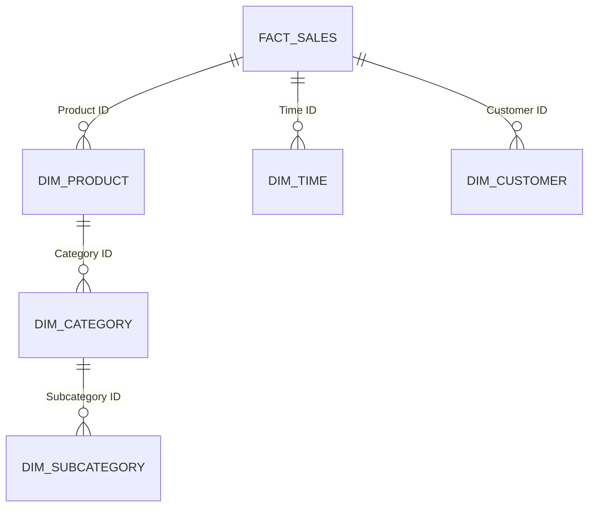

# 雪花模式设计

## 介绍

在数据仓库设计中，雪花模式（Snowflake Schema）是一种常见的数据建模方法。它是星型模式（Star Schema）的扩展，通过将维度表进一步规范化，以减少数据冗余并提高数据一致性。雪花模式因其结构类似于雪花的分支而得名。

与星型模式不同，雪花模式中的维度表可能被分解为多个相关的表，形成层次结构。这种设计在某些场景下可以提高查询性能和数据管理的灵活性，但也可能增加查询的复杂性。

## 雪花模式的基本结构

雪花模式由以下两部分组成：

1. **事实表（Fact Table）**：存储业务过程中的度量值（如销售额、数量等），通常包含外键指向维度表。
2. **维度表（Dimension Table）**：存储描述性信息（如产品、时间、客户等），维度表可能被进一步规范化，形成多层次的关联。

以下是一个简单的雪花模式示例：



在这个示例中，`FACT_SALES` 是事实表，`DIM_PRODUCT`、`DIM_TIME` 和 `DIM_CUSTOMER` 是维度表。`DIM_PRODUCT` 进一步关联到 `DIM_CATEGORY` 和 `DIM_SUBCATEGORY`，形成了雪花模式的分支结构。

## 雪花模式的优点

1. **减少数据冗余**：通过规范化维度表，避免了重复数据的存储。
2. **提高数据一致性**：由于数据被规范化，更新操作只需在单一位置进行。
3. **灵活性**：适合需要复杂查询和分析的场景。

## 雪花模式的缺点

1. **查询复杂性**：由于维度表被分解为多个表，查询时需要更多的 JOIN 操作。
2. **性能问题**：在某些情况下，过多的 JOIN 操作可能导致查询性能下降。

## 实际案例

假设我们正在为一个零售公司设计数据仓库，用于分析销售数据。以下是雪花模式的设计：

1. **事实表**：`FACT_SALES`，包含以下字段：
   - `SalesID`（主键）
   - `ProductID`（外键）
   - `TimeID`（外键）
   - `CustomerID`（外键）
   - `SalesAmount`（度量值）

2. **维度表**：
   - `DIM_PRODUCT`：包含产品信息。
   - `DIM_TIME`：包含时间信息（如年、月、日）。
   - `DIM_CUSTOMER`：包含客户信息。
   - `DIM_CATEGORY`：包含产品类别信息。
   - `DIM_SUBCATEGORY`：包含产品子类别信息。

以下是一个 SQL 查询示例，用于获取某个月的销售总额：

```sql
SELECT 
    T.Year,
    T.Month,
    SUM(F.SalesAmount) AS TotalSales
FROM 
    FACT_SALES F
JOIN 
    DIM_TIME T ON F.TimeID = T.TimeID
WHERE 
    T.Year = 2023 AND T.Month = 10
GROUP BY 
    T.Year, T.Month;
```

:::note
在实际应用中，雪花模式的设计需要根据具体业务需求进行调整。如果查询性能是关键，可能需要权衡规范化和查询复杂性。
:::

## 总结

雪花模式是一种强大的数据仓库设计方法，特别适合需要高度规范化和复杂分析的场景。尽管它可能增加查询的复杂性，但在某些情况下，它可以显著提高数据管理的效率和一致性。

对于初学者来说，理解雪花模式的基本概念和设计原则是掌握数据仓库设计的重要一步。通过实际案例和练习，可以更好地理解其应用场景和优缺点。

## 附加资源与练习

1. **练习**：尝试为一个在线书店设计雪花模式，包含事实表和多个维度表。
2. **资源**：
   - [数据仓库设计指南](https://example.com/data-warehouse-design)
   - [SQL 查询优化技巧](https://example.com/sql-optimization)

:::tip
建议初学者在学习雪花模式时，先从星型模式入手，逐步理解规范化的概念和应用场景。
:::