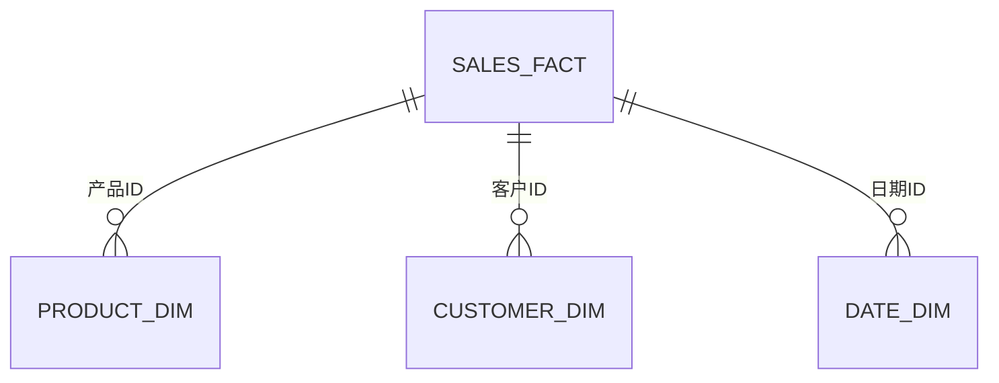

# 事实表与维度表

在数据仓库和商业智能（BI）中，**事实表**和**维度表**是两个核心概念。它们是构建数据模型的基础，用于存储和分析业务数据。本文将详细介绍这两种表的结构、作用以及它们之间的关系。

---

## 什么是事实表与维度表？

### 事实表（Fact Table）
事实表是数据仓库中存储**业务事实**（即度量值）的表。它通常包含数值型数据，例如销售额、订单数量、利润等。事实表是数据分析的核心，因为它记录了业务活动的具体结果。

### 维度表（Dimension Table）
维度表是存储**描述性信息**的表，用于为事实表中的数据提供上下文。例如，时间维度表可能包含日期、月份、年份等信息，而产品维度表可能包含产品名称、类别、价格等信息。

事实表和维度表通过**外键**关联，共同构成**星型模式**或**雪花模式**，这是数据仓库中最常见的数据模型。

---

## 事实表与维度表的结构

### 事实表的结构
事实表通常包含以下内容：
1. **外键**：用于关联维度表。
2. **度量值**：数值型数据，例如销售额、数量等。
3. **退化维度**：某些情况下，维度信息可能直接存储在事实表中。

例如，一个销售事实表可能如下所示：

| 订单ID | 产品ID | 客户ID | 日期ID | 销售额 | 数量 |
|--------|--------|--------|--------|--------|------|
| 1      | 101    | 201    | 20230101 | 100.00 | 2    |
| 2      | 102    | 202    | 20230102 | 200.00 | 1    |

### 维度表的结构
维度表通常包含以下内容：
1. **主键**：唯一标识每条记录。
2. **属性**：描述性信息，例如产品名称、客户姓名等。

例如，一个产品维度表可能如下所示：

| 产品ID | 产品名称 | 类别   | 价格  |
|--------|----------|--------|-------|
| 101    | 笔记本电脑 | 电子产品 | 800.00 |
| 102    | 智能手机 | 电子产品 | 500.00 |

---

## 事实表与维度表的关系

事实表和维度表通过**外键**关联。例如，销售事实表中的 `产品ID` 外键关联到产品维度表中的 `产品ID` 主键。这种关系可以用星型模式表示：

---

## 实际案例：零售行业的数据仓库

假设我们正在为一个零售公司设计数据仓库，以下是事实表和维度表的应用场景：

### 事实表：销售事实表
存储每次销售的具体数据，例如销售额、数量等。

| 订单ID | 产品ID | 客户ID | 日期ID | 销售额 | 数量 |
|--------|--------|--------|--------|--------|------|
| 1      | 101    | 201    | 20230101 | 100.00 | 2    |
| 2      | 102    | 202    | 20230102 | 200.00 | 1    |

### 维度表：产品维度表
存储产品的描述性信息。

| 产品ID | 产品名称 | 类别   | 价格  |
|--------|----------|--------|-------|
| 101    | 笔记本电脑 | 电子产品 | 800.00 |
| 102    | 智能手机 | 电子产品 | 500.00 |

### 维度表：客户维度表
存储客户的信息。

| 客户ID | 客户姓名 | 地区   |
|--------|----------|--------|
| 201    | 张三     | 北京   |
| 202    | 李四     | 上海   |

### 维度表：日期维度表
存储日期的详细信息。

| 日期ID | 日期      | 月份 | 季度 | 年份 |
|--------|-----------|------|------|------|
| 20230101 | 2023-01-01 | 1    | Q1   | 2023 |
| 20230102 | 2023-01-02 | 1    | Q1   | 2023 |

通过关联这些表，我们可以轻松分析以下问题：
- 每个产品的总销售额是多少？
- 每个地区的客户购买了多少产品？
- 每个季度的销售趋势如何？

---

## 总结

事实表和维度表是数据仓库和商业智能的核心组成部分。事实表存储业务活动的度量值，而维度表提供描述性信息。通过外键关联，它们共同构建了星型模式或雪花模式，支持复杂的业务分析。

:::tip
**小提示**：在设计数据仓库时，尽量保持维度表的规范化，以避免数据冗余。同时，确保事实表中的度量值能够准确反映业务需求。
:::

---

## 附加资源与练习

### 资源
- [数据仓库基础知识](https://en.wikipedia.org/wiki/Data_warehouse)
- [星型模式与雪花模式](https://www.guru99.com/star-snowflake-data-warehousing.html)

### 练习
1. 设计一个简单的销售数据仓库，包括事实表和至少三个维度表。
2. 编写 SQL 查询，计算每个产品的总销售额。
3. 分析某个季度的销售趋势，并可视化结果。

通过实践，你将更深入地理解事实表与维度表的作用及其在商业智能中的应用。