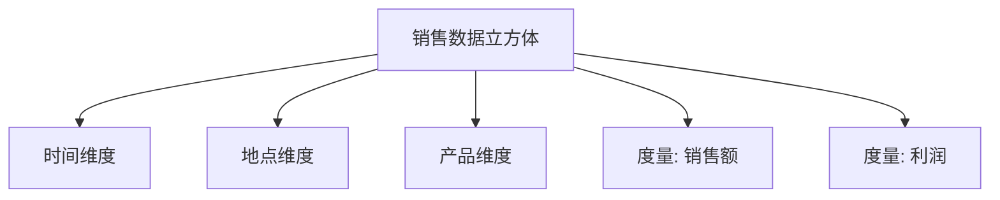

# 数据立方体(Data Cube)

## 什么是数据立方体？

数据立方体（Data Cube）是一种多维数据结构，用于存储和分析大量数据。它通常用于数据仓库和商业智能（BI）系统中，以支持复杂的查询和分析操作。数据立方体将数据组织成多个维度（如时间、地点、产品等），并允许用户从不同角度快速访问和分析数据。

:::note
数据立方体的名称来源于其三维结构，类似于几何中的立方体。但实际上，数据立方体可以包含任意数量的维度。
:::

## 数据立方体的结构

数据立方体由以下几个关键部分组成：

1. **维度（Dimensions）**：描述数据的角度或分类方式。例如，时间、地点、产品等。
2. **度量（Measures）**：需要分析的具体数值数据。例如，销售额、利润、库存数量等。
3. **单元格（Cells）**：每个维度组合对应的度量值。例如，2023年1月在北京的某产品销售额。

### 示例：销售数据立方体

假设我们有一个销售数据立方体，包含以下维度和度量：

- **维度**：
  - 时间（年、月、日）
  - 地点（国家、城市）
  - 产品（类别、品牌）
- **度量**：
  - 销售额
  - 利润

## 数据立方体的操作

数据立方体支持多种操作，帮助用户从不同角度分析数据：

1. **切片（Slice）**：选择一个维度的特定值，获取子集数据。例如，选择“2023年”查看该年份的销售数据。
2. **切块（Dice）**：选择多个维度的特定值，获取更细粒度的数据。例如，选择“2023年”和“北京”查看该年份和地点的销售数据。
3. **钻取（Drill-down/Drill-up）**：在维度层次结构中向下或向上移动，获取更详细或更汇总的数据。例如，从“年”钻取到“月”。
4. **旋转（Pivot）**：改变维度的排列方式，重新组织数据视图。

### 示例：切片操作

假设我们有以下销售数据：

| 时间   | 地点   | 产品   | 销售额 |
| ------ | ------ | ------ | ------ |
| 2023年 | 北京   | 手机   | 100000 |
| 2023年 | 上海   | 手机   | 80000  |
| 2023年 | 北京   | 电脑   | 120000 |
| 2023年 | 上海   | 电脑   | 90000  |

如果我们对“时间=2023年”进行切片操作，结果如下：

| 地点   | 产品   | 销售额 |
| ------ | ------ | ------ |
| 北京   | 手机   | 100000 |
| 上海   | 手机   | 80000  |
| 北京   | 电脑   | 120000 |
| 上海   | 电脑   | 90000  |

## 实际应用场景

数据立方体在商业智能中广泛应用，以下是一些典型场景：

1. **销售分析**：分析不同时间、地点和产品的销售数据，帮助企业制定销售策略。
2. **库存管理**：监控库存水平，优化库存周转率。
3. **财务分析**：分析收入、成本和利润，支持财务决策。

:::tip
在实际应用中，数据立方体通常与OLAP（在线分析处理）工具结合使用，以支持快速的多维数据分析。
:::

## 总结

数据立方体是一种强大的多维数据结构，能够帮助用户从多个角度分析和理解数据。通过切片、切块、钻取和旋转等操作，用户可以灵活地探索数据，发现隐藏的模式和趋势。

## 附加资源与练习

- **练习**：尝试使用Excel或Google Sheets创建一个简单的数据立方体，分析销售数据。
- **资源**：
  - [OLAP与数据立方体入门指南](https://example.com)
  - [商业智能工具推荐](https://example.com)

:::caution
在实际项目中，数据立方体的设计和实现可能涉及复杂的ETL（提取、转换、加载）过程，建议深入学习相关工具和技术。
:::