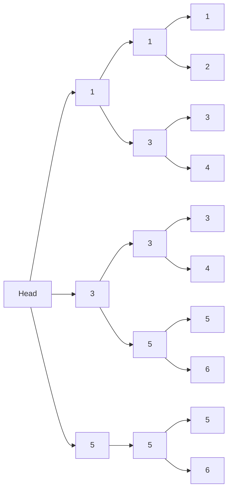

# 跳表

跳表（Skip List）是一种概率性的数据结构，它通过在有序链表的基础上添加多层索引来实现高效的查找、插入和删除操作。跳表的设计灵感来源于二分查找，但它不需要像平衡树那样复杂的平衡操作，因此实现起来更加简单。

## 跳表的基本概念

跳表的核心思想是通过多层链表来加速查找过程。每一层链表都是下一层链表的子集，最底层包含所有元素。通过这种方式，跳表可以在 O(log n) 的时间复杂度内完成查找、插入和删除操作。

### 跳表的结构

跳表由多层链表组成，每一层都是一个有序链表。最底层（第 0 层）包含所有元素，而每一层都是下一层的子集。每一层的元素通过指针连接，形成一个类似于“跳跃”的结构。



在上图中，`Head` 是跳表的头节点，它指向每一层的第一个元素。每一层的元素通过指针连接，形成一个多层链表结构。

## 跳表的操作

### 查找操作

查找操作从最高层开始，逐层向下查找，直到找到目标元素或确定目标元素不存在。

```python
def search(skip_list, target):
    current = skip_list.head
    for level in reversed(range(len(skip_list.head.next))):
        while current.next[level] and current.next[level].value < target:
            current = current.next[level]
    current = current.next[0]
    if current and current.value == target:
        return current
    return None
```

### 插入操作

插入操作首先通过查找确定插入位置，然后随机决定新元素的层数，最后将新元素插入到每一层的相应位置。

```python
import random

def insert(skip_list, value):
    update = [None] * len(skip_list.head.next)
    current = skip_list.head
    for level in reversed(range(len(skip_list.head.next))):
        while current.next[level] and current.next[level].value < value:
            current = current.next[level]
        update[level] = current
    current = current.next[0]
    if current and current.value == value:
        return  # 元素已存在
    new_level = random_level()
    if new_level > len(skip_list.head.next):
        for _ in range(len(skip_list.head.next), new_level):
            update.append(skip_list.head)
        skip_list.head.next.extend([None] * (new_level - len(skip_list.head.next)))
    new_node = Node(value, new_level)
    for level in range(new_level):
        new_node.next[level] = update[level].next[level]
        update[level].next[level] = new_node

def random_level():
    level = 1
    while random.random() < 0.5 and level < MAX_LEVEL:
        level += 1
    return level
```

### 删除操作

删除操作首先通过查找确定要删除的元素，然后将其从每一层的链表中移除。

```python
def delete(skip_list, value):
    update = [None] * len(skip_list.head.next)
    current = skip_list.head
    for level in reversed(range(len(skip_list.head.next))):
        while current.next[level] and current.next[level].value < value:
            current = current.next[level]
        update[level] = current
    current = current.next[0]
    if current and current.value == value:
        for level in range(len(current.next)):
            update[level].next[level] = current.next[level]
        return True
    return False
```

## 实际应用场景

跳表在实际应用中有广泛的应用场景，特别是在需要高效查找、插入和删除操作的场景中。以下是一些常见的应用场景：

1. **Redis 中的有序集合**：Redis 使用跳表来实现其有序集合（Sorted Set）数据结构，以支持高效的插入、删除和范围查询操作。
2. **LevelDB 和 RocksDB**：这些键值存储引擎使用跳表来实现其内存中的数据结构，以支持高效的查找和插入操作。
3. **并发数据结构**：跳表由于其简单的实现和高效的性能，常被用于实现并发数据结构，如并发跳表。

## 总结

跳表是一种高效的数据结构，它通过多层链表实现了 O(log n) 时间复杂度的查找、插入和删除操作。相比于平衡树，跳表的实现更加简单，且在实际应用中表现出色。

## 附加资源与练习

- **练习**：尝试实现一个跳表，并测试其查找、插入和删除操作的性能。
- **进一步阅读**：可以参考《算法导论》中关于跳表的详细介绍，或者查阅 Redis 源码中跳表的实现。

:::tip
跳表的实现虽然简单，但在实际应用中需要注意随机层数的选择，以确保跳表的性能。
:::