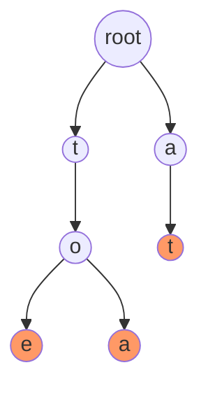

# 字典树 (Trie)

字典树（Trie），也称为前缀树或单词查找树，是一种用于高效存储和检索字符串的树形数据结构。它的核心思想是利用字符串的公共前缀来减少存储空间，并提高查询效率。字典树在搜索引擎、拼写检查、自动补全等场景中有着广泛的应用。

## 什么是字典树？

字典树是一种多叉树结构，每个节点代表一个字符，从根节点到某个节点的路径表示一个字符串。字典树的典型特点是：

1. **根节点不包含字符**，除根节点外，每个节点都包含一个字符。
2. **从根节点到某一节点的路径**表示一个字符串。
3. **每个节点的子节点**代表下一个可能的字符。
4. **标记节点**：某些节点会被标记为“结束节点”，表示从根节点到该节点的路径构成一个完整的字符串。

## 字典树的结构

我们可以通过以下 Mermaid 图来直观地理解字典树的结构：



在上图中，字典树存储了单词 "to"、"tea" 和 "at"。节点 `e` 和 `a` 被标记为结束节点，表示它们是某个单词的结尾。

## 字典树的实现

下面是一个简单的字典树的 Python 实现：

```python
class TrieNode:
    def __init__(self):
        self.children = {}
        self.is_end_of_word = False

class Trie:
    def __init__(self):
        self.root = TrieNode()

    def insert(self, word):
        current = self.root
        for char in word:
            if char not in current.children:
                current.children[char] = TrieNode()
            current = current.children[char]
        current.is_end_of_word = True

    def search(self, word):
        current = self.root
        for char in word:
            if char not in current.children:
                return False
            current = current.children[char]
        return current.is_end_of_word

    def starts_with(self, prefix):
        current = self.root
        for char in prefix:
            if char not in current.children:
                return False
            current = current.children[char]
        return True
```

### 示例

```python
trie = Trie()
trie.insert("apple")
print(trie.search("apple"))   # 输出: True
print(trie.search("app"))     # 输出: False
print(trie.starts_with("app")) # 输出: True
trie.insert("app")
print(trie.search("app"))     # 输出: True
```

## 字典树的应用场景

字典树在以下场景中非常有用：

1. **自动补全**：搜索引擎和输入法中的自动补全功能通常使用字典树来实现。
2. **拼写检查**：字典树可以快速检查一个单词是否存在于字典中。
3. **IP 路由**：在网络路由中，字典树用于高效查找最长前缀匹配。
4. **词频统计**：字典树可以用于统计文本中单词的出现频率。

:::tip
字典树的查询时间复杂度为 O(m)，其中 m 是查询字符串的长度。这使得字典树在处理大量字符串时非常高效。
:::

## 总结

字典树是一种高效的数据结构，特别适合处理字符串的存储和检索问题。通过利用字符串的公共前缀，字典树能够显著减少存储空间，并提高查询效率。它在自动补全、拼写检查、IP 路由等领域有着广泛的应用。

## 附加资源与练习

- **练习 1**：实现一个字典树，并添加一个方法 `delete(word)`，用于删除字典树中的某个单词。
- **练习 2**：扩展字典树，使其能够统计每个单词的出现次数。
- **资源**：阅读更多关于字典树的优化和变体，如压缩字典树（Compressed Trie）。

:::caution
在实际应用中，字典树可能会占用较多内存，尤其是在存储大量长字符串时。可以考虑使用压缩字典树或其他优化技术来减少内存消耗。
:::