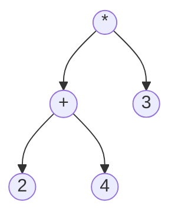

## 什么是二叉树？

二叉树（Binary Tree）是一种常见的树形数据结构，其中每个节点最多有两个子节点，分别称为左子节点和右子节点。二叉树是许多高级数据结构（如二叉搜索树、堆、AVL 树等）的基础。

### 二叉树的基本结构

二叉树的每个节点通常包含以下部分：
- **数据域**：存储节点的值。
- **左子节点**：指向左子树的指针。
- **右子节点**：指向右子树的指针。

以下是一个简单的二叉树节点定义（以 Python 为例）：

```python
class TreeNode:
    def __init__(self, value):
        self.value = value
        self.left = None
        self.right = None
```

### 二叉树的类型

根据节点的排列方式，二叉树可以分为以下几种类型：
1. **满二叉树**：每个节点都有 0 或 2 个子节点。
2. **完全二叉树**：除了最后一层，其他层都是满的，且最后一层的节点尽可能靠左。
3. **平衡二叉树**：左右子树的高度差不超过 1。
4. **二叉搜索树**：左子树的所有节点值小于根节点，右子树的所有节点值大于根节点。

### 二叉树的遍历

遍历二叉树是指按照某种顺序访问树中的所有节点。常见的遍历方式有三种：
1. **前序遍历**：根节点 -> 左子树 -> 右子树。
2. **中序遍历**：左子树 -> 根节点 -> 右子树。
3. **后序遍历**：左子树 -> 右子树 -> 根节点。

以下是一个二叉树遍历的代码示例：

```python
def preorder_traversal(root):
    if root:
        print(root.value)  # 访问根节点
        preorder_traversal(root.left)  # 遍历左子树
        preorder_traversal(root.right)  # 遍历右子树

def inorder_traversal(root):
    if root:
        inorder_traversal(root.left)  # 遍历左子树
        print(root.value)  # 访问根节点
        inorder_traversal(root.right)  # 遍历右子树

def postorder_traversal(root):
    if root:
        postorder_traversal(root.left)  # 遍历左子树
        postorder_traversal(root.right)  # 遍历右子树
        print(root.value)  # 访问根节点
```

### 二叉树的实际应用

二叉树在计算机科学中有广泛的应用，例如：
1. **表达式树**：用于表示数学表达式。
2. **文件系统**：目录结构可以看作是一棵树。
3. **数据库索引**：B 树和 B+ 树是基于二叉树的高级数据结构。
4. **决策树**：用于机器学习和人工智能中的分类问题。

以下是一个表达式树的示例：



这个树表示表达式 `(2 + 4) * 3`。

### 总结

二叉树是一种基础但非常重要的数据结构，理解其基本概念和操作是学习更高级数据结构的关键。通过遍历、插入、删除等操作，二叉树可以解决许多实际问题。

:::tip 提示
如果你对二叉树感兴趣，可以尝试实现以下练习：
1. 实现一个二叉搜索树，并支持插入、删除和查找操作。
2. 编写代码计算二叉树的高度。
3. 实现二叉树的层次遍历（广度优先遍历）。
:::

### 附加资源

- [二叉树 - Wikipedia](https://zh.wikipedia.org/wiki/%E4%BA%8C%E5%8F%89%E6%A0%91)
- [LeetCode 二叉树练习题](https://leetcode.com/tag/binary-tree/)

希望这篇内容能帮助你更好地理解二叉树！如果有任何问题，欢迎在评论区留言讨论。