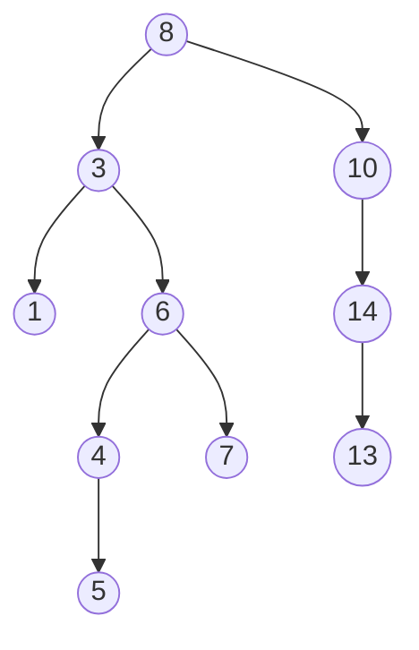
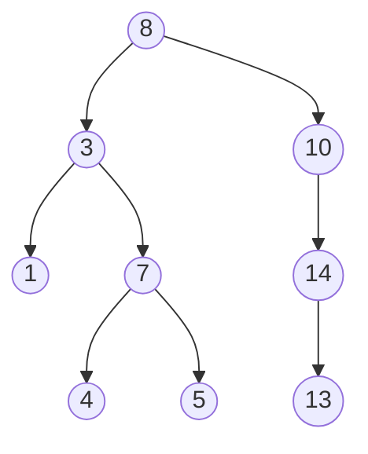

# 二叉搜索树

二叉搜索树（Binary Search Tree，简称 BST）是一种常见的数据结构，广泛应用于搜索、插入和删除操作。它是一棵二叉树，具有以下特性：

1. **左子树**中的所有节点的值都小于**根节点**的值。
2. **右子树**中的所有节点的值都大于**根节点**的值。
3. 左右子树也分别是二叉搜索树。

这些特性使得二叉搜索树在查找、插入和删除操作中具有较高的效率。

---

## 二叉搜索树的基本操作

### 1. 查找操作
在二叉搜索树中查找一个值非常简单。从根节点开始，比较目标值与当前节点的值：
- 如果目标值等于当前节点的值，则找到目标。
- 如果目标值小于当前节点的值，则递归查找左子树。
- 如果目标值大于当前节点的值，则递归查找右子树。

```python
def search(root, target):
    if root is None or root.value == target:
        return root
    if target < root.value:
        return search(root.left, target)
    return search(root.right, target)
```

**示例：**
假设我们有一棵二叉搜索树如下：


查找值为 `6` 的节点：
- 从根节点 `8` 开始，`6 < 8`，进入左子树。
- 在节点 `3`，`6 > 3`，进入右子树。
- 在节点 `6`，找到目标。

---

### 2. 插入操作
插入操作与查找类似。从根节点开始，找到合适的位置插入新节点：
- 如果树为空，则新节点成为根节点。
- 如果目标值小于当前节点的值，则递归插入左子树。
- 如果目标值大于当前节点的值，则递归插入右子树。

```python
def insert(root, value):
    if root is None:
        return TreeNode(value)
    if value < root.value:
        root.left = insert(root.left, value)
    else:
        root.right = insert(root.right, value)
    return root
```

**示例：**
在上述树中插入值为 `5` 的节点：
- 从根节点 `8` 开始，`5 < 8`，进入左子树。
- 在节点 `3`，`5 > 3`，进入右子树。
- 在节点 `6`，`5 < 6`，进入左子树。
- 在节点 `4`，`5 > 4`，插入为右子节点。

插入后的树结构：



---

### 3. 删除操作
删除操作稍微复杂一些，分为三种情况：
1. **删除叶子节点**：直接删除。
2. **删除只有一个子节点的节点**：用子节点替换当前节点。
3. **删除有两个子节点的节点**：找到右子树的最小节点（或左子树的最大节点），替换当前节点，然后删除该最小节点。

```python
def delete(root, value):
    if root is None:
        return root
    if value < root.value:
        root.left = delete(root.left, value)
    elif value > root.value:
        root.right = delete(root.right, value)
    else:
        if root.left is None:
            return root.right
        elif root.right is None:
            return root.left
        temp = find_min(root.right)
        root.value = temp.value
        root.right = delete(root.right, temp.value)
    return root

def find_min(node):
    while node.left is not None:
        node = node.left
    return node
```

**示例：**
删除值为 `6` 的节点：
- 找到右子树的最小节点 `7`，替换 `6`。
- 删除节点 `7`。

删除后的树结构：



---

## 实际应用场景

二叉搜索树在以下场景中非常有用：
1. **数据库索引**：用于快速查找和排序数据。
2. **字典实现**：用于存储和检索键值对。
3. **文件系统**：用于管理文件和目录的层次结构。

---

## 总结

二叉搜索树是一种高效的数据结构，适用于需要频繁查找、插入和删除操作的场景。通过理解其基本特性和操作，你可以更好地应用它解决实际问题。

---

## 附加资源与练习

1. **练习**：
   - 实现一个二叉搜索树，并测试查找、插入和删除操作。
   - 尝试将二叉搜索树扩展为平衡二叉搜索树（如 AVL 树或红黑树）。

2. **资源**：
   - [二叉搜索树 - Wikipedia](https://en.wikipedia.org/wiki/Binary_search_tree)
   - 《算法导论》 - 二叉搜索树章节

:::tip
尝试自己动手实现二叉搜索树，并通过调试工具观察树的结构变化，加深理解！
:::