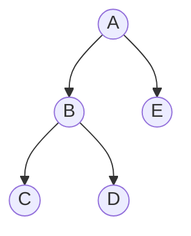
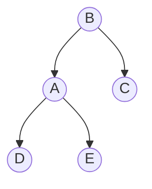
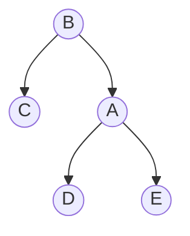

# 平衡树

平衡树是一种自平衡的二叉搜索树，它通过自动调整树的结构来保持树的平衡，从而确保查找、插入和删除操作的时间复杂度为 O(log n)。平衡树的设计目的是为了解决普通二叉搜索树在极端情况下（如插入有序数据）退化为链表的问题。

## 什么是平衡树？

平衡树是一种特殊的二叉搜索树，它在每次插入或删除节点后，会自动调整树的结构，使得树的高度保持在一个合理的范围内。常见的平衡树包括 **AVL 树** 和 **红黑树**。

### 为什么需要平衡树？

在普通的二叉搜索树中，如果插入的数据是有序的（例如从小到大），树会退化为一个链表，导致查找、插入和删除操作的时间复杂度从 O(log n) 退化为 O(n)。平衡树通过自动调整树的结构，避免了这种情况的发生。

## 平衡树的工作原理

平衡树的核心思想是通过 **旋转操作** 来调整树的结构，使得树的高度保持平衡。常见的旋转操作包括 **左旋** 和 **右旋**。

### 旋转操作

#### 左旋
左旋是将一个节点的右子树提升为新的根节点，原来的根节点成为新根节点的左子树。



左旋后：



#### 右旋
右旋是将一个节点的左子树提升为新的根节点，原来的根节点成为新根节点的右子树。


右旋后：



### 平衡因子

在 AVL 树中，每个节点都有一个 **平衡因子**，它是该节点的左子树高度减去右子树高度的值。平衡因子的绝对值必须小于等于 1，否则需要通过旋转操作来调整树的结构。

## 代码示例：AVL 树的插入操作

以下是一个简单的 AVL 树插入操作的 Python 实现：

```python
class TreeNode:
    def __init__(self, key):
        self.key = key
        self.left = None
        self.right = None
        self.height = 1

class AVLTree:
    def insert(self, root, key):
        if not root:
            return TreeNode(key)
        elif key < root.key:
            root.left = self.insert(root.left, key)
        else:
            root.right = self.insert(root.right, key)

        root.height = 1 + max(self.get_height(root.left), self.get_height(root.right))

        balance = self.get_balance(root)

        # 左左情况
        if balance > 1 and key < root.left.key:
            return self.right_rotate(root)

        # 右右情况
        if balance < -1 and key > root.right.key:
            return self.left_rotate(root)

        # 左右情况
        if balance > 1 and key > root.left.key:
            root.left = self.left_rotate(root.left)
            return self.right_rotate(root)

        # 右左情况
        if balance < -1 and key < root.right.key:
            root.right = self.right_rotate(root.right)
            return self.left_rotate(root)

        return root

    def left_rotate(self, z):
        y = z.right
        T2 = y.left

        y.left = z
        z.right = T2

        z.height = 1 + max(self.get_height(z.left), self.get_height(z.right))
        y.height = 1 + max(self.get_height(y.left), self.get_height(y.right))

        return y

    def right_rotate(self, z):
        y = z.left
        T3 = y.right

        y.right = z
        z.left = T3

        z.height = 1 + max(self.get_height(z.left), self.get_height(z.right))
        y.height = 1 + max(self.get_height(y.left), self.get_height(y.right))

        return y

    def get_height(self, root):
        if not root:
            return 0
        return root.height

    def get_balance(self, root):
        if not root:
            return 0
        return self.get_height(root.left) - self.get_height(root.right)
```

### 输入和输出

假设我们插入以下节点：`10, 20, 30, 40, 50, 25`，AVL 树的结构将自动调整以保持平衡。

```python
avl = AVLTree()
root = None
keys = [10, 20, 30, 40, 50, 25]

for key in keys:
    root = avl.insert(root, key)
```

最终的 AVL 树结构将保持平衡，确保所有操作的时间复杂度为 O(log n)。

## 实际应用场景

平衡树在计算机科学中有广泛的应用，特别是在需要高效查找、插入和删除操作的场景中。以下是一些常见的应用场景：

1. **数据库索引**：数据库系统通常使用平衡树（如 B 树和 B+ 树）来维护索引，以加速数据检索。
2. **内存管理**：操作系统使用平衡树来管理内存分配和释放。
3. **路由表**：网络路由器使用平衡树来存储和查找路由信息。

## 总结

平衡树是一种强大的数据结构，它通过自动调整树的结构来保持平衡，从而确保高效的操作性能。理解平衡树的工作原理和实现方法，对于深入学习数据结构和算法至关重要。

## 附加资源与练习

- **练习**：尝试实现一个红黑树，并比较它与 AVL 树的性能差异。
- **资源**：阅读《算法导论》中关于平衡树的章节，深入了解其数学原理和实现细节。

:::tip
平衡树的实现可能看起来复杂，但通过逐步理解和实践，你将能够掌握这一重要的数据结构。
:::