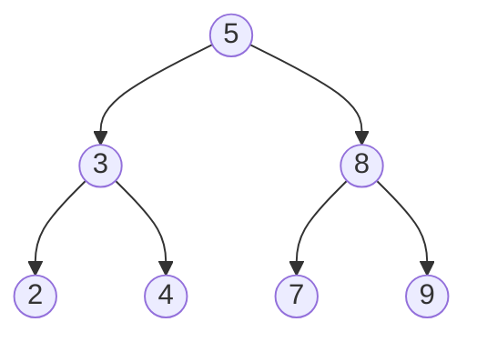

# AVL树与红黑树

在数据结构中，**AVL树**和**红黑树**是两种常见的自平衡二叉搜索树。它们通过特定的规则保持树的平衡，从而确保在最坏情况下仍能高效地进行插入、删除和查找操作。本文将详细介绍这两种树的基本概念、实现原理及其应用场景。

## 1. 什么是AVL树？

AVL树是一种高度平衡的二叉搜索树，由Adelson-Velsky和Landis在1962年提出。它的特点是每个节点的左右子树高度差（平衡因子）不超过1。如果插入或删除操作导致树失去平衡，AVL树会通过旋转操作重新平衡。

### 1.1 AVL树的平衡因子

平衡因子是AVL树中每个节点的左右子树高度差。平衡因子的值只能是-1、0或1。如果某个节点的平衡因子超出这个范围，树就会失去平衡，需要进行旋转操作。



在上面的示例中，节点5的平衡因子为0，因为它的左右子树高度相同。

### 1.2 AVL树的旋转操作

AVL树通过四种旋转操作来保持平衡：左旋、右旋、左右旋和右左旋。以下是右旋的示例：

```python
def right_rotate(node):
    left_child = node.left
    node.left = left_child.right
    left_child.right = node
    return left_child
```

### 1.3 AVL树的插入操作

插入新节点后，AVL树会从插入点向上检查每个祖先节点的平衡因子。如果发现不平衡，则进行相应的旋转操作。

```python
def insert(root, key):
    if not root:
        return Node(key)
    elif key < root.key:
        root.left = insert(root.left, key)
    else:
        root.right = insert(root.right, key)
    
    root.height = 1 + max(get_height(root.left), get_height(root.right))
    
    balance = get_balance(root)
    
    # Left Left Case
    if balance > 1 and key < root.left.key:
        return right_rotate(root)
    
    # Right Right Case
    if balance < -1 and key > root.right.key:
        return left_rotate(root)
    
    # Left Right Case
    if balance > 1 and key > root.left.key:
        root.left = left_rotate(root.left)
        return right_rotate(root)
    
    # Right Left Case
    if balance < -1 and key < root.right.key:
        root.right = right_rotate(root.right)
        return left_rotate(root)
    
    return root
```

## 2. 什么是红黑树？

红黑树是一种自平衡二叉搜索树，它通过颜色标记（红色或黑色）和特定的规则来保持平衡。红黑树的特点是：

1. 每个节点是红色或黑色。
2. 根节点是黑色。
3. 每个叶子节点（NIL节点）是黑色。
4. 如果一个节点是红色，则它的两个子节点都是黑色。
5. 从任一节点到其每个叶子的所有路径都包含相同数目的黑色节点。

### 2.1 红黑树的插入操作

插入新节点时，红黑树会通过颜色调整和旋转操作来保持平衡。以下是插入操作的示例：

```python
def insert(root, key):
    node = Node(key)
    node.color = "RED"
    
    # Standard BST insertion
    if not root:
        return node
    
    if key < root.key:
        root.left = insert(root.left, key)
    else:
        root.right = insert(root.right, key)
    
    # Fix Red-Black Tree properties
    if root.color == "RED" and root.left.color == "RED":
        root.color = "BLACK"
        root.left.color = "BLACK"
        root.right.color = "RED"
    
    return root
```

### 2.2 红黑树的删除操作

删除操作比插入操作更复杂，因为它可能破坏红黑树的性质。删除后，红黑树会通过颜色调整和旋转操作来恢复平衡。

## 3. AVL树与红黑树的比较

| 特性           | AVL树                          | 红黑树                        |
|----------------|--------------------------------|-------------------------------|
| 平衡标准       | 严格平衡（高度差≤1）            | 近似平衡（最长路径≤2倍最短路径）|
| 插入/删除性能  | 较慢（需要更多旋转操作）        | 较快（旋转操作较少）           |
| 查找性能       | 较快（树更平衡）                | 较慢（树相对不平衡）           |
| 适用场景       | 查找密集型应用                  | 插入/删除密集型应用            |

## 4. 实际应用场景

- **AVL树**：适用于需要频繁查找但较少插入和删除的场景，如数据库索引。
- **红黑树**：适用于需要频繁插入和删除的场景，如C++ STL中的`std::map`和`std::set`。

## 5. 总结

AVL树和红黑树都是自平衡二叉搜索树，它们通过不同的方式保持树的平衡。AVL树适合查找密集型应用，而红黑树适合插入/删除密集型应用。理解它们的原理和实现有助于在实际开发中选择合适的数据结构。

## 6. 附加资源与练习

- **练习**：尝试实现一个AVL树或红黑树，并测试其插入、删除和查找操作的性能。
- **资源**：
  - [AVL树维基百科](https://en.wikipedia.org/wiki/AVL_tree)
  - [红黑树维基百科](https://en.wikipedia.org/wiki/Red%E2%80%93black_tree)

:::tip
建议初学者从AVL树开始学习，因为它更容易理解平衡的概念。掌握AVL树后，再学习红黑树会更容易。
:::