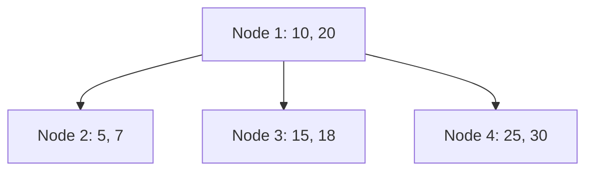
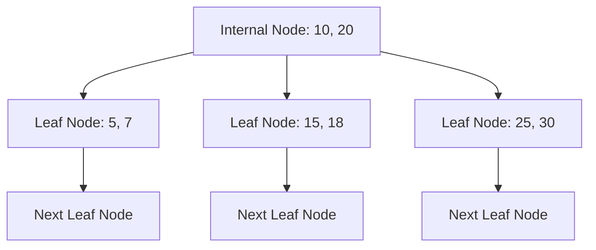

# B树与B+树

B树与B+树是计算机科学中用于存储和组织数据的重要数据结构，尤其在数据库和文件系统中广泛应用。它们的设计旨在优化磁盘I/O操作，减少数据访问时间。本文将详细介绍B树与B+树的基本概念、结构、操作及其实际应用。

## 1. 什么是B树？

B树（B-Tree）是一种自平衡的树数据结构，能够保持数据有序，并允许在对数时间内进行搜索、插入和删除操作。B树的特点是每个节点可以包含多个键和子节点，这使得它非常适合用于磁盘存储系统，因为它可以减少磁盘I/O操作的次数。

### B树的结构

B树的每个节点通常包含以下内容：
- 一组键（keys）：用于存储数据。
- 一组子节点（children）：指向其他节点。

B树的一个重要特性是它的平衡性，即所有叶子节点都位于同一层级。这种平衡性确保了树的高度不会过高，从而保证了操作的效率。

在上面的示例中，根节点包含两个键（10和20），并指向三个子节点。每个子节点又包含自己的键和子节点。

### B树的操作

#### 搜索操作

在B树中搜索一个键的过程类似于二叉搜索树。从根节点开始，根据键的大小决定向左或向右子树移动，直到找到目标键或到达叶子节点。

#### 插入操作

插入操作稍微复杂一些。首先，找到合适的叶子节点插入新键。如果插入后节点的键数超过了允许的最大值，节点会分裂成两个节点，并将中间的键提升到父节点。这个过程可能会递归进行，直到根节点。

#### 删除操作

删除操作也需要保持树的平衡。删除一个键后，如果节点的键数低于最小值，可能需要从兄弟节点借一个键，或者合并节点。

## 2. 什么是B+树？

B+树是B树的一种变体，它在B树的基础上进行了优化，特别适合用于数据库和文件系统。B+树与B树的主要区别在于：
- B+树的所有数据都存储在叶子节点中，内部节点仅用于索引。
- B+树的叶子节点通过指针连接，形成一个有序链表，便于范围查询。

### B+树的结构

B+树的内部节点只存储键，不存储数据。数据全部存储在叶子节点中，并且叶子节点之间通过指针连接，形成一个有序链表。

在上面的示例中，内部节点仅存储键（10和20），而叶子节点存储数据（5, 7, 15, 18, 25, 30），并且叶子节点之间通过指针连接。

### B+树的操作

#### 搜索操作

B+树的搜索操作与B树类似，但由于所有数据都存储在叶子节点中，搜索过程最终会到达叶子节点。

#### 插入操作

插入操作与B树类似，但插入后需要确保叶子节点之间的链表连接正确。

#### 删除操作

删除操作也需要保持树的平衡，并且需要维护叶子节点之间的链表连接。

## 3. 实际应用场景

B树和B+树在数据库和文件系统中有着广泛的应用。例如：
- **数据库索引**：B+树常用于数据库的索引结构，因为它支持高效的范围查询和顺序访问。
- **文件系统**：许多文件系统使用B树或B+树来管理文件和目录的存储。

:::tip
在实际应用中，B+树由于其叶子节点的链表结构，特别适合用于需要频繁进行范围查询的场景。
:::

## 4. 总结

B树和B+树是两种重要的数据结构，它们在数据库和文件系统中有着广泛的应用。B树适合用于需要频繁插入和删除的场景，而B+树则更适合用于需要高效范围查询的场景。理解这两种数据结构的基本概念和操作，对于深入学习数据库和文件系统至关重要。

## 5. 附加资源与练习

- **练习**：尝试实现一个简单的B树或B+树，并测试其搜索、插入和删除操作。
- **资源**：
  - [《算法导论》](https://mitpress.mit.edu/books/introduction-algorithms) - 详细介绍了B树和B+树的理论和实现。
  - [B树与B+树的维基百科页面](https://en.wikipedia.org/wiki/B-tree) - 提供了更多的背景知识和参考资料。

:::note
通过实践和深入学习，你将能够更好地理解B树和B+树的工作原理及其在实际应用中的重要性。
:::