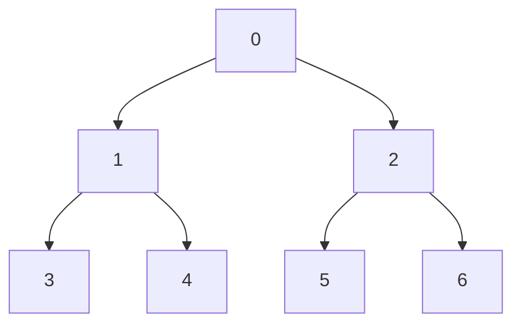

# 堆结构

堆（Heap）是一种特殊的树形数据结构，通常用于实现优先队列。堆的一个重要特性是：**堆中的每个节点的值都满足特定的堆性质**。根据堆性质的不同，堆可以分为**最大堆**和**最小堆**。

- **最大堆**：每个节点的值都大于或等于其子节点的值。
- **最小堆**：每个节点的值都小于或等于其子节点的值。

堆通常用数组来实现，因为堆是一个完全二叉树，数组可以有效地表示这种结构。

## 堆的基本性质

堆是一个完全二叉树，这意味着除了最后一层，其他层都是完全填充的，并且最后一层的节点都尽可能地靠左排列。这种性质使得堆可以用数组来表示，而不需要显式地使用指针。

### 数组表示

假设我们有一个数组 `arr`，其中 `arr[0]` 是堆的根节点。对于任意一个节点 `i`，其左子节点和右子节点的位置可以通过以下公式计算：

- 左子节点：`2 * i + 1`
- 右子节点：`2 * i + 2`
- 父节点：`(i - 1) / 2`



## 堆的操作

堆的主要操作包括插入元素、删除元素和构建堆。下面我们逐一介绍这些操作。

### 插入元素

在堆中插入一个新元素时，我们首先将新元素添加到数组的末尾，然后通过“上浮”（Heapify Up）操作将其调整到正确的位置，以保持堆的性质。

```python
def heapify_up(heap, index):
    parent = (index - 1) // 2
    if index > 0 and heap[index] > heap[parent]:
        heap[index], heap[parent] = heap[parent], heap[index]
        heapify_up(heap, parent)

def insert(heap, value):
    heap.append(value)
    heapify_up(heap, len(heap) - 1)
```

### 删除元素

在堆中删除元素通常是指删除堆顶元素（即最大堆中的最大值或最小堆中的最小值）。删除堆顶元素后，我们将数组的最后一个元素移动到堆顶，然后通过“下沉”（Heapify Down）操作将其调整到正确的位置。

```python
def heapify_down(heap, index):
    left = 2 * index + 1
    right = 2 * index + 2
    largest = index
    if left < len(heap) and heap[left] > heap[largest]:
        largest = left
    if right < len(heap) and heap[right] > heap[largest]:
        largest = right
    if largest != index:
        heap[index], heap[largest] = heap[largest], heap[index]
        heapify_down(heap, largest)

def delete_max(heap):
    if not heap:
        return None
    max_value = heap[0]
    heap[0] = heap[-1]
    heap.pop()
    heapify_down(heap, 0)
    return max_value
```

### 构建堆

构建堆的过程是将一个无序数组转换为一个堆。我们可以通过从最后一个非叶子节点开始，逐个进行“下沉”操作来实现。

```python
def build_heap(arr):
    n = len(arr)
    for i in range(n // 2 - 1, -1, -1):
        heapify_down(arr, i)
```

## 实际应用场景

堆结构在许多实际应用中都非常有用，以下是一些常见的应用场景：

1. **优先队列**：堆是实现优先队列的理想数据结构。优先队列允许我们以优先级顺序处理元素，而不是按照插入顺序。
2. **堆排序**：堆排序是一种高效的排序算法，时间复杂度为 `O(n log n)`。
3. **Dijkstra 算法**：在图的单源最短路径算法中，堆用于高效地选择下一个要处理的节点。
4. **Top K 问题**：堆可以用于快速找到一组数据中最大或最小的 K 个元素。

## 总结

堆是一种非常重要的数据结构，特别适合用于需要频繁插入和删除最大或最小元素的场景。通过理解堆的基本性质和操作，你可以更好地应用它来解决实际问题。

:::tip 提示
如果你对堆的实现和应用感兴趣，可以尝试自己实现一个堆，并解决一些相关的编程问题，例如堆排序或 Top K 问题。
:::

## 附加资源

- [堆排序算法详解](https://example.com/heap-sort)
- [优先队列的实现与应用](https://example.com/priority-queue)
- [Dijkstra 算法与堆的应用](https://example.com/dijkstra-heap)

## 练习

1. 实现一个最大堆，并测试插入和删除操作。
2. 使用堆实现堆排序算法。
3. 编写一个程序，使用堆找到一组数据中的前 K 个最大元素。