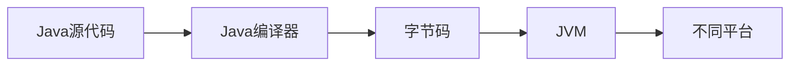

## 介绍

Java是一种广泛使用的编程语言，以其强大的功能和跨平台能力而闻名。Java语言的设计目标是“一次编写，到处运行”，这意味着Java程序可以在任何支持Java虚拟机（JVM）的设备上运行。Java语言的核心特性使其成为初学者和高级开发者的理想选择。

## Java语言的核心特性

### 1. 面向对象编程（OOP）

Java是一种纯粹的面向对象编程语言。面向对象编程的核心思想是将现实世界中的事物抽象为对象，并通过对象之间的交互来解决问题。Java中的类（Class）和对象（Object）是OOP的基础。

```java
// 定义一个简单的类
class Dog {
    String name;
    int age;

    void bark() {
        System.out.println(name + " is barking!");
    }
}

// 创建对象并调用方法
public class Main {
    public static void main(String[] args) {
        Dog myDog = new Dog();
        myDog.name = "Buddy";
        myDog.age = 3;
        myDog.bark();  // 输出: Buddy is barking!
    }
}
```

### 2. 平台无关性

Java程序通过Java虚拟机（JVM）运行，这使得Java程序可以在任何安装了JVM的设备上运行，而不需要重新编译。这种特性被称为“一次编写，到处运行”。



### 3. 自动内存管理（垃圾回收）

Java通过垃圾回收机制（Garbage Collection）自动管理内存。开发者不需要手动释放内存，JVM会自动回收不再使用的对象，从而减少内存泄漏的风险。

```java
public class GarbageCollectionExample {
    public static void main(String[] args) {
        for (int i = 0; i < 100000; i++) {
            new Object();  // 创建大量对象
        }
        System.gc();  // 建议JVM进行垃圾回收
    }
}
```

:::note
虽然`System.gc()`可以建议JVM进行垃圾回收，但JVM不一定会立即执行。
:::

### 4. 强类型语言

Java是一种强类型语言，这意味着每个变量都必须声明其类型，并且在编译时会进行类型检查。这有助于减少运行时错误。

```java
int number = 10;  // 正确
// number = "Hello";  // 错误：类型不匹配
```

### 5. 异常处理

Java提供了强大的异常处理机制，允许开发者捕获和处理运行时错误，从而提高程序的健壮性。

```java
public class ExceptionHandlingExample {
    public static void main(String[] args) {
        try {
            int result = 10 / 0;  // 除以零会抛出异常
        } catch (ArithmeticException e) {
            System.out.println("Cannot divide by zero!");
        }
    }
}
```

### 6. 多线程支持

Java内置了对多线程的支持，允许开发者编写并发程序。多线程可以提高程序的执行效率，特别是在处理大量任务时。

```java
class MyThread extends Thread {
    public void run() {
        System.out.println("Thread is running");
    }
}

public class Main {
    public static void main(String[] args) {
        MyThread thread = new MyThread();
        thread.start();  // 启动线程
    }
}
```

## 实际应用场景

### 1. 企业级应用开发

Java广泛应用于企业级应用开发，如银行系统、电子商务平台等。Java的稳定性和安全性使其成为企业级应用的首选语言。

### 2. Android应用开发

Java是Android应用开发的主要语言之一。虽然近年来Kotlin逐渐流行，但Java仍然是Android开发的重要工具。

### 3. 大数据处理

Java在大数据处理领域也有广泛应用，如Hadoop和Spark等大数据框架都是用Java编写的。

## 总结

Java语言的核心特性使其成为一门强大且灵活的编程语言。通过掌握这些特性，初学者可以更好地理解Java的工作原理，并能够编写出高效、健壮的程序。

## 附加资源与练习

- **练习1**：编写一个Java程序，定义一个`Car`类，包含`brand`和`speed`属性，并实现一个`accelerate`方法，使车速增加。
- **练习2**：研究Java的异常处理机制，并尝试编写一个程序，捕获和处理多种不同类型的异常。
- **附加资源**：阅读《Java编程思想》或《Effective Java》等经典书籍，深入理解Java语言的高级特性。

:::tip
Java的学习是一个循序渐进的过程，建议初学者多动手实践，逐步掌握Java的核心概念。
:::