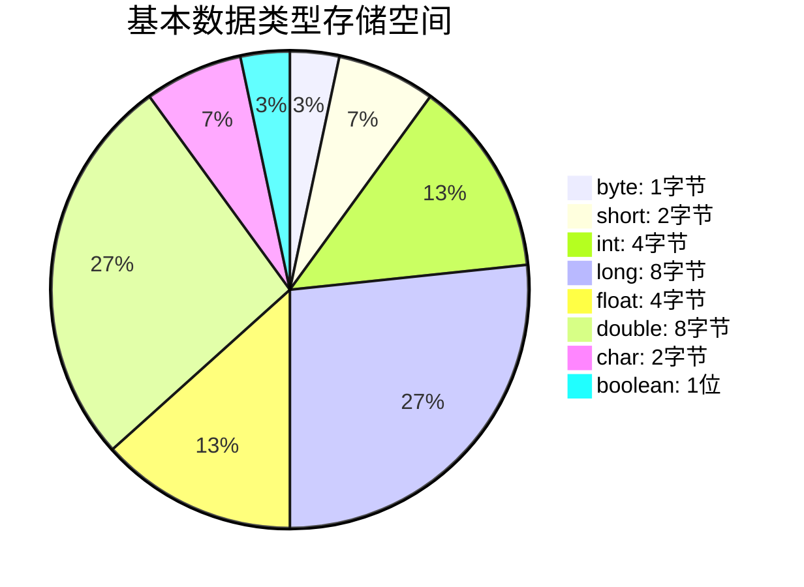

## 介绍

在 Java 中，数据类型分为两大类：**基本数据类型**和**引用数据类型**。基本数据类型是 Java 中最基础的数据存储形式，而包装类则是为基本数据类型提供的对象表示形式。理解这两者的区别和使用场景对于编写高效、灵活的 Java 程序至关重要。

### 基本数据类型

Java 提供了 8 种基本数据类型，它们分别是：

- **整型**：`byte`、`short`、`int`、`long`
- **浮点型**：`float`、`double`
- **字符型**：`char`
- **布尔型**：`boolean`

这些基本数据类型在内存中直接存储值，而不是对象的引用。它们的存储空间和取值范围如下：



### 包装类

包装类是为基本数据类型提供的对象表示形式。每个基本数据类型都有对应的包装类：

- `Byte`、`Short`、`Integer`、`Long`
- `Float`、`Double`
- `Character`
- `Boolean`

包装类的主要用途包括：

1. **将基本数据类型转换为对象**，以便在需要对象的上下文中使用（例如集合类）。
2. **提供实用方法**，例如将字符串转换为数值。

:::note
包装类是**不可变**的，一旦创建，其值就不能改变。
:::

### 自动装箱与拆箱

Java 5 引入了**自动装箱**和**自动拆箱**机制，使得基本数据类型和包装类之间的转换更加方便。

- **自动装箱**：将基本数据类型自动转换为对应的包装类。
- **自动拆箱**：将包装类自动转换为对应的基本数据类型。

```java
// 自动装箱
Integer num = 10; // 基本数据类型 int 自动装箱为 Integer

// 自动拆箱
int value = num; // Integer 自动拆箱为 int
```

### 实际案例

#### 案例 1：集合类中的使用

集合类（如 `ArrayList`）只能存储对象，不能存储基本数据类型。因此，我们需要使用包装类。

```java
import java.util.ArrayList;

public class Main {
    public static void main(String[] args) {
        ArrayList<Integer> numbers = new ArrayList<>();
        numbers.add(5); // 自动装箱
        numbers.add(10);

        int firstNumber = numbers.get(0); // 自动拆箱
        System.out.println("第一个数字是: " + firstNumber);
    }
}
```

**输出：**
```
第一个数字是: 5
```

#### 案例 2：实用方法

包装类提供了许多实用方法，例如将字符串转换为数值。

```java
public class Main {
    public static void main(String[] args) {
        String numberStr = "123";
        int number = Integer.parseInt(numberStr); // 将字符串转换为 int
        System.out.println("转换后的数字是: " + number);
    }
}
```

**输出：**
```
转换后的数字是: 123
```

### 总结

- **基本数据类型**是 Java 中最基础的数据存储形式，直接存储值。
- **包装类**为基本数据类型提供了对象表示形式，并提供了实用方法。
- **自动装箱**和**自动拆箱**机制使得基本数据类型和包装类之间的转换更加方便。
- 包装类在集合类、实用方法等场景中非常有用。

### 附加资源与练习

1. **练习**：编写一个程序，使用 `ArrayList` 存储一组整数，并计算它们的总和。
2. **进一步学习**：了解 Java 中的泛型机制，以及如何与包装类结合使用。

:::tip
尝试使用不同的包装类（如 `Double`、`Character`）来完成类似的练习，以加深对包装类的理解。
:::