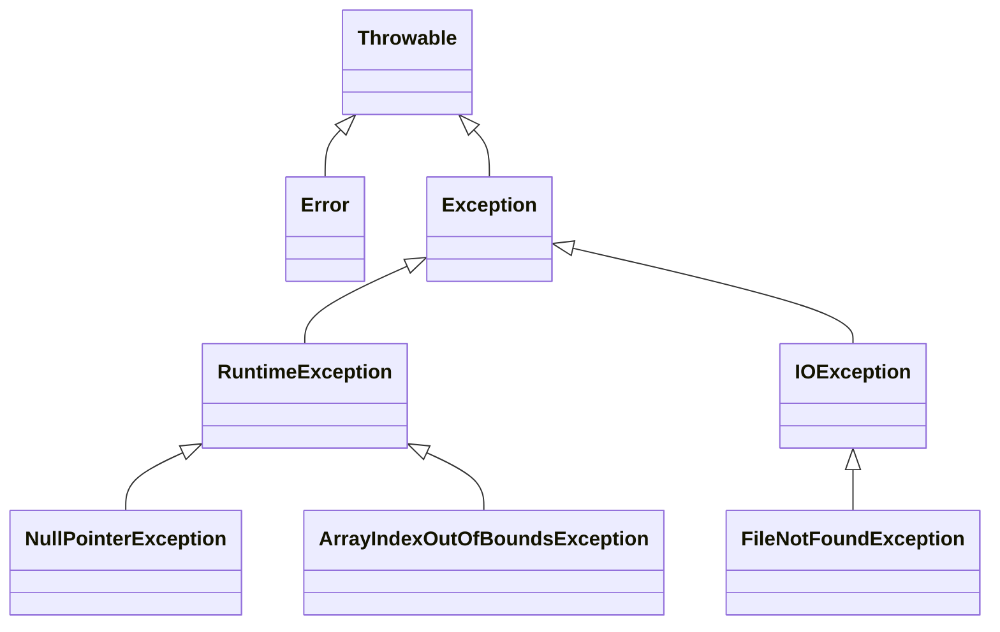

## 介绍

在Java编程中，异常（Exception）是指在程序执行过程中发生的意外事件，这些事件可能会中断程序的正常流程。Java提供了一套完善的异常处理机制，帮助开发者优雅地处理这些意外情况，确保程序的健壮性和稳定性。

Java异常体系是Java语言中处理错误和异常的核心机制。它通过`Throwable`类及其子类`Error`和`Exception`来分类和管理异常。理解Java异常体系是编写高质量Java代码的关键。

## Java异常的分类

Java异常可以分为两大类：**检查型异常（Checked Exceptions）**和**非检查型异常（Unchecked Exceptions）**。

### 1. 检查型异常（Checked Exceptions）

检查型异常是指在编译时就必须处理的异常。这些异常通常是由外部因素引起的，例如文件不存在、网络连接失败等。Java编译器会强制要求开发者处理这些异常，否则代码将无法通过编译。

常见的检查型异常包括：
- `IOException`
- `SQLException`
- `ClassNotFoundException`

### 2. 非检查型异常（Unchecked Exceptions）

非检查型异常是指在运行时发生的异常，通常是由程序逻辑错误引起的。这些异常不需要在编译时处理，但开发者仍然可以通过捕获和处理这些异常来提高程序的健壮性。

常见的非检查型异常包括：
- `NullPointerException`
- `ArrayIndexOutOfBoundsException`
- `ArithmeticException`

## Java异常体系结构

Java异常体系的核心是`Throwable`类，它是所有异常和错误的基类。`Throwable`类有两个主要的子类：`Error`和`Exception`。



- **Error**：表示严重的系统错误，通常由JVM抛出，应用程序无法处理。例如：`OutOfMemoryError`、`StackOverflowError`。
- **Exception**：表示程序可以处理的异常，分为检查型异常和非检查型异常。

## 异常处理机制

Java提供了`try-catch-finally`语句来处理异常。通过捕获和处理异常，开发者可以防止程序崩溃，并提供友好的错误信息。

### 1. `try-catch` 块

`try`块用于包裹可能抛出异常的代码，`catch`块用于捕获并处理异常。

```java
try {
    int result = 10 / 0; // 这里会抛出 ArithmeticException
} catch (ArithmeticException e) {
    System.out.println("捕获到异常: " + e.getMessage());
}
```

**输出：**
```
捕获到异常: / by zero
```

### 2. `finally` 块

`finally`块用于执行无论是否发生异常都必须执行的代码，通常用于释放资源。

```java
try {
    int result = 10 / 0;
} catch (ArithmeticException e) {
    System.out.println("捕获到异常: " + e.getMessage());
} finally {
    System.out.println("finally 块总是会执行");
}
```

**输出：**
```
捕获到异常: / by zero
finally 块总是会执行
```

### 3. `throws` 关键字

`throws`关键字用于声明方法可能抛出的异常，调用该方法的代码必须处理这些异常。

```java
public void readFile() throws IOException {
    // 读取文件的代码
}
```

## 实际应用场景

### 场景1：文件读取

在文件读取操作中，可能会遇到文件不存在的情况。通过捕获`FileNotFoundException`，我们可以优雅地处理这种情况。

```java
import java.io.File;
import java.io.FileNotFoundException;
import java.util.Scanner;

public class FileReadExample {
    public static void main(String[] args) {
        try {
            File file = new File("nonexistent.txt");
            Scanner scanner = new Scanner(file);
            while (scanner.hasNextLine()) {
                System.out.println(scanner.nextLine());
            }
            scanner.close();
        } catch (FileNotFoundException e) {
            System.out.println("文件未找到: " + e.getMessage());
        }
    }
}
```

**输出：**
```
文件未找到: nonexistent.txt (系统找不到指定的文件。)
```

### 场景2：数组越界

在访问数组元素时，可能会发生数组越界异常。通过捕获`ArrayIndexOutOfBoundsException`，我们可以防止程序崩溃。

```java
public class ArrayExample {
    public static void main(String[] args) {
        int[] numbers = {1, 2, 3};
        try {
            System.out.println(numbers[3]); // 这里会抛出 ArrayIndexOutOfBoundsException
        } catch (ArrayIndexOutOfBoundsException e) {
            System.out.println("数组越界: " + e.getMessage());
        }
    }
}
```

**输出：**
```
数组越界: Index 3 out of bounds for length 3
```

## 总结

Java异常体系是Java编程中处理错误和异常的核心机制。通过理解异常的分类、处理方式以及实际应用场景，开发者可以编写出更加健壮和可靠的代码。掌握`try-catch-finally`语句和`throws`关键字的使用，是处理Java异常的基础。

:::tip 提示
在实际开发中，建议尽量捕获具体的异常类型，而不是直接捕获`Exception`，这样可以更精确地处理异常情况。
:::

## 附加资源与练习

- **练习1**：编写一个程序，尝试读取一个不存在的文件，并捕获`FileNotFoundException`。
- **练习2**：编写一个程序，尝试访问一个数组的越界元素，并捕获`ArrayIndexOutOfBoundsException`。

通过以上练习，你将更好地理解Java异常处理的实际应用。