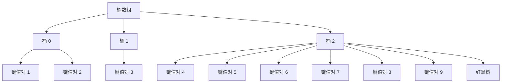

## 介绍

`HashMap` 是 Java 中最常用的数据结构之一，它基于哈希表实现，提供了高效的键值对存储和检索功能。对于初学者来说，理解 `HashMap` 的实现原理是掌握 Java 集合框架的重要一步。本文将深入探讨 `HashMap` 的内部结构、哈希冲突的处理机制以及实际应用场景。

## HashMap 的内部结构

`HashMap` 的核心是一个数组，数组中的每个元素是一个链表或红黑树的头节点。这个数组被称为“桶数组”（bucket array），每个桶对应一个哈希值。当插入一个键值对时，`HashMap` 会根据键的哈希值计算出对应的桶索引，然后将键值对存储在该桶中。

```java
// HashMap 的基本结构
class HashMap<K, V> {
    Node<K, V>[] table; // 桶数组
    int size;           // 键值对的数量
    float loadFactor;   // 负载因子
    int threshold;      // 扩容阈值

    static class Node<K, V> {
        final int hash;
        final K key;
        V value;
        Node<K, V> next;

        Node(int hash, K key, V value, Node<K, V> next) {
            this.hash = hash;
            this.key = key;
            this.value = value;
            this.next = next;
        }
    }
}
```

:::note
**注意**：在 Java 8 之前，`HashMap` 的每个桶是一个链表。在 Java 8 及以后，当链表长度超过一定阈值时，链表会转换为红黑树，以提高查找效率。
:::

## 哈希冲突的处理

哈希冲突是指两个不同的键通过哈希函数计算后得到相同的桶索引。`HashMap` 通过链地址法（Chaining）来处理哈希冲突。具体来说，当多个键映射到同一个桶时，这些键值对会以链表的形式存储在该桶中。如果链表长度超过一定阈值（默认为 8），链表会转换为红黑树。



:::tip
**提示**：红黑树的引入是为了在哈希冲突严重时，将查找时间复杂度从 O(n) 降低到 O(log n)。
:::

## 实际案例

假设我们有一个存储学生信息的 `HashMap`，其中键是学生的学号，值是学生的姓名。我们可以通过以下代码来演示 `HashMap` 的使用：

```java
import java.util.HashMap;

public class StudentMap {
    public static void main(String[] args) {
        HashMap<Integer, String> studentMap = new HashMap<>();
        studentMap.put(101, "Alice");
        studentMap.put(102, "Bob");
        studentMap.put(103, "Charlie");

        System.out.println("Student with ID 102: " + studentMap.get(102));
    }
}
```

**输出**：
```
Student with ID 102: Bob
```

在这个例子中，`HashMap` 根据学号的哈希值将学生信息存储在不同的桶中。当我们通过学号查找学生时，`HashMap` 会快速定位到对应的桶，并返回学生的姓名。

## 总结

`HashMap` 是 Java 中非常高效的数据结构，它通过哈希表实现了快速的键值对存储和检索。理解 `HashMap` 的内部结构、哈希冲突的处理机制以及实际应用场景，对于掌握 Java 集合框架至关重要。

:::caution
**注意**：虽然 `HashMap` 提供了高效的查找性能，但在高并发环境下，`HashMap` 可能会出现线程安全问题。如果需要线程安全的哈希表，可以考虑使用 `ConcurrentHashMap`。
:::

## 附加资源与练习

- **练习**：尝试实现一个简单的 `HashMap`，并测试其插入、查找和删除操作。
- **资源**：阅读 Java 官方文档中关于 `HashMap` 的部分，了解更多细节和高级用法。

通过本文的学习，你应该对 `HashMap` 的实现原理有了更深入的理解。继续探索和实践，你将能够更好地掌握 Java 中的集合框架。