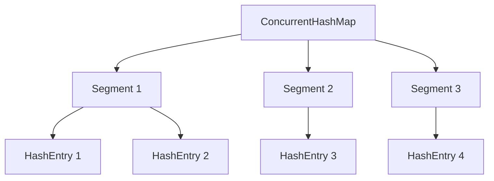

## 介绍

`ConcurrentHashMap` 是 Java 集合框架中的一个重要类，它提供了线程安全的哈希表实现。与 `Hashtable` 或 `Collections.synchronizedMap` 不同，`ConcurrentHashMap` 通过分段锁（Segment Locking）或 CAS（Compare-And-Swap）操作来实现高效的并发访问。这使得它在多线程环境下表现出色，尤其是在读多写少的场景中。

## 为什么需要 ConcurrentHashMap？

在多线程环境中，直接使用 `HashMap` 会导致线程安全问题，例如数据不一致或死锁。而 `Hashtable` 虽然线程安全，但它的同步机制是通过对整个表加锁来实现的，这会导致性能瓶颈。`ConcurrentHashMap` 通过更细粒度的锁机制，允许多个线程同时读取和写入，从而提高了并发性能。

## ConcurrentHashMap 的实现原理

### 分段锁机制（Java 7）

在 Java 7 中，`ConcurrentHashMap` 使用了分段锁机制。它将整个哈希表分成多个段（Segment），每个段独立加锁。这样，不同的线程可以同时访问不同的段，从而提高了并发性能。



### CAS 操作与红黑树（Java 8+）

在 Java 8 中，`ConcurrentHashMap` 的实现进行了重大改进。它不再使用分段锁，而是采用了 CAS 操作和红黑树来进一步提高并发性能。具体来说：

1. **CAS 操作**：`ConcurrentHashMap` 使用 CAS 操作来保证线程安全，而不是传统的锁机制。CAS 是一种无锁算法，它通过比较并交换的方式来更新数据，避免了锁的开销。
2. **红黑树**：当链表长度超过一定阈值时，`ConcurrentHashMap` 会将链表转换为红黑树，以减少查找时间。

## 代码示例

以下是一个简单的 `ConcurrentHashMap` 使用示例：

```java
import java.util.concurrent.ConcurrentHashMap;

public class ConcurrentHashMapExample {
    public static void main(String[] args) {
        ConcurrentHashMap<String, Integer> map = new ConcurrentHashMap<>();

        // 添加元素
        map.put("apple", 1);
        map.put("banana", 2);
        map.put("orange", 3);

        // 获取元素
        System.out.println("apple: " + map.get("apple")); // 输出: apple: 1

        // 更新元素
        map.put("apple", 5);
        System.out.println("apple: " + map.get("apple")); // 输出: apple: 5

        // 删除元素
        map.remove("banana");
        System.out.println("banana: " + map.get("banana")); // 输出: banana: null
    }
}
```

### 输出

```
apple: 1
apple: 5
banana: null
```

## 实际应用场景

`ConcurrentHashMap` 在实际开发中有广泛的应用，尤其是在需要高并发访问的场景中。以下是一些常见的应用场景：

1. **缓存系统**：在缓存系统中，`ConcurrentHashMap` 可以用来存储缓存数据，多个线程可以同时读取和更新缓存。
2. **计数器**：在多线程环境下，`ConcurrentHashMap` 可以用来实现线程安全的计数器。
3. **任务调度**：在任务调度系统中，`ConcurrentHashMap` 可以用来存储任务状态，多个线程可以同时查询和更新任务状态。

## 总结

`ConcurrentHashMap` 是 Java 中一个非常重要的并发集合类，它通过分段锁或 CAS 操作来实现高效的并发访问。与传统的 `Hashtable` 相比，`ConcurrentHashMap` 在多线程环境下具有更好的性能表现。在实际开发中，`ConcurrentHashMap` 广泛应用于缓存系统、计数器、任务调度等场景。

## 附加资源与练习

- **官方文档**：[ConcurrentHashMap (Java Platform SE 8)](https://docs.oracle.com/javase/8/docs/api/java/util/concurrent/ConcurrentHashMap.html)
- **练习**：尝试在多线程环境下使用 `ConcurrentHashMap` 实现一个简单的缓存系统，并测试其性能。

:::tip
如果你对 `ConcurrentHashMap` 的实现细节感兴趣，可以深入研究其源码，了解其内部数据结构和并发控制机制。
:::