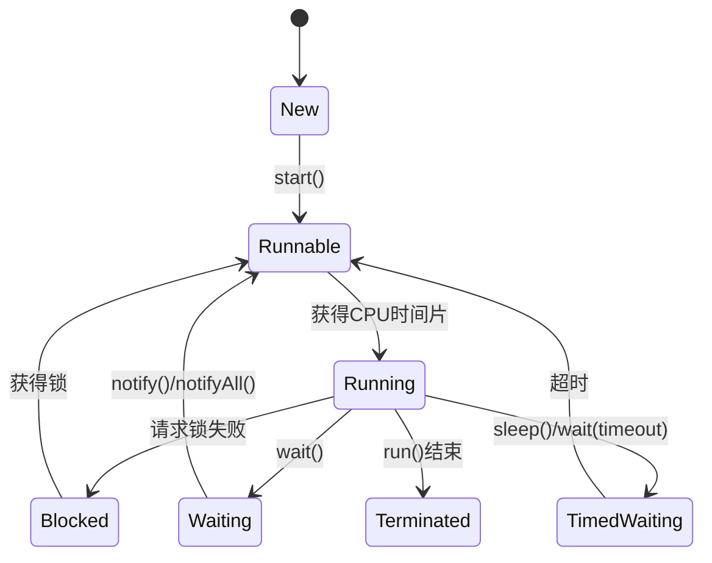

## 介绍

在 Java 并发编程中，线程是执行代码的最小单位。理解线程的生命周期对于编写高效、稳定的多线程程序至关重要。线程的生命周期描述了线程从创建到终止的整个过程，包括线程的状态及其转换。本文将详细介绍线程生命周期的各个阶段，并通过代码示例和实际案例帮助你更好地理解这一概念。

## 线程的生命周期

Java 中的线程生命周期可以分为以下几个状态：

1. **新建（New）**
2. **就绪（Runnable）**
3. **运行（Running）**
4. **阻塞（Blocked）**
5. **等待（Waiting）**
6. **超时等待（Timed Waiting）**
7. **终止（Terminated）**

下面我们将逐一介绍这些状态及其转换。

### 1. 新建（New）

当创建一个 `Thread` 对象时，线程处于新建状态。此时，线程尚未启动，也没有开始执行任何代码。

```java
Thread thread = new Thread(() -> {
    System.out.println("线程正在运行");
});
```

在这个阶段，线程对象已经被创建，但还没有调用 `start()` 方法。

### 2. 就绪（Runnable）

当调用 `start()` 方法后，线程进入就绪状态。此时，线程已经准备好运行，但还没有被调度执行。线程调度器将决定何时让线程进入运行状态。

```java
thread.start();
```

### 3. 运行（Running）

当线程调度器选择了一个就绪状态的线程并分配了 CPU 时间片时，线程进入运行状态。此时，线程正在执行其 `run()` 方法中的代码。

```java
@Override
public void run() {
    System.out.println("线程正在运行");
}
```

### 4. 阻塞（Blocked）

线程在运行过程中可能会因为某些原因进入阻塞状态。例如，当线程试图获取一个已经被其他线程持有的锁时，它会被阻塞，直到锁被释放。

```java
synchronized (lock) {
    // 临界区代码
}
```

### 5. 等待（Waiting）

线程可以通过调用 `wait()` 方法进入等待状态。此时，线程会释放持有的锁，并等待其他线程调用 `notify()` 或 `notifyAll()` 方法来唤醒它。

```java
synchronized (lock) {
    lock.wait(); // 线程进入等待状态
}
```

### 6. 超时等待（Timed Waiting）

与等待状态类似，线程可以通过调用带有超时参数的 `wait(long timeout)` 或 `sleep(long millis)` 方法进入超时等待状态。线程会在指定的时间后自动唤醒。

```java
Thread.sleep(1000); // 线程进入超时等待状态，1秒后自动唤醒
```

### 7. 终止（Terminated）

当线程的 `run()` 方法执行完毕或线程被强制终止时，线程进入终止状态。此时，线程的生命周期结束，无法再次启动。

```java
thread.join(); // 等待线程终止
```

## 线程状态转换图



## 实际案例

假设我们有一个简单的生产者-消费者模型，生产者线程生成数据并将其放入共享队列，消费者线程从队列中取出数据并处理。在这个过程中，线程可能会经历多种状态转换。

```java
import java.util.Queue;
import java.util.LinkedList;

public class ProducerConsumerExample {
    private static final int CAPACITY = 5;
    private static final Queue<Integer> queue = new LinkedList<>();

    public static void main(String[] args) {
        Thread producer = new Thread(() -> {
            for (int i = 0; i < 10; i++) {
                synchronized (queue) {
                    while (queue.size() == CAPACITY) {
                        try {
                            queue.wait(); // 生产者进入等待状态
                        } catch (InterruptedException e) {
                            e.printStackTrace();
                        }
                    }
                    queue.add(i);
                    System.out.println("生产: " + i);
                    queue.notifyAll(); // 唤醒消费者
                }
            }
        });

        Thread consumer = new Thread(() -> {
            while (true) {
                synchronized (queue) {
                    while (queue.isEmpty()) {
                        try {
                            queue.wait(); // 消费者进入等待状态
                        } catch (InterruptedException e) {
                            e.printStackTrace();
                        }
                    }
                    int value = queue.poll();
                    System.out.println("消费: " + value);
                    queue.notifyAll(); // 唤醒生产者
                }
            }
        });

        producer.start();
        consumer.start();
    }
}
```

在这个例子中，生产者和消费者线程可能会因为队列满或空而进入等待状态，并在适当的时候被唤醒。

## 总结

线程的生命周期是 Java 并发编程中的核心概念之一。通过理解线程的各个状态及其转换，你可以更好地控制多线程程序的执行流程，避免常见的并发问题。希望本文的内容能帮助你掌握线程生命周期的基本知识，并为你的并发编程学习打下坚实的基础。

## 附加资源

- [Java 官方文档 - Thread](https://docs.oracle.com/javase/8/docs/api/java/lang/Thread.html)
- [Java 并发编程实战](https://book.douban.com/subject/10484692/)

## 练习

1. 编写一个程序，创建两个线程，一个线程打印奇数，另一个线程打印偶数，确保它们交替打印。
2. 修改上面的生产者-消费者示例，使其支持多个生产者和消费者线程。