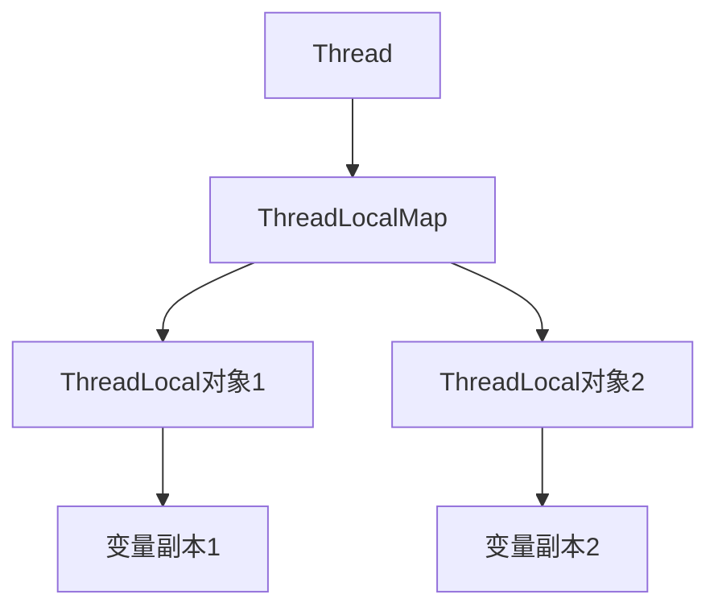

## 介绍

在Java并发编程中，`ThreadLocal` 是一个非常有用的工具，它允许我们为每个线程创建独立的变量副本。这意味着每个线程都可以拥有自己的变量实例，而不会与其他线程共享。`ThreadLocal` 的主要用途是解决多线程环境下的线程安全问题，尤其是在需要为每个线程维护独立状态时。

## ThreadLocal的基本概念

`ThreadLocal` 是一个泛型类，它的主要作用是提供线程本地变量。每个线程都可以通过 `ThreadLocal` 对象访问自己的变量副本，而不会影响其他线程的副本。`ThreadLocal` 的核心思想是将变量与线程绑定，使得每个线程都可以独立地操作自己的变量。

### 创建ThreadLocal变量

要创建一个 `ThreadLocal` 变量，可以使用以下代码：

```java
ThreadLocal<String> threadLocal = new ThreadLocal<>();
```

### 设置和获取ThreadLocal变量

你可以使用 `set()` 方法为当前线程设置变量值，并使用 `get()` 方法获取当前线程的变量值：

```java
threadLocal.set("Hello, ThreadLocal!");
String value = threadLocal.get();
System.out.println(value); // 输出: Hello, ThreadLocal!
```

### 移除ThreadLocal变量

当你不再需要 `ThreadLocal` 变量时，可以使用 `remove()` 方法将其从当前线程中移除：

```java
threadLocal.remove();
```

## ThreadLocal的工作原理

`ThreadLocal` 的核心实现依赖于 `Thread` 类中的 `ThreadLocalMap`。每个线程都有一个 `ThreadLocalMap`，它是一个自定义的哈希表，用于存储线程本地变量。`ThreadLocalMap` 的键是 `ThreadLocal` 对象，值是该线程对应的变量副本。



### 代码示例

以下是一个简单的示例，展示了 `ThreadLocal` 的工作原理：

```java
public class ThreadLocalExample {
    private static ThreadLocal<String> threadLocal = new ThreadLocal<>();

    public static void main(String[] args) {
        Thread thread1 = new Thread(() -> {
            threadLocal.set("Thread 1 Value");
            System.out.println(threadLocal.get()); // 输出: Thread 1 Value
        });

        Thread thread2 = new Thread(() -> {
            threadLocal.set("Thread 2 Value");
            System.out.println(threadLocal.get()); // 输出: Thread 2 Value
        });

        thread1.start();
        thread2.start();
    }
}
```

在这个示例中，`thread1` 和 `thread2` 分别设置了不同的 `ThreadLocal` 值，并且它们互不干扰。

## 实际应用场景

`ThreadLocal` 在实际开发中有很多应用场景，以下是一些常见的例子：

### 1. 用户会话管理

在Web应用中，`ThreadLocal` 可以用于存储当前用户的会话信息。每个请求都由一个独立的线程处理，因此可以使用 `ThreadLocal` 来存储当前用户的会话数据，而不需要显式地传递会话对象。

```java
public class UserSession {
    private static ThreadLocal<User> currentUser = new ThreadLocal<>();

    public static void setCurrentUser(User user) {
        currentUser.set(user);
    }

    public static User getCurrentUser() {
        return currentUser.get();
    }

    public static void clear() {
        currentUser.remove();
    }
}
```

### 2. 数据库连接管理

在数据库操作中，`ThreadLocal` 可以用于管理数据库连接。每个线程可以拥有自己的数据库连接，从而避免线程安全问题。

```java
public class ConnectionManager {
    private static ThreadLocal<Connection> connectionHolder = new ThreadLocal<>();

    public static Connection getConnection() {
        Connection connection = connectionHolder.get();
        if (connection == null) {
            connection = createConnection();
            connectionHolder.set(connection);
        }
        return connection;
    }

    private static Connection createConnection() {
        // 创建并返回一个新的数据库连接
        return null;
    }

    public static void closeConnection() {
        Connection connection = connectionHolder.get();
        if (connection != null) {
            try {
                connection.close();
            } catch (SQLException e) {
                e.printStackTrace();
            }
            connectionHolder.remove();
        }
    }
}
```

## 总结

`ThreadLocal` 是Java并发编程中的一个重要工具，它允许每个线程拥有自己的变量副本，从而避免了线程安全问题。通过 `ThreadLocal`，我们可以轻松地为每个线程维护独立的状态，而不需要显式地传递变量。

在实际开发中，`ThreadLocal` 可以用于用户会话管理、数据库连接管理等多种场景。然而，需要注意的是，`ThreadLocal` 变量在使用完毕后应及时清理，以避免内存泄漏问题。

## 附加资源

- [Java官方文档 - ThreadLocal](https://docs.oracle.com/javase/8/docs/api/java/lang/ThreadLocal.html)
- [深入理解Java并发编程](https://book.douban.com/subject/1230446/)

## 练习

1. 编写一个程序，使用 `ThreadLocal` 为每个线程存储一个唯一的ID，并在线程结束时打印该ID。
2. 思考并实现一个场景，使用 `ThreadLocal` 来管理线程的日志上下文信息。

:::tip
在完成练习时，记得及时清理 `ThreadLocal` 变量，以避免内存泄漏问题。
:::