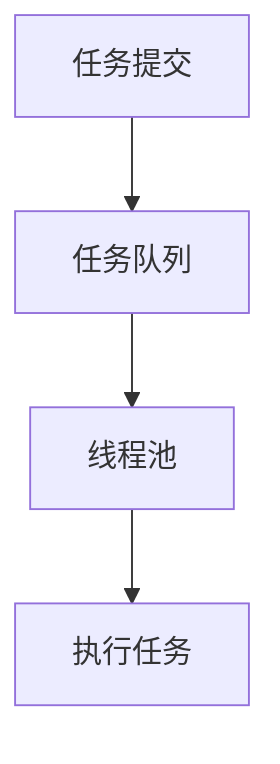

## 介绍

在 Java 并发编程中，线程池（Thread Pool）是一种管理和复用线程的机制。它通过预先创建一组线程，并将任务分配给这些线程来执行，从而避免了频繁创建和销毁线程的开销。线程池不仅提高了性能，还简化了线程管理。

### 为什么需要线程池？

- **资源开销**：创建和销毁线程是昂贵的操作，线程池可以复用线程，减少开销。
- **线程管理**：线程池可以限制并发线程的数量，避免系统资源耗尽。
- **任务队列**：线程池通常与任务队列结合使用，确保任务按顺序执行或根据优先级执行。

## 线程池的基本原理

线程池的核心思想是**线程复用**。它通过维护一个线程池和一个任务队列来实现：

1. **线程池**：包含一组预先创建的线程，这些线程可以重复使用。
2. **任务队列**：用于存储待执行的任务。当线程池中的线程空闲时，它们会从任务队列中取出任务并执行。



## Java 中的线程池实现

Java 提供了 `java.util.concurrent` 包来支持线程池的实现。最常用的类是 `ThreadPoolExecutor` 和 `Executors` 工厂类。

### 使用 `Executors` 创建线程池

`Executors` 提供了几种常见的线程池创建方法：

1. **FixedThreadPool**：固定大小的线程池。
2. **CachedThreadPool**：可缓存的线程池，线程数量根据任务动态调整。
3. **SingleThreadExecutor**：单线程的线程池，任务按顺序执行。
4. **ScheduledThreadPool**：支持定时及周期性任务执行的线程池。

以下是一个使用 `FixedThreadPool` 的示例：

```java
import java.util.concurrent.ExecutorService;
import java.util.concurrent.Executors;

public class ThreadPoolExample {
    public static void main(String[] args) {
        // 创建一个固定大小为 3 的线程池
        ExecutorService executor = Executors.newFixedThreadPool(3);

        // 提交 5 个任务
        for (int i = 1; i <= 5; i++) {
            Runnable task = new Task(i);
            executor.execute(task);
        }

        // 关闭线程池
        executor.shutdown();
    }
}

class Task implements Runnable {
    private int taskId;

    public Task(int taskId) {
        this.taskId = taskId;
    }

    @Override
    public void run() {
        System.out.println("Task " + taskId + " is running on thread " + Thread.currentThread().getName());
    }
}
```

**输出示例：**

```
Task 1 is running on thread pool-1-thread-1
Task 2 is running on thread pool-1-thread-2
Task 3 is running on thread pool-1-thread-3
Task 4 is running on thread pool-1-thread-1
Task 5 is running on thread pool-1-thread-2
```

:::note
注意：`FixedThreadPool` 的线程数量是固定的，如果任务数量超过线程池大小，多余的任务会进入任务队列等待执行。
:::

### 自定义线程池

如果需要更精细的控制，可以直接使用 `ThreadPoolExecutor` 类。以下是一个自定义线程池的示例：

```java
import java.util.concurrent.*;

public class CustomThreadPoolExample {
    public static void main(String[] args) {
        // 创建自定义线程池
        ThreadPoolExecutor executor = new ThreadPoolExecutor(
            2, // 核心线程数
            4, // 最大线程数
            60, // 空闲线程存活时间
            TimeUnit.SECONDS, // 时间单位
            new LinkedBlockingQueue<>(10) // 任务队列
        );

        // 提交任务
        for (int i = 1; i <= 10; i++) {
            Runnable task = new Task(i);
            executor.execute(task);
        }

        // 关闭线程池
        executor.shutdown();
    }
}
```

:::tip
提示：`ThreadPoolExecutor` 提供了更多配置选项，例如拒绝策略、线程工厂等。
:::

## 实际应用场景

线程池在以下场景中非常有用：

1. **Web 服务器**：处理大量并发请求时，使用线程池可以避免频繁创建和销毁线程。
2. **数据处理**：批量处理数据时，可以将任务分配给线程池中的线程并行执行。
3. **定时任务**：使用 `ScheduledThreadPool` 可以轻松实现定时任务调度。

## 总结

线程池是 Java 并发编程中的重要工具，它通过复用线程和任务队列机制，提高了程序的性能和可维护性。本文介绍了线程池的基本原理、Java 中的实现方法以及实际应用场景。

:::caution
注意：在使用线程池时，务必注意线程池的大小和任务队列的容量，避免资源耗尽或任务堆积。
:::

## 附加资源与练习

- **练习**：尝试使用 `CachedThreadPool` 和 `ScheduledThreadPool` 实现不同的任务调度。
- **深入学习**：阅读 `ThreadPoolExecutor` 的源码，了解其内部实现机制。
- **扩展阅读**：学习 Java 并发包中的其他工具类，如 `Future`、`Callable` 和 `CompletableFuture`。