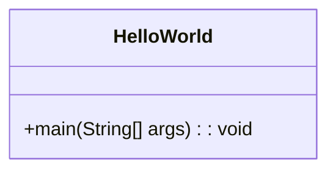

# 类文件结构

在Java编程中，`.class`文件是Java源代码编译后的产物。这些文件包含了Java虚拟机（JVM）执行程序所需的所有信息。理解类文件的结构对于深入理解Java程序的运行机制至关重要。本文将详细介绍类文件的组成部分及其作用。

## 类文件概述

类文件是Java源代码编译后的二进制文件，它包含了Java程序的字节码。JVM通过读取类文件来执行程序。类文件的结构是平台无关的，这意味着无论你在哪个操作系统上编译Java代码，生成的类文件结构都是一致的。

## 类文件的组成部分

类文件由多个部分组成，每个部分都有其特定的作用。以下是类文件的主要组成部分：

1. **魔数（Magic Number）**：类文件的前4个字节是魔数，用于标识文件类型。Java类文件的魔数是`0xCAFEBABE`。

2. **版本号（Version）**：接下来的4个字节表示类文件的版本号，包括主版本号和次版本号。

3. **常量池（Constant Pool）**：常量池是类文件中最重要的部分之一，它包含了类文件中使用的所有常量，如字符串、类名、方法名等。

4. **访问标志（Access Flags）**：访问标志用于描述类或接口的访问权限和属性，如`public`、`final`等。

5. **类索引、父类索引和接口索引（This Class, Super Class, Interfaces）**：这些索引指向常量池中的类名、父类名和接口名。

6. **字段表（Fields）**：字段表包含了类中所有字段的信息，如字段名、类型、访问权限等。

7. **方法表（Methods）**：方法表包含了类中所有方法的信息，如方法名、参数类型、返回类型等。

8. **属性表（Attributes）**：属性表包含了类文件中的附加信息，如源代码文件名、行号表等。

## 类文件结构示例

以下是一个简单的Java类及其对应的类文件结构的示例：

```java
public class HelloWorld {
    public static void main(String[] args) {
        System.out.println("Hello, World!");
    }
}
```

编译后生成的`.class`文件的结构如下：



## 实际应用场景

理解类文件结构在实际开发中有多种应用场景，例如：

- **字节码增强**：通过修改类文件中的字节码，可以实现AOP（面向切面编程）等高级功能。
- **反编译**：通过分析类文件结构，可以将字节码反编译为Java源代码。
- **性能优化**：通过分析类文件中的字节码，可以找到性能瓶颈并进行优化。

## 总结

类文件是Java程序运行的基础，理解其结构对于深入理解Java虚拟机的工作原理至关重要。本文介绍了类文件的主要组成部分及其作用，并通过示例展示了类文件的实际结构。希望本文能帮助你更好地理解类文件结构。

## 附加资源

- [Java虚拟机规范](https://docs.oracle.com/javase/specs/jvms/se16/html/index.html)
- [字节码增强技术](https://www.baeldung.com/java-bytecode-manipulation)
- [反编译工具](https://www.javadecompilers.com/)

## 练习

1. 编写一个简单的Java类，并使用`javap`工具查看其类文件结构。
2. 尝试修改类文件中的字节码，观察程序行为的变化。
3. 使用反编译工具将类文件反编译为Java源代码，并分析其结构。

:::tip
建议初学者在学习类文件结构时，结合实际的类文件进行分析，这样可以更直观地理解各个部分的作用。
:::