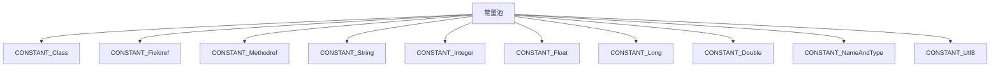

## 什么是常量池？

常量池（Constant Pool）是 Java 虚拟机（JVM）中用于存储类文件中常量数据的一个数据结构。它是类文件的一部分，包含了类或接口中使用的各种常量，例如字符串、类名、方法名、字段名等。常量池的作用是减少重复数据的存储，提高内存使用效率。

在 JVM 中，每个类或接口都有一个与之对应的常量池。常量池中的数据是通过索引来引用的，这些索引在类文件的字节码中被广泛使用。

## 常量池的结构

常量池是一个表结构，其中每一项都是一个常量。常量池中的每一项都有一个标签（tag），用于标识该常量的类型。常见的常量类型包括：

- `CONSTANT_Class`：表示类或接口的符号引用。
- `CONSTANT_Fieldref`：表示字段的符号引用。
- `CONSTANT_Methodref`：表示方法的符号引用。
- `CONSTANT_String`：表示字符串常量。
- `CONSTANT_Integer`：表示整型常量。
- `CONSTANT_Float`：表示浮点型常量。
- `CONSTANT_Long`：表示长整型常量。
- `CONSTANT_Double`：表示双精度浮点型常量。
- `CONSTANT_NameAndType`：表示字段或方法的名称和描述符。
- `CONSTANT_Utf8`：表示 UTF-8 编码的字符串。

以下是一个简单的常量池结构的示例：



## 常量池的实际应用

### 1. 字符串常量池

在 Java 中，字符串常量池是常量池的一个典型应用。当我们使用字符串字面量时，JVM 会将这些字符串存储在字符串常量池中。如果多个字符串字面量具有相同的值，它们将共享同一个常量池中的引用。

```java
String str1 = "Hello";
String str2 = "Hello";
System.out.println(str1 == str2); // 输出 true，因为 str1 和 str2 引用同一个字符串常量
```

### 2. 类和方法引用

在类文件中，类名、方法名和字段名等信息都存储在常量池中。当 JVM 加载类时，它会使用常量池中的信息来解析类、方法和字段的引用。

```java
public class Example {
    public void printMessage() {
        System.out.println("Hello, World!");
    }
}
```

在上面的代码中，`Example` 类的类名、`printMessage` 方法名以及 `"Hello, World!"` 字符串都会存储在常量池中。

## 常量池的加载过程

当 JVM 加载一个类时，它会解析类文件中的常量池，并将其加载到内存中。常量池中的每一项都会被解析为 JVM 内部的数据结构，以便在运行时使用。

:::note
常量池的加载是类加载过程的一部分。JVM 在加载类时会解析常量池，并将其中的符号引用转换为直接引用。
:::

## 实际案例

假设我们有一个简单的 Java 类：

```java
public class HelloWorld {
    public static void main(String[] args) {
        System.out.println("Hello, World!");
    }
}
```

编译后，我们可以使用 `javap -v HelloWorld.class` 命令来查看类文件中的常量池信息。输出可能如下：

```
Constant pool:
   #1 = Methodref          #6.#15         // java/lang/Object."<init>":()V
   #2 = Fieldref           #16.#17        // java/lang/System.out:Ljava/io/PrintStream;
   #3 = String             #18            // Hello, World!
   #4 = Methodref          #19.#20        // java/io/PrintStream.println:(Ljava/lang/String;)V
   #5 = Class              #21            // HelloWorld
   #6 = Class              #22            // java/lang/Object
   #7 = Utf8               <init>
   #8 = Utf8               ()V
   #9 = Utf8               Code
  #10 = Utf8               LineNumberTable
  #11 = Utf8               main
  #12 = Utf8               ([Ljava/lang/String;)V
  #13 = Utf8               SourceFile
  #14 = Utf8               HelloWorld.java
  #15 = NameAndType        #7:#8          // "<init>":()V
  #16 = Class              #23            // java/lang/System
  #17 = NameAndType        #24:#25        // out:Ljava/io/PrintStream;
  #18 = Utf8               Hello, World!
  #19 = Class              #26            // java/io/PrintStream
  #20 = NameAndType        #27:#28        // println:(Ljava/lang/String;)V
  #21 = Utf8               HelloWorld
  #22 = Utf8               java/lang/Object
  #23 = Utf8               java/lang/System
  #24 = Utf8               out
  #25 = Utf8               Ljava/io/PrintStream;
  #26 = Utf8               java/io/PrintStream
  #27 = Utf8               println
  #28 = Utf8               (Ljava/lang/String;)V
```

从上面的输出中，我们可以看到常量池中存储了类名、方法名、字段名以及字符串常量等信息。

## 总结

常量池是 JVM 中一个非常重要的数据结构，它存储了类文件中使用的各种常量。通过常量池，JVM 可以高效地管理类、方法、字段和字符串等资源的引用。理解常量池的结构和作用，有助于我们更好地理解 Java 程序的运行机制。

## 附加资源与练习

- **练习 1**：编写一个简单的 Java 类，并使用 `javap -v` 命令查看其常量池内容。
- **练习 2**：尝试修改类文件中的常量池内容，观察 JVM 的行为变化。

:::tip
想要更深入地了解常量池，可以参考 [Java 虚拟机规范](https://docs.oracle.com/javase/specs/jvms/se17/html/jvms-4.html#jvms-4.4) 中关于常量池的详细描述。
:::