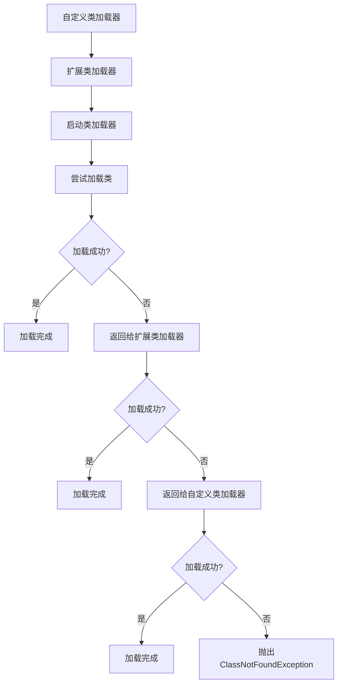

## 什么是双亲委派模型？

双亲委派模型（Parent Delegation Model）是 Java 类加载器（ClassLoader）在加载类时遵循的一种机制。它是 Java 类加载机制的核心设计之一，用于确保类的唯一性和安全性。

在 Java 中，类加载器负责将 `.class` 文件加载到 JVM 中。双亲委派模型的核心思想是：**当一个类加载器需要加载一个类时，它首先会委托其父类加载器尝试加载，只有在父类加载器无法加载时，才会由自己来加载**。

## 双亲委派模型的工作流程

为了更好地理解双亲委派模型，我们可以将其工作流程分为以下几个步骤：

1. **委托父类加载器**：当一个类加载器收到加载类的请求时，它不会立即尝试加载，而是先将请求委托给其父类加载器。
2. **递归委托**：父类加载器会继续向上委托，直到到达启动类加载器（Bootstrap ClassLoader）。
3. **尝试加载**：如果父类加载器无法加载该类，子类加载器才会尝试自己加载。
4. **加载成功或失败**：如果所有父类加载器都无法加载该类，子类加载器会抛出 `ClassNotFoundException`。



## 为什么需要双亲委派模型？

双亲委派模型的设计主要有以下几个目的：

1. **避免重复加载**：通过委托机制，可以确保每个类只被加载一次，避免类的重复加载。
2. **保证类的唯一性**：由于类加载器会优先委托父类加载器加载，因此可以确保同一个类在 JVM 中只有一个版本。
3. **安全性**：通过优先使用核心类库（如 `java.lang` 包中的类），可以防止用户自定义的类替换核心类库中的类，从而保证 JVM 的安全性。

## 实际案例：双亲委派模型的应用

假设我们有一个自定义的类加载器 `MyClassLoader`，它尝试加载一个类 `com.example.MyClass`。以下是加载过程的伪代码：

```java
public class MyClassLoader extends ClassLoader {
    @Override
    protected Class<?> findClass(String name) throws ClassNotFoundException {
        // 1. 首先委托父类加载器加载
        try {
            return super.findClass(name);
        } catch (ClassNotFoundException e) {
            // 2. 如果父类加载器无法加载，尝试自己加载
            byte[] classData = loadClassData(name);
            if (classData != null) {
                return defineClass(name, classData, 0, classData.length);
            } else {
                throw new ClassNotFoundException("Class not found: " + name);
            }
        }
    }

    private byte[] loadClassData(String className) {
        // 从文件系统或网络中加载类的字节码
        // 这里省略具体实现
        return null;
    }
}
```

在这个例子中，`MyClassLoader` 首先会委托其父类加载器加载 `com.example.MyClass`。如果父类加载器无法加载，`MyClassLoader` 才会尝试自己加载。

## 双亲委派模型的局限性

尽管双亲委派模型在大多数情况下都能很好地工作，但它也有一些局限性。例如：

1. **无法加载不同版本的类**：由于双亲委派模型要求类只能被加载一次，因此无法在同一 JVM 中加载不同版本的类。
2. **无法实现热部署**：在某些场景下（如 Web 应用的热部署），需要动态加载新的类版本，而双亲委派模型无法直接支持这种需求。

## 总结

双亲委派模型是 Java 类加载机制的核心设计之一，它通过委托机制确保了类的唯一性和安全性。理解双亲委派模型对于掌握 Java 类加载机制至关重要。

:::tip 提示
如果你对类加载机制感兴趣，可以进一步研究 Java 中的自定义类加载器，以及如何打破双亲委派模型来实现特定的需求。
:::

## 附加资源

- [Java 类加载机制官方文档](https://docs.oracle.com/javase/specs/jvms/se17/html/jvms-5.html)
- [深入理解 Java 虚拟机](https://book.douban.com/subject/34907497/) - 一本深入讲解 JVM 的书籍。

## 练习

1. 编写一个自定义类加载器，尝试加载一个类并观察双亲委派模型的工作过程。
2. 思考在什么场景下需要打破双亲委派模型，并尝试实现一个打破双亲委派模型的类加载器。