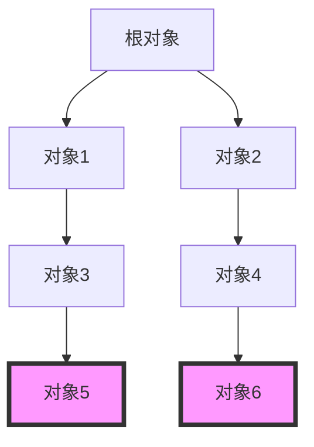
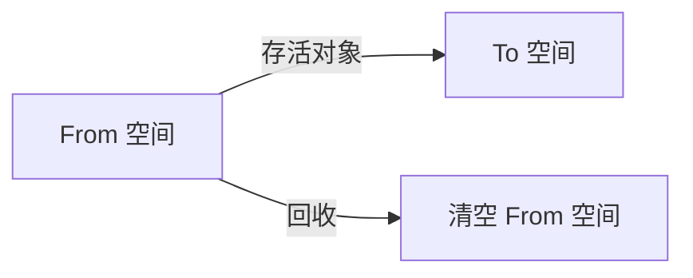
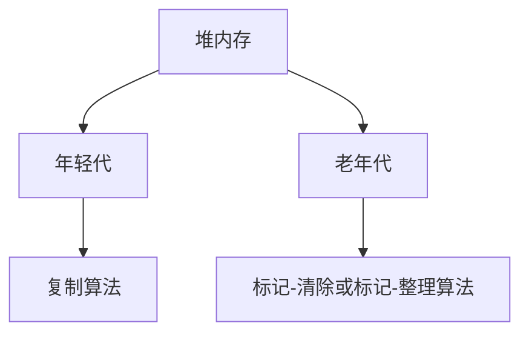

# 垃圾回收算法

在 Java 虚拟机（JVM）中，垃圾回收（Garbage Collection, GC）是自动管理内存的核心机制。它负责回收不再使用的对象，释放内存空间，避免内存泄漏。垃圾回收算法是实现这一机制的关键。本文将详细介绍常见的垃圾回收算法，帮助初学者理解其工作原理和应用场景。

## 什么是垃圾回收？

垃圾回收是指自动识别并回收程序中不再使用的对象的过程。在 Java 中，程序员不需要手动释放内存，JVM 会自动处理这些任务。垃圾回收器会定期扫描堆内存，标记不再被引用的对象，并将其回收。

:::note
垃圾回收的主要目标是：
1. 提高内存利用率。
2. 避免内存泄漏。
3. 减少程序员的内存管理负担。
:::

## 常见的垃圾回收算法

以下是 JVM 中常见的垃圾回收算法：

### 1. 标记-清除算法（Mark-Sweep）

**标记-清除算法**是最基础的垃圾回收算法，分为两个阶段：
1. **标记阶段**：从根对象（如栈中的引用、静态变量等）开始，遍历所有可达对象，并标记它们。
2. **清除阶段**：遍历堆内存，回收未被标记的对象。

**优点**：
- 实现简单。
- 适用于大多数场景。

**缺点**：
- 会产生内存碎片。
- 回收效率较低。

### 2. 复制算法（Copying）

**复制算法**将堆内存分为两个区域：**From 空间**和**To 空间**。在垃圾回收时，将 From 空间中的存活对象复制到 To 空间，然后清空 From 空间。

**优点**：
- 不会产生内存碎片。
- 回收效率高。

**缺点**：
- 需要双倍内存空间。
- 适用于存活对象较少的场景。

### 3. 标记-整理算法（Mark-Compact）

**标记-整理算法**结合了标记-清除和复制算法的优点。它首先标记所有存活对象，然后将它们整理到内存的一端，最后清理剩余空间。

**优点**：
- 不会产生内存碎片。
- 内存利用率高。

**缺点**：
- 整理过程耗时较长。

### 4. 分代收集算法（Generational Collection）

**分代收集算法**基于对象的生命周期将堆内存分为不同的代（如年轻代和老年代）。年轻代使用复制算法，老年代使用标记-清除或标记-整理算法。

**优点**：
- 针对不同生命周期的对象采用不同的回收策略。
- 提高整体回收效率。

**缺点**：
- 实现复杂。

## 实际应用场景

### 案例 1：Web 应用中的垃圾回收

在 Web 应用中，用户请求会频繁创建和销毁对象。年轻代使用复制算法可以快速回收短期对象，而老年代使用标记-整理算法可以高效管理长期存活的对象。

### 案例 2：大数据处理中的垃圾回收

在大数据处理中，大量临时对象会被创建。分代收集算法可以有效管理这些对象，避免频繁的 Full GC（全局垃圾回收）对性能的影响。

## 总结

垃圾回收算法是 JVM 内存管理的核心。通过理解标记-清除、复制、标记-整理和分代收集等算法，我们可以更好地优化 Java 应用的性能。选择合适的垃圾回收算法，可以显著提高内存利用率和程序运行效率。

:::tip
**附加资源**：
- [Oracle 官方文档：Java 垃圾回收](https://docs.oracle.com/javase/8/docs/technotes/guides/vm/gctuning/)
- 《深入理解 Java 虚拟机》——周志明
:::

:::caution
**练习**：
1. 尝试编写一个 Java 程序，观察不同垃圾回收算法的效果。
2. 使用 JVM 参数（如 `-XX:+UseSerialGC`）指定垃圾回收器，并分析其性能。
:::