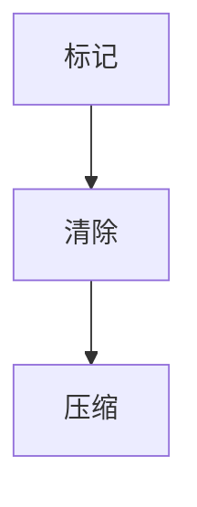

# 垃圾收集器

## 介绍

在 Java 虚拟机（JVM）中，垃圾收集器（Garbage Collector, GC）是一个自动内存管理机制，负责回收不再使用的对象以释放内存。垃圾收集器的主要目标是减少内存泄漏和手动内存管理的复杂性，使开发者能够专注于业务逻辑。

:::note
垃圾收集器是 JVM 的核心组件之一，理解其工作原理对于优化 Java 应用程序的性能至关重要。
:::

## 垃圾收集的基本概念

### 什么是垃圾？

在 Java 中，垃圾指的是那些不再被任何活动对象引用的对象。这些对象占用的内存可以被回收，以便为新的对象分配空间。

### 垃圾收集的过程

垃圾收集器的工作过程通常包括以下几个步骤：

1. **标记（Marking）**：垃圾收集器会遍历所有对象，标记出哪些对象是存活的，哪些是垃圾。
2. **清除（Sweeping）**：垃圾收集器会清除所有被标记为垃圾的对象，释放它们占用的内存。
3. **压缩（Compacting）**：可选步骤，垃圾收集器会将存活的对象移动到内存的一端，以减少内存碎片。



## 垃圾收集器的类型

JVM 提供了多种垃圾收集器，每种收集器都有其特定的使用场景和优缺点。以下是几种常见的垃圾收集器：

### 1. Serial GC

Serial GC 是最简单的垃圾收集器，它使用单线程进行垃圾收集。适用于单核处理器或小型应用程序。

:::caution
Serial GC 在垃圾收集时会暂停所有应用线程（Stop-The-World），因此不适合对延迟敏感的应用。
:::

### 2. Parallel GC

Parallel GC 使用多线程进行垃圾收集，适用于多核处理器和需要高吞吐量的应用。

:::tip
Parallel GC 是 Java 8 及之前版本的默认垃圾收集器。
:::

### 3. CMS (Concurrent Mark Sweep) GC

CMS GC 是一种以低延迟为目标的垃圾收集器，它尽可能减少垃圾收集时的停顿时间。

:::warning
CMS GC 在 Java 9 中已被标记为废弃，并在 Java 14 中被移除。
:::

### 4. G1 (Garbage-First) GC

G1 GC 是一种面向服务端应用的垃圾收集器，旨在平衡吞吐量和延迟。它将堆内存划分为多个区域，并优先收集垃圾最多的区域。

:::note
G1 GC 是 Java 9 及之后版本的默认垃圾收集器。
:::

### 5. ZGC (Z Garbage Collector)

ZGC 是一种低延迟的垃圾收集器，适用于需要极低停顿时间的大型应用。

:::tip
ZGC 在 Java 11 中引入，并持续优化以支持更大的堆内存。
:::

## 实际案例

### 案例 1：选择适合的垃圾收集器

假设你正在开发一个对延迟敏感的高性能 Web 应用。在这种情况下，G1 GC 或 ZGC 可能是更好的选择，因为它们能够在不显著影响应用性能的情况下进行垃圾收集。

### 案例 2：优化内存使用

如果你发现你的应用在高峰期频繁触发 Full GC，导致应用停顿，你可以考虑调整堆大小或切换到更适合的垃圾收集器。

```java
// 示例：设置 JVM 参数以使用 G1 GC
public class Main {
    public static void main(String[] args) {
        System.out.println("Hello, G1 GC!");
    }
}
```

运行该程序时，可以使用以下 JVM 参数：

```bash
java -XX:+UseG1GC Main
```

## 总结

垃圾收集器是 JVM 中至关重要的组件，它帮助开发者自动管理内存，减少内存泄漏的风险。了解不同类型的垃圾收集器及其适用场景，可以帮助你更好地优化 Java 应用程序的性能。

## 附加资源

- [Oracle 官方文档：Java Garbage Collection Basics](https://docs.oracle.com/javase/8/docs/technotes/guides/vm/gctuning/)
- [Understanding G1 Garbage Collector](https://www.oracle.com/technical-resources/articles/java/g1gc.html)
- [ZGC: The Next Generation Low-Latency Garbage Collector](https://wiki.openjdk.org/display/zgc/Main)

## 练习

1. 尝试在你的 Java 应用程序中切换不同的垃圾收集器，并观察其对性能的影响。
2. 使用 JVM 参数 `-XX:+PrintGCDetails` 来打印垃圾收集的详细信息，分析日志以理解垃圾收集的过程。
