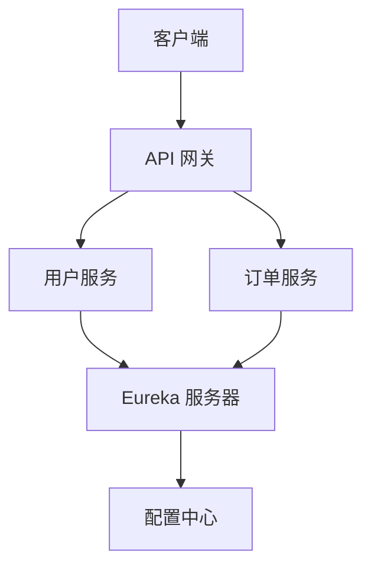

# Spring Cloud 组件

Spring Cloud 是一个用于构建分布式系统的工具集，它基于 Spring Boot 开发，提供了微服务架构中常见的功能，如配置管理、服务发现、负载均衡、断路器等。Spring Cloud 的核心目标是简化分布式系统的开发，使开发者能够专注于业务逻辑，而无需过多关注底层基础设施。

本文将逐步介绍 Spring Cloud 的核心组件，并通过实际案例展示其应用场景。

---

## 1. Spring Cloud 的核心组件

Spring Cloud 提供了多个组件来支持微服务架构的开发。以下是几个最常用的组件：

### 1.1 Spring Cloud Config
Spring Cloud Config 是一个集中化的外部配置管理工具，支持从 Git、本地文件系统等存储中加载配置。它允许你在不重启服务的情况下动态更新配置。

```java
// 示例：在 Spring Boot 应用中启用 Spring Cloud Config
@SpringBootApplication
@EnableConfigServer
public class ConfigServerApplication {
    public static void main(String[] args) {
        SpringApplication.run(ConfigServerApplication.class, args);
    }
}
```

### 1.2 Spring Cloud Netflix Eureka
Eureka 是一个服务发现组件，用于实现微服务之间的动态注册与发现。它允许服务在启动时将自己注册到 Eureka 服务器，并能够查询其他服务的位置。

```java
// 示例：在 Spring Boot 应用中启用 Eureka 客户端
@SpringBootApplication
@EnableEurekaClient
public class ServiceApplication {
    public static void main(String[] args) {
        SpringApplication.run(ServiceApplication.class, args);
    }
}
```

### 1.3 Spring Cloud Gateway
Spring Cloud Gateway 是一个 API 网关，用于路由请求、负载均衡、安全控制等。它是微服务架构中的入口点，负责将请求转发到正确的服务。

```java
// 示例：配置 Spring Cloud Gateway 路由
spring:
  cloud:
    gateway:
      routes:
        - id: user_service
          uri: http://localhost:8081
          predicates:
            - Path=/user/**
```

### 1.4 Spring Cloud Hystrix
Hystrix 是一个断路器组件，用于处理分布式系统中的故障和延迟。它通过隔离服务调用、提供回退机制来提高系统的容错能力。

```java
// 示例：使用 Hystrix 实现断路器
@HystrixCommand(fallbackMethod = "fallbackMethod")
public String callService() {
    return restTemplate.getForObject("http://service-url", String.class);
}

public String fallbackMethod() {
    return "Fallback response";
}
```

---

## 2. 实际案例：构建一个简单的微服务系统

以下是一个使用 Spring Cloud 组件构建的简单微服务系统示例：

1. **配置中心**：使用 Spring Cloud Config 管理所有服务的配置。
2. **服务注册与发现**：使用 Eureka 实现服务的动态注册与发现。
3. **API 网关**：使用 Spring Cloud Gateway 路由请求。
4. **断路器**：使用 Hystrix 处理服务调用失败的情况。



---

## 3. 总结

Spring Cloud 提供了一套完整的工具集，帮助开发者轻松构建和管理分布式系统。通过本文的学习，你应该已经掌握了 Spring Cloud 的核心组件及其基本用法。接下来，你可以尝试在实际项目中应用这些组件，并进一步探索 Spring Cloud 的高级功能。

---

## 4. 附加资源与练习

- **官方文档**：[Spring Cloud 官方文档](https://spring.io/projects/spring-cloud)
- **练习**：尝试搭建一个包含两个微服务的系统，使用 Eureka 进行服务发现，并通过 Spring Cloud Gateway 路由请求。
- **深入学习**：研究 Spring Cloud Stream 和 Spring Cloud Sleuth，了解它们在消息驱动和分布式追踪中的应用。

:::tip
如果你在学习过程中遇到问题，可以参考 Spring Cloud 的官方文档或加入相关的开发者社区寻求帮助。
:::