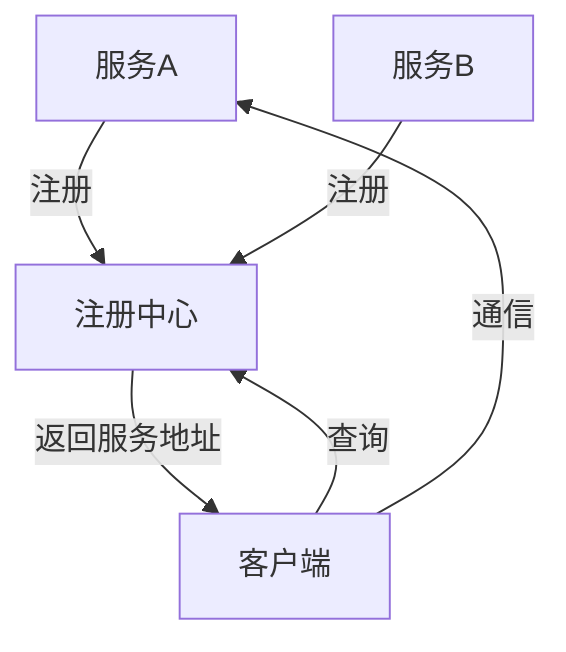

# 服务注册与发现

在现代微服务架构中，服务注册与发现是一个关键概念。它允许服务在分布式系统中动态地注册自己，并发现其他服务的位置。这种机制使得服务之间的通信更加灵活和高效，尤其是在服务实例频繁变化的环境中。

## 什么是服务注册与发现？

服务注册与发现是微服务架构中的一个核心组件，用于管理服务实例的动态变化。它的主要功能包括：

1. **服务注册**：当一个服务启动时，它会将自己的网络地址（如 IP 和端口）注册到一个中心化的注册中心。
2. **服务发现**：当一个服务需要与其他服务通信时，它会从注册中心查询目标服务的地址。

通过这种方式，服务之间的通信不再依赖于硬编码的地址，而是通过注册中心动态获取。

## 为什么需要服务注册与发现？

在传统的单体应用中，服务之间的通信通常是通过硬编码的地址或配置文件实现的。然而，在微服务架构中，服务实例可能会频繁地启动、停止或迁移。如果仍然使用硬编码的方式，会导致以下问题：

- **服务地址变更**：当服务实例的地址发生变化时，所有依赖该服务的客户端都需要手动更新配置。
- **负载均衡**：无法动态地将请求分发到多个服务实例上。
- **故障恢复**：无法自动检测和移除故障的服务实例。

服务注册与发现机制解决了这些问题，使得服务之间的通信更加灵活和可靠。

---

## 服务注册与发现的工作原理

服务注册与发现的核心组件是**注册中心**（Service Registry）。常见的注册中心包括 **Eureka**、**Consul** 和 **Zookeeper**。以下是其工作原理：

1. **服务注册**：服务启动时，向注册中心发送自己的元数据（如服务名称、IP 地址、端口等）。
2. **心跳机制**：服务定期向注册中心发送心跳，以表明自己仍然存活。
3. **服务发现**：客户端从注册中心获取目标服务的地址列表，并根据负载均衡策略选择一个实例进行通信。
4. **服务下线**：当服务停止时，注册中心会将其从服务列表中移除。

以下是一个简单的流程图，展示了服务注册与发现的过程：



---

## 在 Spring 框架中实现服务注册与发现

Spring 框架通过 **Spring Cloud** 提供了对服务注册与发现的支持。以下是一个使用 **Eureka** 作为注册中心的示例。

### 1. 创建 Eureka 注册中心

首先，我们需要创建一个 Eureka 服务器作为注册中心。

```java
@SpringBootApplication
@EnableEurekaServer
public class EurekaServerApplication {
    public static void main(String[] args) {
        SpringApplication.run(EurekaServerApplication.class, args);
    }
}
```

在 `application.yml` 中配置 Eureka 服务器：

```yaml
server:
  port: 8761

eureka:
  instance:
    hostname: localhost
  client:
    registerWithEureka: false
    fetchRegistry: false
```

启动后，Eureka 服务器将在 `http://localhost:8761` 上运行。

### 2. 注册服务

接下来，我们创建一个服务并将其注册到 Eureka。

```java
@SpringBootApplication
@EnableEurekaClient
public class ServiceApplication {
    public static void main(String[] args) {
        SpringApplication.run(ServiceApplication.class, args);
    }
}
```

在 `application.yml` 中配置服务：

```yaml
spring:
  application:
    name: my-service

server:
  port: 8080

eureka:
  client:
    serviceUrl:
      defaultZone: http://localhost:8761/eureka/
```

启动服务后，它会在 Eureka 注册中心注册自己。

### 3. 服务发现

客户端可以通过 Eureka 发现服务并进行通信。

```java
@RestController
public class MyController {

    @Autowired
    private DiscoveryClient discoveryClient;

    @GetMapping("/service-instances")
    public List<ServiceInstance> getServiceInstances() {
        return discoveryClient.getInstances("my-service");
    }
}
```

访问 `/service-instances` 端点，客户端将返回 `my-service` 的所有实例信息。

---

## 实际应用场景

服务注册与发现在以下场景中非常有用：

1. **动态扩展**：当需要增加服务实例以应对高流量时，新实例会自动注册到注册中心，客户端无需修改配置。
2. **故障恢复**：当某个服务实例发生故障时，注册中心会将其移除，客户端会自动切换到其他可用实例。
3. **负载均衡**：通过结合负载均衡器（如 Ribbon），客户端可以将请求分发到多个服务实例上。

---

## 总结

服务注册与发现是微服务架构中不可或缺的一部分。它通过动态管理服务实例的地址，使得服务之间的通信更加灵活和可靠。Spring 框架通过 Spring Cloud 提供了对服务注册与发现的支持，使得开发者可以轻松实现这一机制。

:::tip 提示
如果你想进一步学习，可以尝试以下练习：
1. 使用 Consul 替换 Eureka 作为注册中心。
2. 结合 Ribbon 实现客户端负载均衡。
3. 探索 Spring Cloud Gateway 如何与服务注册与发现结合使用。
:::

:::note 附加资源
- [Spring Cloud 官方文档](https://spring.io/projects/spring-cloud)
- [Eureka 官方文档](https://github.com/Netflix/eureka)
- [Consul 官方文档](https://www.consul.io/)
:::