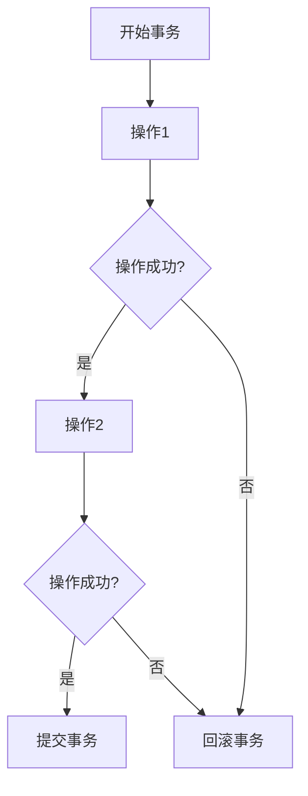

# 事务管理机制

在开发企业级应用程序时，事务管理是一个至关重要的概念。它确保数据库操作的一致性和完整性，尤其是在多个操作需要作为一个整体执行时。Spring 框架提供了强大的事务管理支持，帮助开发者轻松实现事务控制。

## 什么是事务管理？

事务管理是指确保一组数据库操作要么全部成功提交，要么全部回滚的机制。事务的四个关键特性通常被称为 **ACID**：

- **原子性（Atomicity）**：事务中的所有操作要么全部成功，要么全部失败。
- **一致性（Consistency）**：事务执行前后，数据库的状态保持一致。
- **隔离性（Isolation）**：多个事务并发执行时，彼此之间互不干扰。
- **持久性（Durability）**：事务一旦提交，其结果将永久保存在数据库中。

Spring 框架通过两种方式支持事务管理：**声明式事务管理** 和 **编程式事务管理**。

---

## 声明式事务管理

声明式事务管理是通过配置的方式实现事务控制，通常使用注解 `@Transactional`。这种方式简单易用，适合大多数场景。

### 使用 `@Transactional` 注解

以下是一个简单的示例，展示如何在 Spring 中使用 `@Transactional` 注解：

```java
@Service
public class UserService {

    @Autowired
    private UserRepository userRepository;

    @Transactional
    public void createUser(User user) {
        userRepository.save(user);
        // 如果此处抛出异常，事务将回滚
    }
}
```

:::note
`@Transactional` 注解可以应用于类或方法级别。如果应用于类级别，则该类的所有方法都将继承事务行为。
:::

### 事务传播行为

Spring 提供了多种事务传播行为，用于控制事务的边界。例如：

- `REQUIRED`：如果当前存在事务，则加入该事务；否则，创建一个新事务。
- `REQUIRES_NEW`：总是创建一个新事务，如果当前存在事务，则挂起当前事务。

```java
@Transactional(propagation = Propagation.REQUIRES_NEW)
public void updateUser(User user) {
    userRepository.save(user);
}
```

---

## 编程式事务管理

编程式事务管理是通过编写代码显式控制事务的提交和回滚。这种方式更灵活，但代码复杂度较高。

### 使用 `TransactionTemplate`

以下是一个使用 `TransactionTemplate` 的示例：

```java
@Service
public class UserService {

    @Autowired
    private TransactionTemplate transactionTemplate;

    @Autowired
    private UserRepository userRepository;

    public void createUser(User user) {
        transactionTemplate.execute(status -> {
            try {
                userRepository.save(user);
                // 如果操作成功，事务将提交
            } catch (Exception e) {
                status.setRollbackOnly(); // 标记事务为回滚
            }
            return null;
        });
    }
}
```

:::tip
编程式事务管理适合需要精细控制事务的场景，例如在事务中执行复杂的业务逻辑。
:::

---

## 实际应用场景

假设我们有一个电商系统，用户下单时需要同时更新库存和订单表。如果其中一个操作失败，整个事务需要回滚，以确保数据一致性。

```java
@Service
public class OrderService {

    @Autowired
    private OrderRepository orderRepository;

    @Autowired
    private InventoryRepository inventoryRepository;

    @Transactional
    public void placeOrder(Order order) {
        orderRepository.save(order);
        inventoryRepository.decreaseStock(order.getProductId(), order.getQuantity());
        // 如果库存不足，抛出异常，事务将回滚
    }
}
```

---

## 总结

事务管理是确保数据一致性和完整性的关键机制。Spring 框架通过声明式和编程式事务管理，为开发者提供了灵活且强大的工具。无论是简单的 CRUD 操作，还是复杂的业务逻辑，Spring 的事务管理机制都能满足需求。

---

## 附加资源与练习

1. **练习**：尝试在一个 Spring Boot 项目中实现声明式和编程式事务管理，并测试事务的回滚行为。
2. **深入学习**：阅读 Spring 官方文档中关于事务管理的章节，了解更多高级特性，如事务隔离级别和超时设置。
3. **扩展阅读**：了解分布式事务管理（如使用 Spring Cloud 和 Seata）以应对微服务架构中的事务挑战。



通过以上内容，您应该对 Spring 框架中的事务管理机制有了全面的了解。继续实践和探索，您将能够熟练运用事务管理来构建健壮的应用程序。