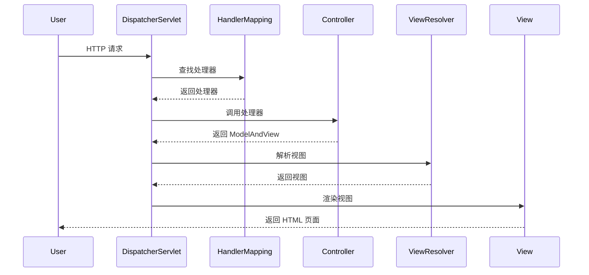

# Spring MVC 原理

Spring MVC 是 Spring 框架中的一个重要模块，用于构建基于 MVC（Model-View-Controller）设计模式的 Web 应用程序。它通过分离应用程序的不同层（如业务逻辑、数据展示和用户交互）来简化开发过程。本文将详细介绍 Spring MVC 的工作原理，帮助你理解其核心组件和请求处理流程。

## 什么是 Spring MVC？

Spring MVC 是一个基于 Java 的 Web 框架，它实现了 MVC 设计模式。MVC 模式将应用程序分为三个主要部分：

- **Model（模型）**：负责处理应用程序的数据逻辑。
- **View（视图）**：负责数据的展示。
- **Controller（控制器）**：负责处理用户输入并更新模型。

Spring MVC 通过这种分层设计，使得开发者可以更轻松地管理和维护代码。

## Spring MVC 的核心组件

Spring MVC 的核心组件包括：

1. **DispatcherServlet**：这是 Spring MVC 的核心控制器，负责接收所有的 HTTP 请求，并将它们分发给相应的处理器（Controller）。
2. **HandlerMapping**：负责将请求映射到相应的处理器（Controller）。
3. **Controller**：处理请求并返回模型和视图。
4. **ModelAndView**：包含模型数据和视图信息。
5. **ViewResolver**：负责解析视图名称并返回实际的视图对象。

## Spring MVC 的请求处理流程

Spring MVC 的请求处理流程可以分为以下几个步骤：

1. **请求到达 DispatcherServlet**：当用户发起一个 HTTP 请求时，请求首先到达 `DispatcherServlet`。
2. **HandlerMapping 查找处理器**：`DispatcherServlet` 使用 `HandlerMapping` 来查找处理该请求的 `Controller`。
3. **Controller 处理请求**：找到对应的 `Controller` 后，`Controller` 处理请求并返回一个 `ModelAndView` 对象。
4. **ViewResolver 解析视图**：`DispatcherServlet` 使用 `ViewResolver` 来解析 `ModelAndView` 中的视图名称，并返回实际的视图对象。
5. **视图渲染**：视图对象将模型数据渲染成最终的 HTML 页面，并返回给用户。



## 实际案例

假设我们有一个简单的 Web 应用程序，用户可以通过表单提交一个名字，然后应用程序返回一个欢迎消息。

### 1. 创建 Controller

```java
@Controller
public class WelcomeController {

    @RequestMapping("/welcome")
    public ModelAndView welcome(@RequestParam("name") String name) {
        ModelAndView modelAndView = new ModelAndView();
        modelAndView.addObject("message", "Welcome, " + name + "!");
        modelAndView.setViewName("welcome");
        return modelAndView;
    }
}
```

### 2. 创建视图文件 `welcome.jsp`

```jsp
<html>
<head>
    <title>Welcome</title>
</head>
<body>
    <h1>${message}</h1>
</body>
</html>
```

### 3. 配置 `ViewResolver`

在 Spring 配置文件中配置 `ViewResolver`：

```xml
<bean class="org.springframework.web.servlet.view.InternalResourceViewResolver">
    <property name="prefix" value="/WEB-INF/views/" />
    <property name="suffix" value=".jsp" />
</bean>
```

### 4. 运行应用程序

当用户访问 `/welcome?name=John` 时，应用程序会返回一个包含 "Welcome, John!" 的 HTML 页面。

## 总结

Spring MVC 是一个强大的 Web 框架，通过 MVC 设计模式将应用程序的不同层分离，使得代码更易于维护和扩展。本文介绍了 Spring MVC 的核心组件和请求处理流程，并通过一个简单的案例展示了其实际应用。

## 附加资源

- [Spring MVC 官方文档](https://docs.spring.io/spring-framework/docs/current/reference/html/web.html)
- [Spring MVC 教程](https://www.baeldung.com/spring-mvc-tutorial)

## 练习

1. 尝试创建一个新的 Spring MVC 项目，并实现一个简单的用户注册功能。
2. 修改上面的案例，使其支持多个语言的欢迎消息（如中文、英文等）。

:::tip
在学习过程中，建议多动手实践，通过编写代码来加深对 Spring MVC 的理解。
:::