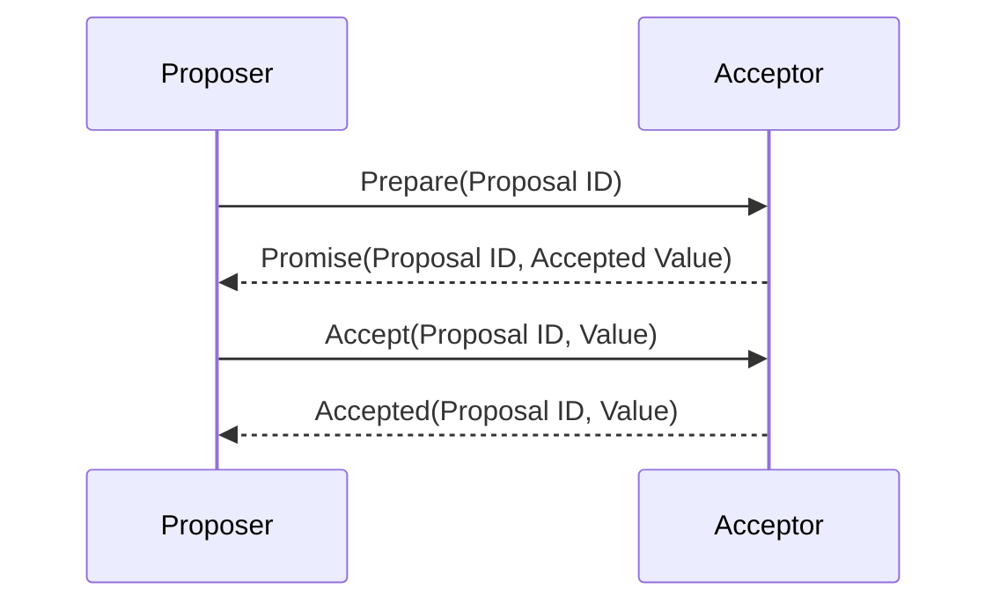
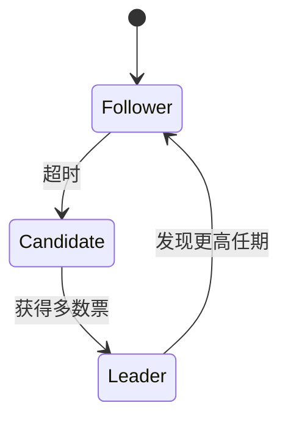

# 一致性算法

在分布式系统中，一致性算法是确保多个节点之间数据一致性的关键技术。由于分布式系统中的节点可能分布在不同的地理位置，并且网络通信可能存在延迟、丢包等问题，因此如何保证数据的一致性成为了一个重要的挑战。

## 什么是分布式一致性？

分布式一致性是指在分布式系统中，多个节点对同一份数据的副本达成一致的状态。简单来说，就是确保所有节点在任何时刻都能看到相同的数据。

:::note
**注意**：分布式一致性并不意味着所有节点在同一时刻看到的数据完全相同，而是指在某个时间点之后，所有节点最终会看到相同的数据。
:::

## 常见的一致性算法

### 1. Paxos 算法

Paxos 算法是分布式系统中最早提出的一致性算法之一，由 Leslie Lamport 提出。它通过多轮投票的方式，确保在分布式系统中达成一致。

#### Paxos 的基本流程

1. **Prepare 阶段**：提议者（Proposer）向接受者（Acceptor）发送一个提案编号（Proposal ID），请求接受者承诺不再接受比该编号更小的提案。
2. **Promise 阶段**：接受者如果发现提案编号比之前接受的任何提案编号都大，就会承诺不再接受比该编号更小的提案，并返回之前接受的最高编号的提案。
3. **Accept 阶段**：提议者收到多数接受者的承诺后，会发送一个包含提案编号和值的提案给接受者。
4. **Accepted 阶段**：接受者如果发现提案编号与之前承诺的编号一致，就会接受该提案。

### 2. Raft 算法

Raft 算法是一种更易于理解和实现的一致性算法，它将一致性分解为领导者选举、日志复制和安全性三个子问题。

#### Raft 的基本流程

1. **领导者选举**：当集群中没有领导者时，节点会发起选举，选出新的领导者。
2. **日志复制**：领导者将客户端请求的日志条目复制到其他节点，并在大多数节点确认后提交日志。
3. **安全性**：Raft 通过任期（Term）和日志索引来确保数据的一致性。

### 3. Zab 协议

Zab 协议是 Zookeeper 使用的一致性协议，它通过原子广播机制确保数据的一致性。

#### Zab 的基本流程

1. **恢复模式**：在系统启动或领导者崩溃后，Zab 会进入恢复模式，选举新的领导者并同步日志。
2. **广播模式**：领导者将客户端请求广播给所有节点，并在大多数节点确认后提交日志。

## 实际应用场景

### 分布式数据库

在分布式数据库中，一致性算法用于确保多个副本之间的数据一致性。例如，Google 的 Spanner 数据库使用 Paxos 算法来保证全球范围内的数据一致性。

### 分布式锁服务

Zookeeper 使用 Zab 协议来实现分布式锁服务，确保在分布式系统中多个节点对共享资源的访问是互斥的。

### 分布式文件系统

HDFS（Hadoop Distributed File System）使用 Raft 算法来确保文件块的副本在多个节点之间的一致性。

## 总结

一致性算法是分布式系统中的核心技术，它确保了多个节点之间的数据一致性。Paxos、Raft 和 Zab 是三种常见的一致性算法，它们在不同的应用场景中发挥着重要作用。

:::tip
**提示**：理解一致性算法的关键在于掌握其基本流程和核心思想，建议通过实际代码实现来加深理解。
:::

## 附加资源

- [Paxos Made Simple](https://lamport.azurewebsites.net/pubs/paxos-simple.pdf)
- [Raft 官方网站](https://raft.github.io/)
- [Zookeeper 官方文档](https://zookeeper.apache.org/doc/current/)

## 练习

1. 实现一个简单的 Raft 算法，模拟领导者选举和日志复制的过程。
2. 阅读 Paxos 算法的论文，并尝试用代码实现其基本流程。
3. 使用 Zookeeper 实现一个分布式锁服务，并测试其一致性。
