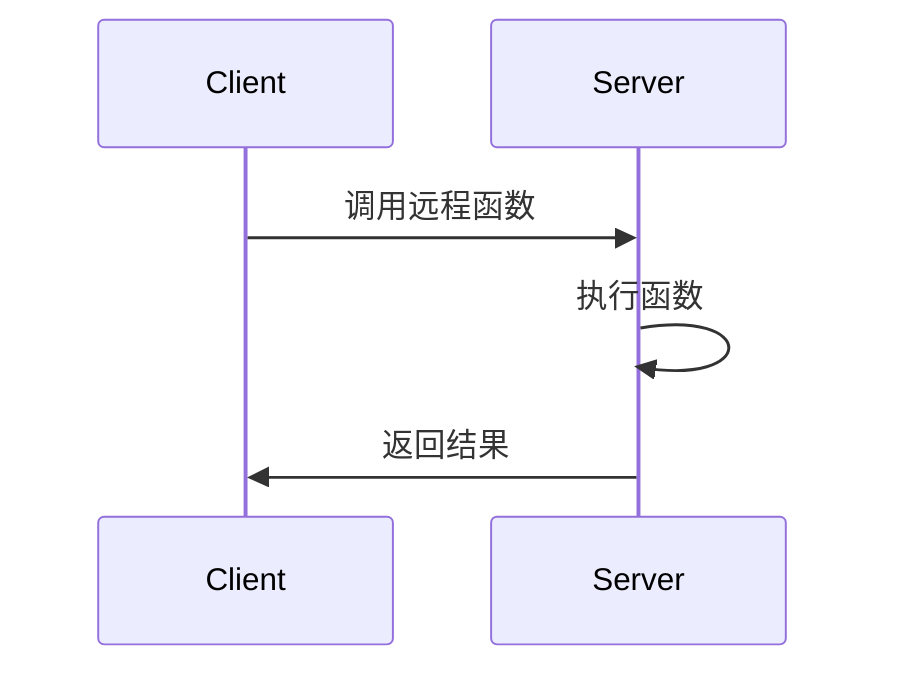

# RPC原理

远程过程调用（Remote Procedure Call，简称RPC）是一种允许程序调用位于另一台计算机上的过程或函数的协议。它使得分布式系统中的不同节点能够像调用本地函数一样调用远程服务，从而简化了分布式应用的开发。

## 什么是RPC？

RPC是一种通信协议，它允许一个程序在本地调用另一个程序中的函数或方法，而无需了解底层的网络细节。RPC的核心思想是让远程调用看起来像本地调用一样简单。

### RPC的工作原理

RPC的工作原理可以分为以下几个步骤：

1. **客户端调用**：客户端程序调用一个本地存根（stub）函数，这个函数看起来像是一个本地函数。
2. **参数打包**：客户端存根将函数参数打包成消息，并通过网络发送到服务器。
3. **服务器接收**：服务器端的存根接收到消息后，解包参数并调用实际的函数。
4. **函数执行**：服务器执行函数，并将结果打包成消息返回给客户端。
5. **结果返回**：客户端存根接收到返回的消息，解包结果并返回给调用者。



### RPC的代码示例

以下是一个简单的RPC调用示例，假设我们有一个远程服务，提供了一个 `add` 函数，用于计算两个数的和。

#### 客户端代码

```python
import rpc_client

def main():
    result = rpc_client.add(3, 5)
    print(f"Result: {result}")

if __name__ == "__main__":
    main()
```

#### 服务器端代码

```python
import rpc_server

def add(a, b):
    return a + b

if __name__ == "__main__":
    rpc_server.register_function(add)
    rpc_server.serve()
```

#### 输入和输出

- **输入**：客户端调用 `add(3, 5)`
- **输出**：服务器返回 `8`，客户端打印 `Result: 8`

### RPC的实际应用场景

RPC广泛应用于分布式系统中，以下是一些常见的应用场景：

1. **微服务架构**：在微服务架构中，各个服务之间通过RPC进行通信，实现服务的解耦和独立部署。
2. **分布式数据库**：分布式数据库系统使用RPC来协调不同节点之间的数据操作。
3. **云计算**：云服务提供商使用RPC来管理虚拟机、存储和网络资源。

### 总结

RPC是分布式系统中非常重要的通信机制，它使得远程调用变得像本地调用一样简单。通过RPC，开发者可以更容易地构建分布式应用，而无需关心底层的网络细节。

### 附加资源与练习

- **资源**：
  - [gRPC官方文档](https://grpc.io/docs/)
  - [Apache Thrift官方文档](https://thrift.apache.org/docs/)
- **练习**：
  - 尝试实现一个简单的RPC框架，支持基本的远程函数调用。
  - 使用现有的RPC框架（如gRPC或Thrift）构建一个分布式计算服务。

:::tip
在学习和使用RPC时，建议从简单的示例开始，逐步深入理解其底层机制和优化方法。
:::